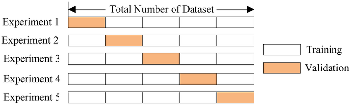

# 교차 검증(Cross validation)

<br/>

> 만약 모델을 학습시키기 위해 데이터를 train set와 test set로 나눈 후 파라미터를 수정하면서 계속 학습을 한다면 train set가 고정된 상태에서 계속 반복되면서 모델이 과적합(overfitting) 될 수 있다.
>
> 이를 해결하고자 하는 것이 바로 교차 검증(cross validation)이다.


<br/>

## 교차 검증

- 일반화 성능 향상을 위해 훈련 세트와 테스트 세트로 한 번 나누는 것보다 더 안정적이고 뛰어난 평가 방법

- 데이터 편중을 막기 위함

- 별도의 여러 세트로 구성된 학습 데이터 세트와 검증 데이터 세트에서 학습과 평가를 수행

- 연산 비용이 늘어나는 단점이 있음 (k배 더 느림)


<br/>




<br/>

```python
from sklearn.model_selection import cross_val_score
```

<br/>

- Parameter and Return

```python
cross_val_score(estimator, X, y=None, *, groups=None, scoring=None, cv=None, n_jobs=None, verbose=0, fit_params=None, pre_dispatch='2*n_jobs', error_score=nan)


'''
Parameter

- estimator : 평가하려는 모델
- X : 훈련 데이터
- y : 타깃 레이블
- cv : 교차 검증 분할 수(k)

Return

- 교차 검증 결과 정확도 점수의 배열
'''
```


<br/>

## Iris 데이터로 사용해보기

<br/>

```python
from sklearn.model_selection import cross_val_score
from sklearn.datasets import load_iris
from sklearn.linear_model import LogisticRegression
from sklearn.tree import DecisionTreeClassifier

# iris 데이터 불러오기
iris = load_iris()

# model
model_lr = LogisticRegression()
model_dt = DecisionTreeClassifier(random_state=42)

scores = cross_val_score(model_lr, iris.data, iris.target)
print("교차 검증 점수: ", scores)

scores = cross_val_score(model_dt, iris.data, iris.target)
print("교차 검증 점수: ", scores)
```

```
교차 검증 점수:  [0.96666667 1.         0.93333333 0.96666667 1.        ]
교차 검증 점수:  [0.96666667 0.96666667 0.9        0.93333333 1.        ]
```


<br/>

```python
# 폴드의 수 조절하기(cv)
scores = cross_val_score(model_dt, iris.data, iris.target, cv=3)
print("교차 검증 점수: ", scores)
```

```
교차 검증 점수:  [0.98 0.94 0.96]
```


<br/>

```python
# 보통 교차 검증의 정확도를 간단하게 나타내기 위해 평균을 사용한다.
print("교차 검증 점수: ", scores.mean())
```

```
교차 검증 점수:  0.96
```


<br/>

**그런데**

데이이터셋을 나열 순서대로 k개의 폴드를 나누는 것은 항상 좋지는 않다.


<br/>

```python
iris = load_iris()

print("Iris 레이블:\n{}".format(iris.target))
```

```
Iris 레이블:
[0 0 0 0 0 0 0 0 0 0 0 0 0 0 0 0 0 0 0 0 0 0 0 0 0 0 0 0 0 0 0 0 0 0 0 0 0
 0 0 0 0 0 0 0 0 0 0 0 0 0 1 1 1 1 1 1 1 1 1 1 1 1 1 1 1 1 1 1 1 1 1 1 1 1
 1 1 1 1 1 1 1 1 1 1 1 1 1 1 1 1 1 1 1 1 1 1 1 1 1 1 2 2 2 2 2 2 2 2 2 2 2
 2 2 2 2 2 2 2 2 2 2 2 2 2 2 2 2 2 2 2 2 2 2 2 2 2 2 2 2 2 2 2 2 2 2 2 2 2
 2 2]
```


<br/>

- 결과에서 볼 수 있듯이 1/3은 클래스 0, 1/3은 클래스 1, 1/3은 클래스 2이다.
- 이 데이터에 3-겹 교차 검증을 적용한다면 첫 번째 폴드는 클래스 0만 가지고 있으므로 정확도는 0이 된다.
- 두 번째, 세 번째도 같은 방법으로 정확도는 0이 된다.


<br/>

- K-fold

```python
from sklearn.model_selection import KFold

kfold = KFold(n_splits=3)
scores = cross_val_score(model_dt, iris.data, iris.target, cv=kfold)
print("교차 검증 점수: ", scores)
```

```
교차 검증 점수:  [0. 0. 0.]
```


<br/>

해결 방법으로는 shuffle=True 를 사용하거나 StratifiedKFold 를 사용하면 된다.


<br/>

```python
# 데이터를 분할하기 전에 섞어주면 결과가 향상된다.
kfold = KFold(n_splits=3, shuffle=True, random_state=0)
scores = cross_val_score(model_dt, iris.data, iris.target, cv=kfold)
print("교차 검증 점수: ", scores)
```

````
교차 검증 점수:  [0.96 0.96 0.96]
````


<br/>

### 계층별 k-fold 교차 검증

```python
from sklearn.model_selection import StratifiedKFold

kfold = StratifiedKFold(n_splits=3)
scores = cross_val_score(model_dt, iris.data, iris.target, cv=kfold)
print("교차 검증 점수: ", scores)
```

```
교차 검증 점수:  [0.98 0.94 0.96]
```


<br/>

- StratifiedKFold는 데이터가 편향되어 있는 경우에 주로 사용된다.


<br/>

**참고로**

- 회귀에서는 k-fold 교차 검증을 사용하고,
- 분류에서는 계층별 k-fold 교차 검증을 주로 사용한다.

또한

cross_val_score 함수에는 KFold의 매개변수를 제어할 수가 없으므로, 따로 KFold 객체를 만들고 매개변수를 조정한 다음에 cross_val_score의 cv 매개변수에 넣어야 한다.


<br/>

<br/>

이외에도 다양한 교차 검증 방법들이 있다.

<br/>

### 임의 분할 교차 검증 (shuffle-split cross-validation)

- 반복 횟수를 훈련 세트나 테스트 세트의 크기와 독립적으로 조절해야 할 때 유용

```python
from sklearn.model_selection import ShuffleSplit
```


<br/>

### 그룹별 교차 검증 (groups cross-validation)

- 데이터 안에 매우 연관된 그룹이 있을 때

```python
from sklearn.model_selection import GroupKFold
```


<br/>

### 반복 교차 검증

데이터셋의 크기가 크지 않을 경우 안정된 검증 점수를 얻기 위해 교차 검증을 반복하여 여러 번 수행

- RepeatedKFold : 회귀에 사용
- RepeatedStratifiedKFold : 분류에 사용

```python
from sklearn.model_selection import RepeatedStratifiedKFold
```


<br/>

등등...


<br/><br/><br/>

------------

<br/>

### Reference


- https://scikit-learn.org/stable/modules/generated/sklearn.model_selection.cross_val_score.html


- [https://velog.io/@skyepodium/K-Fold-%EA%B5%90%EC%B0%A8%EA%B2%80%EC%A6%9D](https://velog.io/@skyepodium/K-Fold-교차검증)


- https://homeproject.tistory.com/m/6