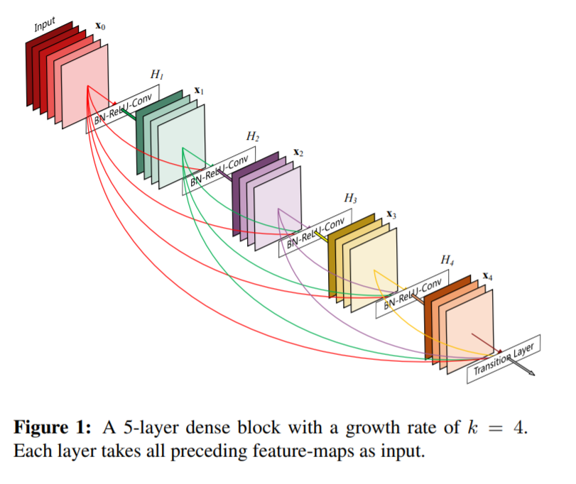

# DenseNet

 

> 이미지 분류 프로젝트를 진행하면서 DenseNet을 사용하였다.
>
> 그래서  DenseNet이 무엇인지? 그리고 장점과 단점이 무엇인지 간단히 공부해보자.

 

장점

이미지에서 저수준의 특징들이 잘 보존된다.

gradient가 수월하게 흘러 gradient vanishing 문제가 발생하지 않는다.

깊이에 비해 파라미터 수가 적기에 연산량이 적양된다

적은 데이터셋에서도 비교적 잘 학습이 된다.

### Reference

- [Densely Connected Convolutional Networks_논문](https://arxiv.org/pdf/1608.06993.pdf)

