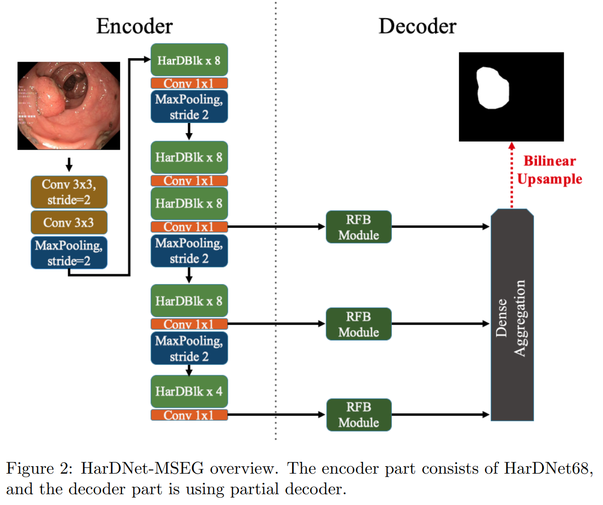
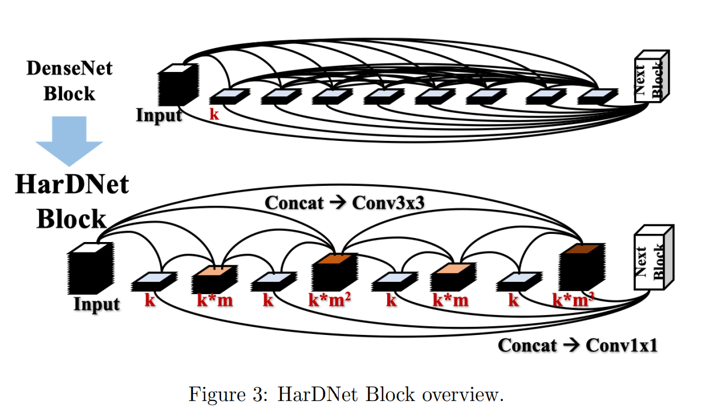
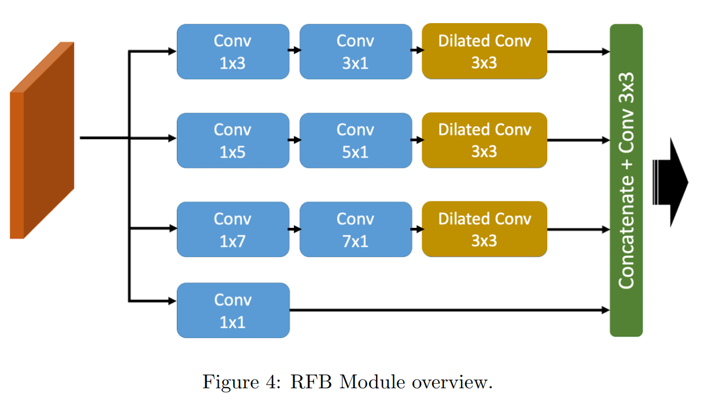
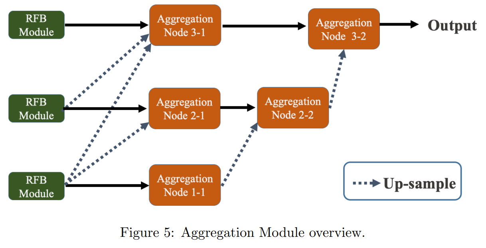

# HarDNet-MSEG 공부

 

## HarDNet

[HarDNet: A Low Memory Traffic Network](https://arxiv.org/abs/1909.00948)

 

inference time을 측정하는 방법으로 memory traffic을 사용하는 방법을 제안함

이 방법은 feature map의 크기를 이용하여 수치화한다. 왜냐하면 중간 단계에 있는 feature map의 크기가 inference 시간과 밀점한 관계가 있기 때문이다.

논문에서 제안한 HarDNet(Harmonic Densely Connected Network)는 MAC와 Memory traffic을 낮추어 효율성을 높인다.

DenseNet에 기반한 새로운 architecture 제안함

  

 

## HarDNet-MSEG

[HarDNet-MSEG: A Simple Encoder-Decoder Polyp Segmentation Neural Network that Achieves over 0.9 Mean Dice and 86 FPS](https://arxiv.org/abs/2101.07172)

HarDNet-MSEG for polyp segmentation 제안함

5개의 datasets에 accuracy와 inference speed에 SOTA 달성

backbone: a low memory traffic CNN called HarDNet68

decoder: Cascaded Partial Decoder

github: [https://github.com/james128333/HarDNet-MSEG](https://github.com/james128333/HarDNet-MSEG)

### 1. Introduction

대장암(CRC, incidence of colorectal cancer)  발생률은 전세계적으로 높고 이를 예방하는것은 매우 중요하다.  조기 진단 및 치료가 매우 중요하다.

CRC를 예방하는 현재 가장 좋은 방법은 내시경을 이용한 용종(polyp) 제거 절제술이다.

초기 polyp 분할 방법은 색 이나 패턴 등의 특징을 이용한 방법이었다. 하지만 용종은 다양한 크기와 색 등을 가지고 있어서 이 방법은 매우 어렵다.

CNN이 발전되면서 초기 방법 보다 더 좋은 방법들이 많이 나왔지만 경계 영역의 절단, 작은 블록의 부족, 넓은 영역의 깨진 이미지 등 여전히 많은 문제점들이 있다. 더욱이 이러한 네트워크의 inference time이 보통 길고, training time은 상대적으로 많이 소요된다.

HarDNet68을 backbone을 기반으로한 HarDNet-MSEG를 제안한다.

인코더-디코더 구조의 이 네트워크는 높은 정확도와 효율적인 inference time을 달성했다.

 

### 2. Related work

LeNet, FCN, U-Net, UNet++ 순으로 점점 medical image segmentation 분야에 적용되었고 발전되었다.

최근에는 더 나은 CNN backbone의 사용 또는 spatial pyramid pooling, attention module 등과 같은 추가 모듈의 도입으로 medical imaging semantic segmentation에 좋은 결과를 달성했다.

전자의 예로는 ResUNet, ResUNet++ 그리고 DoubleU-Net이 있다.  더 나은 CNN backbone을 U자형 구조와 통합함으로써, 전체적인 network는 더 강한 recognition capability, 더 큰 receiving domain 그리고 multi-scale information integration을 갖는다.

두 번째는 DoubleU-Net이 ASPP를 사용하는것과 같이 추가 모듈을 인코더와 디코더 사이에 삽입하는 것인데, 이는 서로 다른 object scales을 처리하고 accuracy를 향상시키는데 도움이 된다. PraNet은 RFB 모듈을 추가하여 skip connection을 통해 다른 scales의 features의 시각 정보를 더 캡쳐한다.

최근에는 attention 또한 computer vision 분야 특히 pixel level에서 상세한 edge information을 요구하는 semantic segmentation에 널리 사용되었다. 예를 들어 PraNet, PolypSeg 그리고 ABC-Net이 있다. 다른 context 모듈을 추가한 후 전부 medical imaging segmentation에서 좋은 결과를 얻었다. Spatial Attention Module 그리고 Channel Attention Module와 같은 context 모듈은 inference speed를 감소 시키는 반면 accuracy를 향상시키고 edge cutting을 더 정밀하게 만드는데 매우 효율적이다.

HarDNet을 backbone으로 사용하고 인코더-디코더 구조로 디자인한 HarDNet-MSEG를 제안한다. 이 네트워크는 높은 정확도와 효율적인 inference time을 달성하였다.  (CVC-ColonDB, EndoScene, ETISLarib Polyp DB, CVCClinic DB, and Kvasir-SEG) 

게다가 RFB, ASPP, Attention 등과 같은 추가 모듈을 추가하는 것을 시도하여 accuracy를 더 향상 시키도록 시도했다.

 

 

 

### 3. HarDNet-MSEG

Figure 2는 제안된 HarDNet-MSEG의 아키텍쳐를 보여준다. 이것은 encoder backbone와 decoder로 구성되어 있다.

 

#### 3.1 Backbone : HarDNet

DenseNet의 original dense block을 향상 시킨 HarDNet은 Figure 3에 나와있다.

 

 

model 디자인에서 memory traffic의 impact를 고려한 이것은 shortcuts을 줄여서 inference speed를 높이고 동시에 key layer가 accuracy의 loss를 만회할 수 있도록 channel's width를 늘린다. 또한 computational density를 높이기 위해 소량의 Conv 1x1 을 사용한다.

 이 디자인을 통해 DenseNet 과 ResNet에 비해 30% inference time을 단축 했을 뿐만 아니라 ImageNet에서 더 높은 정확도를 가졌다. 반면에 FC-HarDNet70 또한 Cityscapes Dataset에서 image segmentation에 SOTA를 달성했다. 그러므로 우리는 Colorectal Polyps image semantic segmentation의 모델 backbone으로 HarDNet68을 사용했다.

 

#### 3.2 Cascaded Partial Decoder

잘 알려진 많은 medical image segmentation 네트워크들은 종종 U-Net을 기반으로 변경되었다. 우리의 디자인 또한 이러한 방향에서 시작되었다. 하지만 inference time과 performance의 균형에 따르면 FC-HarDNet과는 다른 디코더 부분에 HarDBlock(HarDBlk)를 사용하지 않았다.

우리는 Cascaded partial decoder를 참조하였다. 얕은 특징(shallow features)은 resolution이 높고 computing resources를 점유하며, 깊은 정보는 얕은 정보의 공간 세부 사항도 비교적 잘 나타낼 수 있다는 것을 발견했다. 그래서 우리는 shallow features를 버리고 깊은 층의 특징(deeper layer's features)에 대해 더 많은 computing을 하기로 결정했다. 적절한 convolution과 skip connections의 추가로 다른 scales의 feature maps의 집합을 달성할 수 있다.

 

##### 3.2.1 RFB Module

Figure 4는 RFB(Receptive Field Block)을 보여준다. 그것은 lightweight CNN backbone으로 부터 학습된 깊은 features를 강화할 수 있다. 다른 kernel size convolution과 dilated convolution layers를 가진 multi-branch를 사용함으로써, 다른 receptive fields를 가진 features를 생성한다. 그 뒤에 1x1 convolution으로 features를 합치고 final representation을 생성한다.

 

 

우리는 각각 다른 resolution's features maps에서 receptive fields를 확장할수 있도록 Cascaded partial decoder에 따라 이 모듈에 skip connection을 추가한다.

 

##### 3.2.2 Dense Aggregation

그림 5에 표시된 element-wise multiplication으로 aggregation을 수행한다. 동일한 scale로 up-sampling 후, feature는 해당하는 scale의 input feature와 곱해진다.

 

 

 

### 4. Experiments

생략...

