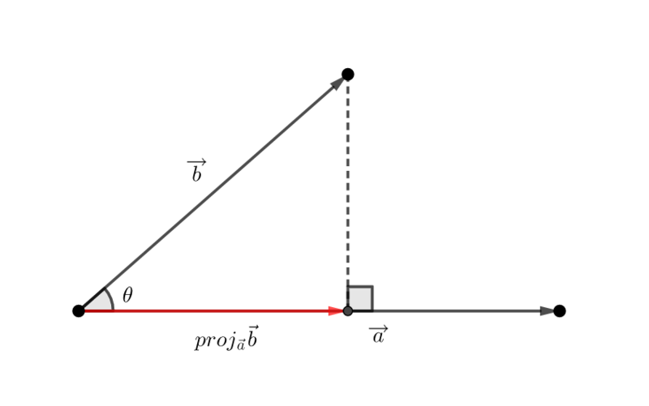

# 9. 벡터의 내적

 

### 내적의 정의

- 두 벡터 a와 b 사잇각 θ(0 ≤ θ ≤ π) 일 때,
  $$
  \vec{a} = (a_1, a_2, a_3)
  $$

  $$
  \vec{b} = (b_1. b_2, b_3)
  $$

  $$
  \vec{a} \cdot \vec{b} = \left| \vec{a} \right| |\vec{b}| \cos \theta = a_1b_1 + a_2b_2 + a_3b_3
  $$

- 사잇각 cos θ
  $$
   \cos \theta  =  \frac{ \vec{a} \cdot \vec{b}}{ \left| \vec{a} \right| |\vec{b}| } 
  $$
  

 

### 내적의 성질

- $$
  \vec{a} \cdot \vec{b} = \vec{b} \cdot \vec{a}
  $$

 

- $$
  \vec{a} \cdot (\vec{b} + \vec{c}) = \vec{a} \cdot \vec{b}+ \vec{a} \cdot \vec{c}
  $$

 

- $$
  m(\vec{a} \cdot \vec{b}) = (m \vec{a}) \cdot \vec{b} = \vec{a} \cdot (m\vec{b}) \neq m \vec{a} \cdot m\vec{b}
  $$

 

- $$
  \vec{a} \perp \vec{b} \iff \vec{a} \cdot \vec{b}=0
  $$

  수직이면, cos90=0 이므로 내적값은 0이다.

 

- $$
  \vec{a} \cdot \vec{a} = |\vec{a}|^2
  $$

  cos0은 1이므로 제곱이된다.

 

 

### 문제

- cos 60 = cos (π/3) = 1/2

 

-ing

 

### 정사영 벡터

- 벡터 a 를 벡터 b에 정사영 벡터

  - $$
    proj_{\vec{b}}\vec{a} = \frac{\vec{a} \cdot \vec{b}}{\vec{b} \cdot \vec{b}}\vec{b}
    $$

   

  

 

