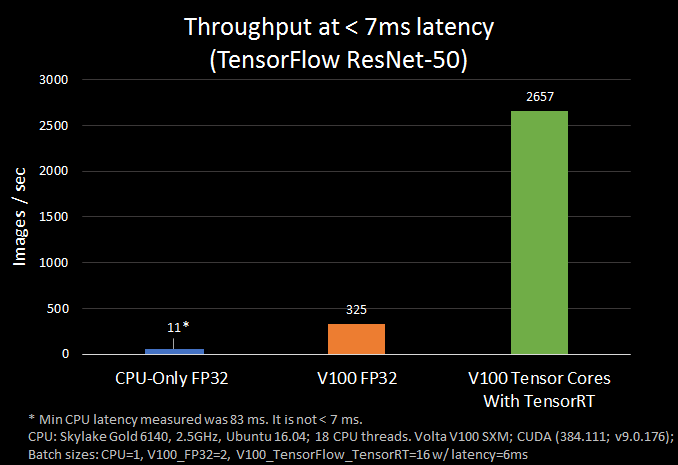
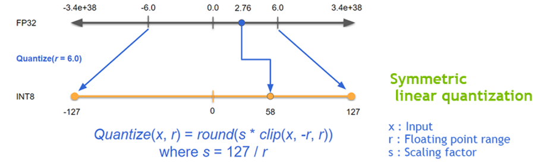

# TensorRT


<br/>

기존 딥러닝 모델을 구조적으로 개선하여, 추론 성능을 향상시키는 라이브러리


TensorRT는 GPU 상에서 딥러닝 모델을 추론하는 과정에서 대기시간을 최소화하고 처리량을 극대화 할 수 있도록 도와주는 최적화 라이브러리

<br/>

텐서플로우 버전 1.7 부터 지원 ---> Tensroflow에서 TensorRT 사용 가능

<br/>

옵션 체크 !!

default 로 무한 딜레이가 걸릴수도 있음


<br/>




<br/>


<br/>

## Sample Code

<br/>

```python
import tensorflow as tf

print("Tensorflow version: ", tf.version.VERSION)
```

<br/>

```python
# check TensorRT version
print("TensorRT version: ")
!dpkg -l | grep nvinfer
```

<br/>

```python
from tensorflow.python.saved_model import tag_constants
from tensorflow.python.compiler.tensorrt import trt_convert as trt
```


<br/>

## 가속화 기술

<br/>

### Quantization & Precision Calibration(양자화 및 정밀도 캘리브레이션)

- 딥러닝의 학습 및 추론에서 정밀도(Precision)을 낮추는 일은 거의 일반적인 방법이다.
- 낮은 정밀도를 가지는 신경말일 수록 데이터의 크기 및 가중치들의 bit 수가 작기 때문에 더 빠르고 효율적인 연산이 가능하다. 
- 이를 위한 양자화 기법 중 TensorRT는 Symmetric Linear Quatization을 사용하고 있으며, 이를 통해 딥러닝 프레임워크의 일반적인 FP32의 데이터를 FP16 및 INT8의 데이터 타입으로 정밀도를 낮출 수 있다.

<br/>



<br/>

- 일반적으로 FP16의 데이터 타입으로 정밀도를 낮추는 것은 모델 정확도에 큰 영향을 주지는 않는다.
- INT8의 데이터 타입으로 정밀도를 낮추는 것은 모델 정확도에 영향을 주기 때문에 추가적으로 캘리브레이션 작업이 필요하다.
- 이를 위해 TensorRT에서는 EntropyCalibrator, EntropyCalibrator2, MinMaxCalibrator를 지원하고 있다.
- 이를 활용하여 양자화 시 가중치 및 intermediate tensor들의 정보의 손실을 최소화 할 수 있다.


<br/>

### Graph Optimization(그래프 최적화)

- TensorRT에서는 Layer Fusion 방식과 Tensor Fusion 방식을 동시에 적용하고 있다.
- Layer Fusion은 Vertical Layer Fusion, Horizontal Layer Fusion이 적용되고, Tensor Fusion이 적용되어 모델 그래프를 단순화 시켜주어 모델의 Layer 수가 크게 감소하게 된다.


<br/>

### Kernel Auto-tuning(커널 자동 튜닝)


<br/>

### Dynamic Tensor Memory & Multi-stream execution(동적 텐서 메모리 및 멀티 스트림 실행)


<br/>

#### :warning:주의 사항:warning:

버전 체크 !!!

tensorflow==2.2 에서 아래 코드를 실행 않됨

**tensorflow==2.0.0** 으로 버전을 다운 시키니 정상 작동됐다.

ㅇ???

그런데 **tensorflow==2.3.1**에서는 또 느리긴 하지만 잘 동작된다.
2.3.1 버전을 사용하는게 좋을꺼 같다.

<br/>

### FP32

- TF native FP32 model to a TF-TRT FP32 model

```python
print('Converting to TF-TRT FP32...')
conversion_params = trt.DEFAULT_TRT_CONVERSION_PARAMS._replace(precision_mode=trt.TrtPrecisionMode.FP32,
                                                               max_workspace_size_bytes=8000000000)

converter = trt.TrtGraphConverterV2(input_saved_model_dir='resnet50_saved_model',
                                    conversion_params=conversion_params)
converter.convert()
converter.save(output_saved_model_dir='resnet50_saved_model_TFTRT_FP32')
print('Done Converting to TF-TRT FP32')
```


<br/>

```
!saved_model_cli show --all --dir resnet50_saved_model_TFTRT_FP32
```


<br/>

-  load and test the TF-TRT FP32 model

```python
# LOAD image and data preprocessing
img = tf.keras.preprocessing.image.load_img(image_path, target_size=img_size)
img = tf.keras.preprocessing.image.img_to_array(img)
img /= 255.0
img = np.expand_dims(img, axis=0)
img = tf.constant(img)
```

```python
signature_keys = list(saved_model_loaded.signatures.keys())
print(signature_keys)

infer = saved_model_loaded.signatures['serving_default']
print(infer.structured_outputs)

pred = infer(img)
print(pred)

key = list(pred.keys())[0]
print(key)

val = pred[key].numpy().item(0)
print(val)

idx = int(np.round(val))
label = label_list[idx]

print("label: ", label)
```


<br/>

### FP16 model

```python
print('Converting to TF-TRT FP16...')

conversion_params = trt.DEFAULT_TRT_CONVERSION_PARAMS._replace(
    precision_mode=trt.TrtPrecisionMode.FP16,
    max_workspace_size_bytes=8000000000)

converter = trt.TrtGraphConverterV2(
   input_saved_model_dir='./model/saved_model', conversion_params=conversion_params)

converter.convert()

converter.save(output_saved_model_dir='./model/FP16_saved_model')

print('Done Converting to TF-TRT FP16')
```


<br/>

- inference 부분은 FP32와 동일함


<br/>

### predict function

```python
# MAKE inference Function
def predict_cxr(image_path):
    img_size = (299, 299)
    label_list = ['COVID','non-COVID']
    img = tf.keras.preprocessing.image.load_img(image_path, target_size=img_size)
    img = tf.keras.preprocessing.image.img_to_array(img)
    img /= 255.0
    img = np.expand_dims(img, axis=0)
    img = tf.constant(img)
    
    signature_keys = list(saved_model_loaded.signatures.keys())
    
    infer = saved_model_loaded.signatures['serving_default']
    
    pred = infer(img)
    
    key = list(pred.keys())[0]
    val = pred[key].numpy().item(0)
    
    idx = int(np.round(val))
    label = label_list[idx]

    return label
```


<br/>

[코드 참고 jupyter notebook](Using_tensorRT.ipynb)

<br/>


<br/>

<br/>

-----------------

<br/>

### Reference

- https://docs.nvidia.com/deeplearning/frameworks/tf-trt-user-guide/index.html

- https://colab.research.google.com/github/vinhngx/tensorrt/blob/vinhn-tf20-notebook/tftrt/examples/image-classification/TFv2-TF-TRT-inference-from-Keras-saved-model.ipynb#scrollTo=RBu2RKs6kVPP
- https://github.com/tensorflow/tensorrt/blob/master/tftrt/examples/image-classification/TF-TRT-inference-from-saved-model.ipynb


<br/>