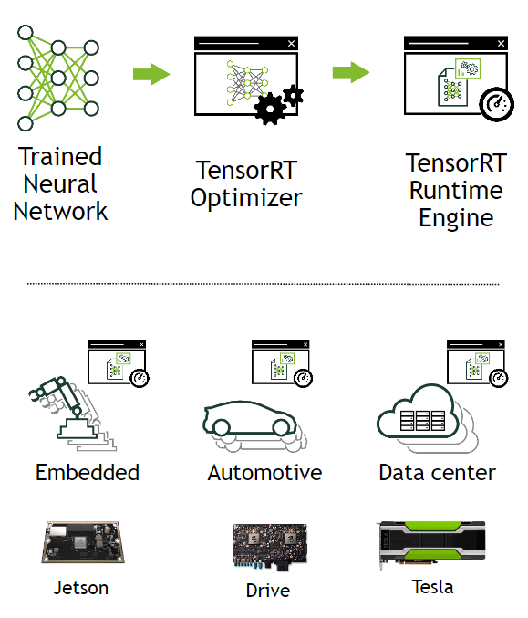

# TensorRT


기존 딥러닝 모델을 구조적으로 개선하여, 추론 성능을 향상시키는 라이브러리

TensorRT는 GPU 상에서 딥러닝 모델을 추론하는 과정에서 대기시간을 최소화하고 처리량을 극대화 할 수 있도록 도와주는 최적화 라이브러리


텐서플로우 버전 1.7 부터 지원 ---> Tensroflow에서 TensorRT 사용 가능


<br/>


<br/>




<br/>

### Sample Code


```python
import tensorflow as tf

print("Tensorflow version: ", tf.version.VERSION)
```


```python
# check TensorRT version
print("TensorRT version: ")
!dpkg -l | grep nvinfer
```


#### :warning:주의 사항:warning:

버전 체크 !!!

tensorflow==2.2 에서 아래 코드를 실행 않됨

**tensorflow==2.0.0** 으로 버전을 다운 시키니 정상 작동됐다.


- TF native FP32 model to a TF-TRT FP32 model

```python
print('Converting to TF-TRT FP32...')
conversion_params = trt.DEFAULT_TRT_CONVERSION_PARAMS._replace(precision_mode=trt.TrtPrecisionMode.FP32,
                                                               max_workspace_size_bytes=8000000000)

converter = trt.TrtGraphConverterV2(input_saved_model_dir='resnet50_saved_model',
                                    conversion_params=conversion_params)
converter.convert()
converter.save(output_saved_model_dir='resnet50_saved_model_TFTRT_FP32')
print('Done Converting to TF-TRT FP32')
```


```
!saved_model_cli show --all --dir resnet50_saved_model_TFTRT_FP32
```


-  load and test the TF-TRT FP32 model

```

```


<br/>

<br/>

-----------------

<br/>

### Reference

- https://docs.nvidia.com/deeplearning/frameworks/tf-trt-user-guide/index.html

- https://colab.research.google.com/github/vinhngx/tensorrt/blob/vinhn-tf20-notebook/tftrt/examples/image-classification/TFv2-TF-TRT-inference-from-Keras-saved-model.ipynb#scrollTo=RBu2RKs6kVPP
- https://github.com/tensorflow/tensorrt/blob/master/tftrt/examples/image-classification/TF-TRT-inference-from-saved-model.ipynb