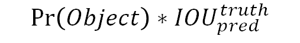
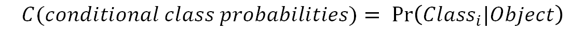
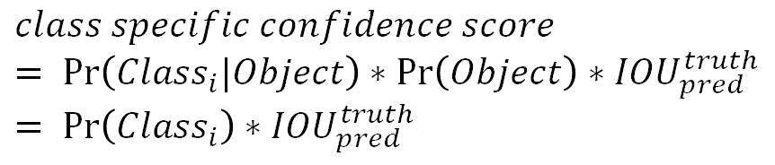
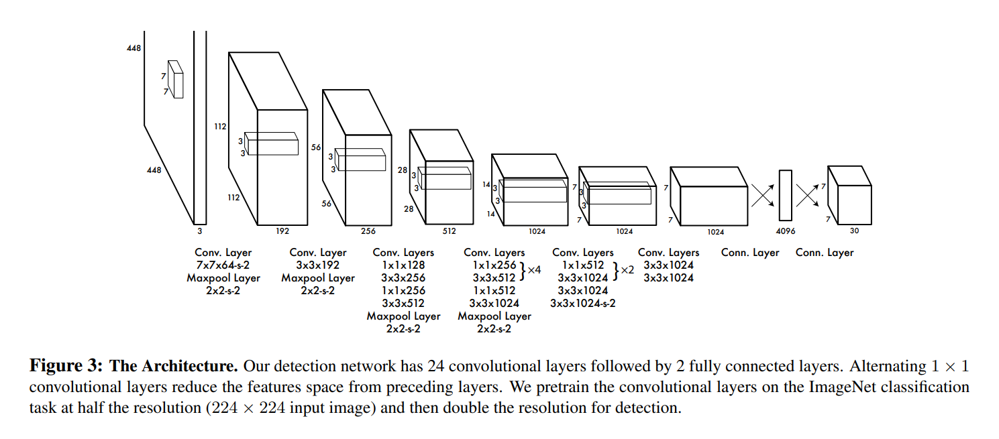
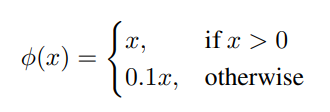
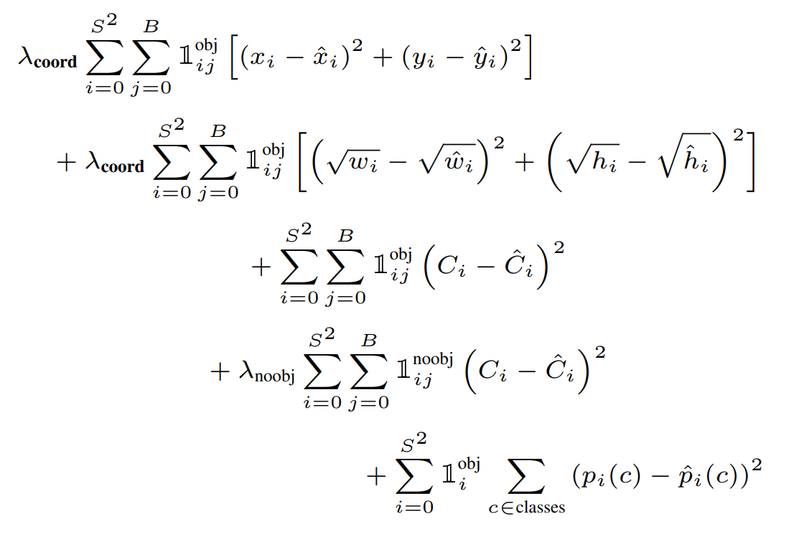

# YOLO

You Only Look Once

 

## Abstract

YOLO 연구진은 객체 검출(Object Detection)에 새로운 접근방식을 적용

기존의 multi-task 문제를 하나의 회귀(regression) 문제로 재정의

YOLO는 이미지 전체에 대해서 하나의 신경망이 한 번의 계산만으로 bounding box와 클래스 확률(class probability)을 예측

- bounding box란 객체의 위치를 알려주기 위해 객체의 둘레를 감싼 직사각형 박스를 말한다. 
- 클래스 확률이란 bounding box로 둘러 싸인 객체가 어떤 클래스에 해당하는지에 관한 확률을 의미한다.

객체 검출 파이프라인이 하나의 신경망으로 구성되어 있으므로 end-to-end 형식이다.

YOLO의 통합된 모델은 굉장히 빠르다.

 

## 1. Introduction

기존의 검출(detection) 모델은 분류기(classifier)를 재정의하여 검출기(detector)로 사용하고 있다.

분류(classification)란 하나의 이미지를 보고 그것이 개인지 고양이인지 판단하는 것을 뜻한다.

객체 검출(object detection)은 하나의 이미지 내에서 개는 어디에 위치해 있고, 고양이는 어디에 위치해 있는지 판단하는 것이다.

따라서, 객체 검출은 분류뿐만 아니라 위치 정보도 판단해야 한다.

기존의 객체 검출 모델로는 대표적으로 DPM과 R-CNN이 있다.

 

DPM(Deformable parts models)은 이미지 전체를 거쳐 슬라이딩 윈도(sliding window) 방식으로 객체 검출을 하는 모델이다.

R-CNN은 이미지 안에서 bounding box를 생성하기 위해 region proposal이라는 방법을 사용한다.

그렇게 제안된 bounding box에 classifier를 적용하여 분류(classification)한다.

분류한 뒤 bounding box를 조정하고, 중복된 검출을 제거하고, 객체에 따라 box의 점수를 재산정하기 위해 후처리(post-processing)를 한다.

이런 복잡함 때문에 R-CNN은 느리다.

각 절차를 독립적으로 훈련시켜야 하므로 최적화(optimization)하기에도 힘들다.

 

그리하여 YOLO 연구진은 객체 검출을 하나의 회귀 문제로 보고 절차를 개선했다.

이미지의 픽셀로부터 bounding box의 위치(coordinates), 클래스 확률(class probabilities)을 구하기까지의 일련의 절차를 하나의 회귀 문제로 재정의한 것이다.

이러한 시스템을 통해 YOLO는 이미지 내에 어떤 물체가 있고 그 물체가 있는지를 하나의 파이프라인으로 빠르게 구해준다.

 

하나의 컨볼루션 네트워크(convolutional network)가 여러 bounding box와 그 bounding box의 클래스 확률을 동시에 계산해 준다.

YOLO는 이미지 전체를 학습하여 곧바로 검출 성능(detection performance)을 최적화한다.

 

YOLO 장점

1. YOLO는 굉장히 빠르다.

왜냐하면, YOLO는 기존의 복잡한 객체 검출 프로세스를 하나의 회귀 문제로 바꾸었기 때문이다.

그리하여, 기존의 객체 검출 모델처럼 복잡한 파이프라인이 필요없다.

단순히 테스트 단계에서 새로운 이미지를 YOLO 신경망에서 넣어주기만 하면 쉽게 객체 검출을 할 수 있다.

YOLO의 기본 네트워크: 1초에 45프레임을 처리

Fast YOLO: 1초에 150프레임 처리

더욱이 YOLO는 다른 실시간 객체 검출 모델보다 2배 이상의 mAP를 갖는다.

 

2. YOLO는 예측을 할 때 이미지 전체를 본다.

슬라이딩 윈도나 region proposal 방식과 달리 YOLO는 훈련과 테스트 단계에서 이미지 전체를 본다.

그리하여, 클래스의 모양에 대한 정보뿐만 아니라 주변 정보까지 학습하여 처리한다.

반면, YOLO 이전의 객체 검출 모델 중 가장 성능이 좋은 모델인 Fast R-CNN는 주변 정보까지는 처리하지 못한다.

그래서 아무 물체가 없는 배경(background)에 반점이나 노이즈가 있으면 그것을 물체로 인식한다.

이를 **background error** 라고 한다.

YOLO는 이미지 전체를 처리하기 때문에 background error가 Fast R-CNN에 비해 훨씬 적다.

 

3. YOLO는 물체의 일반적인 부분을 학습한다.

일반적인 부분을 학습하기 때문에 자연 이미지를 학습하여 그림 이미지로 테스트할 때, YOLO의 성능은 DPM이나 R-CNN보다 월등히 뛰어난다. 

따라서 다른 모델에 비해 YOLO는 훈련 단계에서 보지 못한 새로운 이미지에 대해 더 강건(robust)하다.

즉 검출 정확도가 더 높다

 

단점

하지만, YOLO는 최신(SOTA, state-of-the-art) 객체 검출 모델에 비해 정확도가 다소 떨어진다는 단점이 있다.

빠르게 객체를 검출할 수 있다는 장점은 있지만 정확성이 다소 떨어진다.

특히, 작은 물체에 대한 검출 정확도가 떨어진다.

 

## 2. Unified Detection

YOLO는 객체 검출의 개별 요소를 단일 신경(single neural network)으로 통합한 모델이다.

YOLO는 각각의 bounding box를 예측하기 위해 이미지 전체의 특징을 활용한다.

이러한 YOLO의 디자인 덕분에 높은 정확성을 유지하면서 end-to-end 학습과 실시간 객체 검출이 가능하다.

 

YOLO는 입력 이미지(input images)를 S x S 그리드(grid)로 나눈다.

만약 어떤 객체의 중심이 특정 그리드 셀 안에 위치한다면, 그 그리드 셀이 해당 객체를 검출해야 한다.

 

각각의 그리드 셀은 B개의 bounding box와 그 bounding box에 대한 confidence score를 예측한다.

confidence score는 bounding box가 객체를 포함한다는 것을 얼마나 믿을만한지, 그리고 예측한 bounding box가 얼마나 정확한지를 나타낸단.

confidence score는 다음과 같이 정의한다.

 

 

여기서 IOU는 Intersection over union의 약자로 객체의 실제 bounding box와 예측 bounding box의 합집합 면적 대비 교집합 면적의 비율을 뜻한다.

즉, IOU = (실제 bounding box와 예측 bounding box의 교집합) / (실제 bounding box와 예측 bounding box의 합집합) 이다.

 

만약 그리드 셀에 아무 객체가 없다면 Pr(Object) = 0 이다.

그러므로, confidence score도 0 이다.

그리드 셀에 어떤 객체가 확실히 있다고 예측했을 때, 즉 Pr(Object)=1일 때가 가장 이상적이다.

따라서 confidence score가 IOU와 같다면 가장 이상적인 score이다.

 

각각의 bounding box는 5개의 예측치로 구성되어 있다.

x, y, w, h, confidence이다.

(x, y) 좌표 쌍은 bounding box 중심의 그리드 셀 내 상대 위치를 뜻한다.

절대 위치가 아니라 그리드 셀 내의 상대 위치이므로 0 ~ 1 사이의 값을 갖는다.

만일 bounding box의 중심인 (x, y)가 정확히 그리드 셀 중앙에 위치한다면 (x, y)=(0.5, 0.5)이다.

(w, h) 쌍은 bounding box의 상대 너비와 상대 높이를 뜻한다.

이때 (w, h)는 이미지 전체의 너비와 높이를 1이라고 했을 때 bounding box의 너비와 높이가 몇인지를 상대적인 값으로 나타낸다.

그러므로 (w, h)도 역시 0 ~ 1 사이의 값을 갖는다.

confidence는 앞서 다룬 confidence와 동일하다.

 

그리고 각각의 그리드 셀은 C(conditional class probabilities)를 예측한다.

conditional class probabilities는 다음과 같이 계산할 수 있다.

 

 

이는 그리드 셀 안에 객체가 있다는 조건 하에 그 객체가 어떤 클래스(class)인지에 대한 조건부 확률이다.

그리드 셀에 몇 개의 bounding box가 있는지와는 무관하게 하나의 그리드 셀에는 오직 하나의 클래스에 대한 확률값만을 구한다.

하나의 그리드 셀은 B개의 bounding box를 예측한다고 했다.

B의 개수와는 무관하게 하나의 그리드 셀에서는 클래스 하나만 예측하는 것이다.

 

테스트 단계에서는 conditional class probability와 개별 bounding box의 confidence score를 곱해주는데, 이를 각 bounding box에 대한 class-specific confidence score라고 부른다.

class-specific confidence score는 다음과 같이 계산할 수 있다.

위에서 구한 conditional class probability와 confidence score를 곱한 값이다.

 

 

이 score는 bounding box에 특정 클래스 객체가 나타날 확률(=Pr(Class_i))과 예측된 bounding box가 그 클래스 객체에 얼마나 잘 들어맞는지(fits the object)(=IOU_pred^truth)를 나타낸다.

 

YOLO 연구진은 파스칼 VOC라는 이미지 인식 국제대회 데이터 셋을 이용해 실험했다.

S=7, B=2, C=20

S=7; input image는 7 x7 그리드로 나뉜다.

B=2; 하나의 그리드 셀에서 2개의 bounding box를 예측하겠다는 뜻

이렇게 했을 때 S x S x (B*5 + C) 텐서를 생성한다.

따라서, 최종 예측 텐서의 dimension은 (7x7x30) 이다.

 

### 2.1. Network Design

YOLO 모델은 하나의 CNN 구조로 디자인 되어있다.

YOLO 연구진은 파스칼 VOC 데이터셋에 대해 모델링을 수행했다.

이 CNN의 앞단은 컨볼루션 계층이고, 이어서 전결합 계층(FC layer)으로 구성되어 있다.

컨볼루션 계층(convolutional layer)은 이미지로부터 특징을 추출하고, 전결합 계층(FC layer)은 클래스 확률과 bounding box의 좌표(coordinates)를 예측한다.

 

YOLO의 신경망 구조는 이미지 분류에 사용되는 GoogLeNet에서 따왔다.

YOLO는 총 24개의 컨볼루션 계층과 2개의 전결합 계층(FC layer)으로 구성되어 있다.

GoogLeNet의 인셉션 구조 대신 YOLO는 1x1 축소 계층(reduction layer)과 3x3 컨볼루션 계층의 결합을 사용했다.

1x1 축소 계층(reduction layer)과 3x3 컨볼루션 계층의 결합이 인셉션 구조를 대신한다고 한다.

YOLO 모델의 전체 구조는 다음과 같다.

이 모델의 최종 아웃풋은 7 x 7 x 30의 예측 텐서(prediction tensors)이다.

 

 

좀 더 빠른 객체 인식 속도를 위해 YOLO보다 더 적은 컨볼루션 계층(24개 대신 9개)과 필터를 사용하는 Fast YOLO라는 것도 있다.

크기만 다를 뿐이고 훈련 및 테스트 시 사용하는 나머지 파라미터는 YOLO와 모두 동일하다.

 

### 2.2. Training

우선, 1000개의 클래스를 갖는 ImageNet 데이터셋으로 YOLO의 컨볼루션 계층을 사전훈련(pretrain) 시켰다.

사전훈련을 위해서 24개의 컨볼루션 계층 중 첫 20개의 컨볼루션 계층만 사용했고, 이어서 전결합 계층(FC layer)을 연결했다.

이 모델을 약 1주간 훈련시켰다.

이렇게 사전 훈련된 모델은 ImageNet 2012 검증 데이터셋에서 88%의 정확도를 기록했다.

YOLO 연구진은 이 모든 훈련(training)과 추론(Inference)을 위해 Darknet 프레임워크를 사용했다.

 

Darknet 프레임워크는 YOLO를 개발한 Joseph Redmon이 독자적으로 개발한 신경망 프레임워크이다.

신경망들을 학습하거나 실행할 수 있는 프레임워크로 YOLO도 Darknet에서 학습된 모델 중 하나이다.

 

ImageNet은 분류(Classification)를 위한 데이터셋이다.

따라서 사전 훈련된 분류 모델을 객체 검출(object detection) 모델로 바꾸어야 한다.

연구진은 사전 훈련된 20개의 컨볼루션 계층 뒤에 4개의 컨볼루션 계층 및 2개의 전결합 계층(FC layer)을 추가하여 성능을 향상시켰다.

4개의 컨볼루션 계층 및 2개의 전결합 계층을 추가할 때, 이 계층의 가중치(weight)는 임의로 초기화했다.

또한 객체 검출을 위해서는 이미지 정보의 해상도가 높아야 한다.

따라서, 입력 이미지의 해상도를 224x224에서 448x448로 증가시켰다.

 

YOLO 신경망의 마지막 계층에는 선형 활성화 함수(Linear activation function)을 적용했고, 나머지 모든 계층에는 leaky ReLU를 적용했다.

ReLU는 0이하의 값은 모두 0인데 비해, leaky ReLU는 0이하의 값도 작은 음수 값을 갖는다.

다음은 leaky ReLU의 공식이다.

 

 

YOLO의 loss는 SSE(sum squared error)를 기반으로 한다.

따라서 최종 아웃풋의 SSE를 최적화(optimize) 해야한다.

SSE를 사용한 이유는 SSE가 최적화하기가 쉽기 때문이다.

하지만, SSE를 최적화하는 것이 YOLO의 최종 목적인 mAP(평균 정확도)를 높이는 것과 완벽하게 일치하지는 않다.

YOLO의 loss에는 bounding box의 위치를 얼마나 잘 예측했는지에 대한 loss인 localization loss와 클래스를 얼마나 잘 예측했는지에 대한 loss인 classification loss가 있다.

localization loss와 classification loss의 가중치를 동일하게 두고 학습시키는 것은 좋은 방법이 아니다.

하지만, SSE를 최적화하는 방식은 이 두 loss의 가중치를 동일하게 취급한다.

 

또 다른 문제는, 이미지 내 대부분의 그리드 셀에는 객체가 없다.

배경 영역이 전경 영역보다 더 크기 때문이다.

그리드 셀에 객체가 없다면 confidence score=0이다. 

따라서 대부분의 그리드 셀의 confidence score=0이 되도록 학습할 수 밖에 없다. 이는 모델의 불균형을 초래한다.

 

이를 개선하기 위해 객체가 존재하는 bounding box 좌표(coordinate)에 대한 loss의 가중치를 증가시키고, 객체가 존재하지 않는 bounding box의 confidence loss에 대한 가중치를 감소시켰다.

이는 localization loss와 classification loss 중 localization loss의 가중치를 증가시키고, 객체가 없는 그리드 셀의 confidence loss보다 객체가 존재하는 그리드 셀의 confidence loss의 가중치를 증가시킨다는 뜻이다.

이로써 위의 두 문제가 해결된다.

이를 위해 두 개의 파라미터를 사용했는데, λ_coord와 λ__noobj이다.

λ_coord = 5, λ__noobj = 0.5로 가중치를 줬다.

 

SSE는 또 다른 문제를 가지고 있다.

SSE는 큰 bounding box와 작은 bounding box에 대해 모두 동일한 가중치로 loss를 계산한다.

하지만 작은 bounding box가 큰 bounding box보다 작은 위치 변화에 더 민감하다.

큰 객체를 둘러싸는 bounding box는 조금 움직여도 여전히 큰 객체를 잘 감싸지만, 작은 객체를 둘러싸는 bounding box는 조금만 움직여도 작은 객체를 벗어나게 된다.

이를 개선하기 위해 bounding box의 너비(width)와 높이(height)에 square root를 취해주었다.

너비와 높이에 square root를 취해주면 너비와 높이가 커짐에 따라 그 증가율이 감소해 loss에 대한 가중치를 감소시키는 효과가 있기 때문이다.

 

YOLO는 하나의 그리드 셀 당 여러 개의 bounding box를 예측한다.

훈련(training) 단계에서 하나의 bounding box predictor가 하나의 객체에 대한 책임이 있어야 한다.

즉, 객체 하나당 하나의 bounding box와 매칭을 시켜야 한다.

따라서, 여러 개의 bounding box 중 하나만 선택해야 한다.

이를 위해 예측된 여러 bounding box 중 실제 객체를 감싸는 ground-truth bounding box와의 IOU가 가장 큰 것을 선택한다.

ground-truth bounding box와의 IOU가 가장 크다는 것은 객체를 가장 잘 감싼다는 뜻과 같다.

이렇게 훈련된 bounding box predictor는 특정 크기(size), 종횡비(aspect ratios), 객체의 클래스(classes of object)를 잘 예측학 된다.

 

훈련 단계에서 사용하는 loss function은 다음과 같다.

 

 

여기서 1_i^obj는 그리드 셀 i 안에 객체가 존재하는지 여부를 의미한다.

이 값은 객체가 존재하면 1, 존재하지 않으면 0이다.

1_ij^obj는 그리드 셀 i의 j번째 bounding box predictor가 사용되는지 여부를 의미한다.

 

위 loss function의 5개 식은 차례대로 아래와 같은 의미를 갖는다.

1) 

 

 

 

-------------------

### Reference

- https://arxiv.org/pdf/1506.02640.pdf