# [논문 번역] End-to-End Semi-Supervised Object Detection with Soft Teacher 

## Abstract

이 논문은 이전(multi-stage methods)과 다른 end-to-end의 semi-supervised object detection 방법을 제안한다. 학습을 진행하면서 점진적으로 pseudo label의 퀄리티를 향상시키며,  점점 더 정확한 pseudo label은 object detection 훈젼에 도움이 된다. 

또한 우리는 이 프레임워크 내에서 두가지 단순하면서도 효과적인 기술을 제안한다. 

unlabeled 바운딩 박스의 classification loss가 teacher network에 의해 생성된 classification score로 가중되는 soft teacher mechanism

box regression를 학습하기 위해 신뢰할 수 있는 pseudo boxes를 선택하는 box jittering 접근법

COCO 데이터셋 기준, 다양한 라벨링 비율(1%, 5%, 10%)에서 이전 방법들 보다 더 나은 결과를 냈다.

또한, 우리의 방법은 labeled 데이터의 양이 상대적으로 많을 때 잘 수행된다는 것을 입증했다.

코드와 모델의 링크는 https://github.com/microsoft/SoftTeacher 이다.

 

## 1. Introduction

데이터가 중요하다.(Data matters.)

사실 ImageNet과 같은 큰 데이터는 컴퓨터 비전의 딥러닝 붐을 크게 촉발시켰다. 그러나 레이블 획득은 시간과 비용이 많이 드는 annotation 과정으로 인해 bottleneck 현상이 될 수 있다. 이것은 딥러닝 모델을 학습할때 self-supervised learning와 semi-supervised learning 같은 unlabeled 데이터를 활용하는 학습 방법을 장려했다. 본 논문은 특히 object detection을 위한 semi-supervised learning 문제를 연구한다.

semi-supervised object detection을 위해 우리는 현재 SOTA인 pseudo label 기반의 접근법을 고려한다.  이러한 접근법[27, 36]은 multi-stage 훈련 스키마를 수행하며, 첫번째 단계에서는 labeled 데이터를 이용하여 초기 detector를 훈련한 다음 라벨링되지 않은(unannotated)데이터에 대한 pseudo-labeling 프로세스 및 labeled 데이터에 기초한 재학습(re-training) 단계를 수행한다. 이러한 multi-stage 접근법은 상당히 우수한 정확도를 달성하지만, 최종 성능은 소량의 labeled 데이터를 사용해 훈련된 초기 및 부정확한 detector에 의해 생성된 pseudo labels의 품질(quality)에 의해 제한된다.

이 문제를 해결하기 위해서 unlabeled 이미지에 대한 pseudo labeling을 수행하고 동시에 각 반복(iteration)에서 몇 개의 지정된 레이블과 함께 이러한 pseudo label을 사용하여 detector를 훈련시키는 ens-to-end pseudo label 기반의 semi-supervised object detection framework를 제시한다. 특히 labeled 와 unlabeled 이미지는 하나의 데이터 배치(batch)를 형성하기 위해 사전에 정해진 비율로 무작위로 샘플링된다. 이러한 이미지들에는 2개의 모델이 적용된다. 하나는 detection 훈련에 수행되고 다른 하나는 unlabeled 이미지에 대한 pseudo labels에 annotation하는 역할을 한다. 전자는 student이고, 후자는 student 모델의 exponential moving average(EMA)인 teacher이다. 이 end-to-end 접근법은 복잡한 multi-stage 학습 계획(scheme)를 피한다. 게다가 pseudo labeling과 탐지 훈련 과정이 상호 강화될 수 있는 'flywheel effect'도 가능하게 해서 훈련이 진행될수록 둘 다 점점 더 좋아진다. 

이 end-to-end 프레임워크의 또 다른 중요한 이점은 이전 접근법과 같이 "some generated pseudo boxes with hard category labels"를 제공하는 대신 student 모델의 훈련을 안내하기 위해 teacher 모델을 더 많이 활용할 수 있다는 것이다[27, 36]. soft teacher 접근법은 이 insight를 시행하기위해 제안되었다. 이 접근법에서는 teacher 모델은 이러한 student-generated box 후보자(candidates)에게 카테고리 레이블과 regression vectors를 할당하기 위해 "pseudo boxes"를 제공하는 대신 student 모델에 의해 생성된 모든 box candidates를 직접 평가하는데 사용된다. 이러한 box 후보자에 대한 직접적인 평가(assessment)를 통해 student 모델의 학습에 보다 광범위한 지도(supervision) 정보를 사용할 수 있다. 특히 [27] 과 같이 positive pseudo 레이블의 높은 정밀도(precision)를 보장하기 위해 높은 foreground 임계값(threshold)을 가진 detection score에 따라 box 후보를 foreground/background으로 분류한다. 그러나 이러한 높은 foreground 임계값은 많은 positive box 후보가 배경(background)으로 잘못 할당되는 결과를 초래한다. 이 문제를 해결하기 위해 우리는 각각의 "background" box 후보들의 손실을 가중시키기 위한 reliability(신뢰도) 측정의 사용을 제안한다. 우리는 teacher 모델에 의해 생성된 간단한 detection score가 reliability measure로 잘 적용할 수 있으며, 우리의 접근 방식에 사용된다는 것을 경험적으로 발견했다. 우리는 이 접근법이 이전의 hard foreground/background 할당 방법 보다 훨씬 더 잘 수행된다는것을 발견하고 이를 "soft teacher"라고 명명한다.

insight를 인스턴스화(instantiates)하는 또 다른 접근법은 box jittering 방식을 통해 student's localization branch의 훈련을 위해 신뢰할수 있는 bounding boxes를 선택하는 것이다. 먼저 이 방식은 pseudo-foreground box 후보를 여러번 조금씩 움직이는 것이다. 그런 다음 이 jittered boxes는 teacher model의 location branch에 따라 회귀되고, regressed boxes의 분산은 신뢰도 측도(measuer)로 사용된다. 충분히 높은 신뢰도의 box candidate는 student's localization branch의 학습에 활용된다.

MS-COCO object detection benchmark [16]에서, ResNet-50 [8] 및 FPN [14]과 함께 Faster R-CNN [22] 프레임워크를 사용하여 val2017에서 1%, 5%, 10% 라벨링된 데이터를 20.5mAP, 30.7mAP 및 34.0mAP를 달성하여 이전 최상의 방법인 STAC [27] 각각 +6.5, +6.4, +5.4 mAP 뛰어넘었다.

In addition, we also perform evaluation on a more challenge setting where the labelled data has been adequately large to train a reasonably accurate object detector. Specifically, we adopt the complete COCO train2017 set as labeled data and the unlabeled2017 set as the unlabeled data. Under this setting, we improve the supervised baseline of a Faster R-CNN approach with ResNet-50 and ResNet101 backbones by +3.6 mAP and +3.0 mAP, respectively. Moreover, on a state-of-the-art Swin-Transformer [18] based detector which achieves 58.9 mAP for object detection and 51.2 mAP for instance segmentation on COCO test-dev2017, the proposed approach can still improve the accuracy by +1.5 mAP and +1.2 mAP, respectively, reaching 60.4 mAP and 52.4 mAP. Further incorporating with the Object365 [24] pre-trained model, the detection accuracy reaches 61.3 mAP and the instance segmentation accuracy reaches 53.0 mAP, which is the new state-of-the-art on this benchmark.

 

## 2. Related works

**Semi-supervised learning in image classification**

이미지 분류(classification)에서 semi supervised learning은 대략적으로 consistency 기반과 pseudo label 기반으로 분류할 수 있다. 

consistency 기반의 방법[1, 23, 19, 11]은 unlabeled 이미지를 활용하여 동일한 이미지에 다른 약간의 변화를 줘서 유사한 예측을 생성하도록 하는 정규화(regularization) 손실을 구성한다. perturbing the model [1], augmenting the images [23] 또는 adversarial training [19]을 포함하여 perturbations을 구현하는 몇가지 방법이 있다. [11] 에서는 훈련 target은 다른 훈련 단계(steps)를 예측하여 조립(assembled)된다. [29] 에서는 student 모델의 EMA라고 하는 모델 예측 대신 모델 자체를 앙상블(ensembling)함으로써 [11]을 개발한다.

pseudo-label 접근법 [33, 7, 12] (also named as self-training)은 초기에 훈련된 분류 모델에 의한 pseudo labels로 unlabeled 이미지에 주석(annotate)을 달고, detector는 이러한 pseudo labeled images에 의해 개선(refined)된다. object detection에 초점을 맞춘 우리의 방법과는 다르게 pseudo-label은 이미지를 분류할때 foreground/background labels 와 box regression을 할당하는 문제를 해결할 필요가 없다. 최근 일부 연구 [32, 3, 2, 26]는 semi supervised learning에서 데이터 증강(augmentation)의 중요성을 탐구한다. 이것은 우리가 약한 augmentation을 사용하여 pseudo-labels를 생성하고 detection 모델의 학습을 위해 강한 augmentation 사용하도록 영감을 준다. [13] 에서 SelectiveNet은 pseudo label을 선택하도록 훈련된다. 

 

**Semi-supervised learning in object detection**

이미지 분류의 semi-supervised learning과 유사하게 semi-supervised object detection 방법 또한 2개의 카테고리가 있다. consistency 방법 [10, 28] 과 pseudo-label 방법[20, 36, 13, 27, 31] 이다. 본 논문의 방법은 pseudo-label 범주(category)에 속한다. [20, 36] 에서 서로 다른 데이터 augmentation의 예측은 unlabeled 데이터에 대한 pseudo labels을 형성하여 앙상블된다. [13] 에서는 SelectiveNet은 pseudo-label을 선택하도록 훈련된다. [31] 에서는 unlabeld 이미지에 검출된 box가 labeled 이미지에 붙여넣기(pasted)되고, localization consistency estimation이 pasted label 이미지에 수행된다. 이미지 자체가 수정되므로 [31] 에서는 매우 철저한 detection 프로세스가 요구된다. 우리의 방법에서는 경량 검출 헤드만 처리된다.  STAC [27]은 모델 학습에 약한 augmentation을 사용하고 강한 augmentation은 pseudo-label 수행에 사용할 것을 제안한다. 그러나 다른 pseudo-label 방법 [20, 36, 13, 27, 31]과 마찬가지로 multi-stage 훈련 체계를 따른다. 그에 반해서 우리의 방법은 복잡한 훈련 프로세스는 피하고 더 나은 성능을 달성한 end-to-end 의 pseudo-labeling 프레임워크이다.

 

**Object Detection**

object detection은 효율적이고 정확한 detection 프레임워크를 설계하는데 초점을 맞춘다. 두 개의 mainstreams이 있다. single-stage object detectors [17, 21, 30]와 two-stage object detectors [6, 22, 14, 34, 35]이다. 두 방법의 주요 차이점은 다수의 객체 후보(제안)을 필터링하기 위해 캐스케이드(cascade)를 사용할지 여부이다. 이론적으로 우리의 방법은 두 가지 방법 모두와 호환된다. 하지만, semi-supervised object detection에 관한 이전 연구 [28, 27] 와 공평한 비교를 위해, 우리는 우리의 방법을 실증하기 위해서 기본 detection 프레임워크로 Faster R-CNN [22]를 사용한다.

 

## 3. Methodology

 

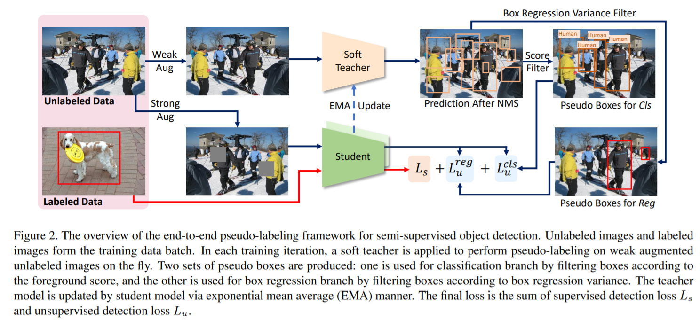

 

Figure 2는 우리의 end-to-end training framework의 개요를 보여준다. student 모델과 teacher 모델 두 가지가 있다.  student 모델은 pseudo boxes를 사용하여 labeled 이미지와 unlabeled 이미지 모두에 대한 detection losses를 통해 학습된다. unlabeled 이미지에는 classification branch 와 regression branch의 tranining을 수행하는데 각각 사용되는 두 개의 pseudo boxes의 sets가 있다.  teacher 모델은 student model의 EMA(exponential moving average)이다. 이 end-to-end framework 내에서, 두개의 주요한 디자인(crucial designs)이 있다: soft teacher and box jittering.

 

### 3.1. End-to-End Pseudo-Labeling Framework

먼저 pseudo label 기반 semi supervised object detection를 위한 end-to-end framework를 소개한다. 우리의 방법은 teacher-student 체계를 따른다. labeled 이미지와 unlabeled 이미지는 training data batch를 형성하기 위해 데이터 샘플링 비율 *Sr* 에 따라 무작위로 샘플링된다. teacher model은 unlabeled 이미지에서 pseudo boxes를 생성하기 위해서서 수행된다. 그리고 student 모델은 ground-truth가 있는 labeled 이미지와 pseudo label이 ground-truth로 있는 unlabeled 이미지 둘 다에 대해 훈련된다. 따라서, 전체 손실(overall loss)은 supervised loss와 unsupervised loss의 가중합(weighted sum)으로 정의된다.

 

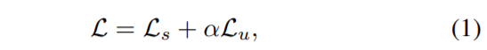

 

여기서 Ls 와 Lu는 각각 labeled 이미지의 supervised loss와 unlabeled 이미지의 unsupervised loss를 나타낸다. α는 unsupervised loss의 기여도를 조절한다. 두 가지 모두 training data batch의 각각의 이미지의 수에 의해 normalized 된다.

 

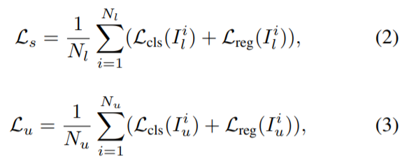

 
$$
I^{i}_{l}
$$
i 번째 labeled 이미지
$$
I^{i}_{u}
$$
i 번째 unlabeled 이미지

$$
L^{}_{cls}
$$

classification loss
$$
L^{}_{reg}
$$
box regression loss
$$
N^{}_{l} \ and \ N_{u}
$$
the number of labeled images and unlabeled images

 

training이 시작될때, teacher 모델과 student 모델 둘다 랜덤하게 초기화된다. training이 진행되면서, teacher 모델은 student 모델에 의해 지속적으로 업데이트되며, teacher 모델은 일반적으로 EMA(exponential moving average) 계획에 따른다.

단순 확률 분포를 이미지 분류에서 pseudo label로 삼는 것과 대조적으로, 이미지는 일반적으로 multiple objects가 포함되어 있고, objects의 annotation은 위치와 카테고리로 구성되어 있기 때문에 object detection을 위한 pseudo label을 만드는 것은 더 복잡하다.  unlabeled 이미지가 주어졌을때, teacher 모델은 object detection에 사용되고 수많은 box 후보가 예측된다. 그런 다음 NMS(non maximum suppression)를 수행하여 중복(redundancy)을 제거한다. 대부분의 중복 box는 제거되지만, 아직 non-foreground 후보가 남아있다. 그러므로, foreground score가 임계값(threshold) 보다 높은 후보(candidates)만 pseudo boxes로 유지된다.

고품질의 pseudo boxes를 생성하고 student 모델의 학습을 용이하게 하기 위해, 우리는 semi supervised image classification task의 최신 발전인 FixMatch [26]을 이용한다. 강한(strong) augmentation은 student 모델의 detection 학습에 적용되고 약한(weak) augmentation은 teacher 모델의 pseudo labeling에 사용된다.

이론적으로, 우리의 framework는 single-stage object detection[15, 17, 21, 30] 과 two-stage object detection[22, 9, 5, 35, 34]을 포함한 주류(mainstream) object detectors에 적용된다. 이전 방법들과 공정한 비교를 위해 우리는 우리의 방법을 설명하기 위한 기본 detection framework로 Faster R-CNN [22]를 사용한다.

 

### 3.2. Soft Teacher

detector의 성능은 pseudo label의 품질(quality)에 따라 달라진다. 실제로 우리는 low confidence로 student 모델의 의해 생성된 box 후보의 대부분을 걸러내기 위해 foreground score에 더 높은 threshold를 사용하면 더 낮은 threshold를 사용하는 것 보다 더 나은 결과를 얻을 수 있다는것을 발견했다. 표 9와 같이 threshold를 0.9로 설정했을때 best performance를 얻었다. 그러나, 높은 threshold가 더 높은 foreground precision을 이끄는 반면, recall은 빠르게 떨어지고 있다. Figure 3에서 a를 보면, foreground threshold를 0.9로 설정했을때, precision은 89%인 반면 recall은 33%로 낮다. 이 경우, 만약 우리가 foreground 와 background labels을 할당하기 위해 student generated box candidates와 teacher generated pseudo boxes 사이에 IoU를 사용한다면, 실제 box annotations가 주어질때 일반적인 object detection framework가 그러하듯이 일부 foreground box candidates는 negatives로 잘못 지정 될 수 있고, 이는 training을 방해하고 performance를 해칠 수 있다.

우리는 end-to-end framework의 유연함(flexibility) 덕분에 teacher 모델의 풍부한 정보를 활용하는 soft teacher를 제안한다. 우리는 각각의 student generated box candidate의 신뢰도(reliability) 를 실제 background로 평가하고, 이는 background classification loss를 측정하는데 사용된다. 두개의 box sets {b^fg_i}와 {b^bg_i}가 주어졌을때,  {b^fg_i} 는 foreground로 할당된 box를 나타내고, {b^bg_i} 는 background로 할당된 box를 나타낸다.

신뢰할수 있는 가중치를 갖는 unlabeled 이미지의 classification loss는 다음과 같이 정의 된다.

 

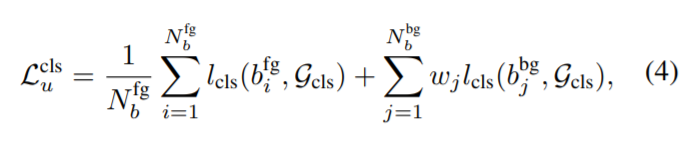

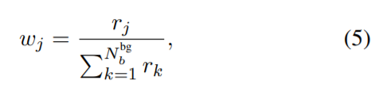

 
$$
\varsigma_{cls}
$$
classification에 사용되는 (teacher-generated) pseudo_boxes의 set
$$
l_{cls}
$$
box classification loss
$$
r_{j}
$$
reliability score for j-th background box candidate
$$
N^{fg}_{b} \ and \ N^{bg}_{b}
$$
number of box candidates of the box sets {b^fg_i} and {b^bg_i}

 

신뢰도(reliability) score를 추정하는것은 어렵다. 우리는 경험적으로 weak augmented 이미지를 가진 teacher 모델에 의해 생성된 background score가 r의 proxy indicator로 잘 작용할 수 있고 우리의 end-to-end framework에서 쉽게 얻을 수 있다는 것을 발견하였다. 구체적으로 student generated box candidate가 주어지면, background score는 detection head를 통해 box를 처리하는 teacher(BG-T)를 사용하여 쉽게 얻어질 수 있다. OHEM [25] 또는 Focal Loss [15]와 같이 널리 사용 되는 hard negative mining 접근법과 달리 이 접근법은 "simple" negative mining에 가깝다는 점에서 주목할 필요가 있다. 비교를 위해서 또한 다음과 같은 지표도 조사했다.

*Background score of student model (BG-S)*: background score를 생성하는 자연스러운 방법은 student 모델의 예측을 직접 사용하는 것이다. 

*Prediction difference (Pred-Diff)*: student 모델과 teacher 모델 사이의 예측 차이도 가능성있는 지표이다. 우리의 방법에 따르면, 두 모델의 background score 사이의 차이를 사용하여 reliability score를 정의하면 된다. 

 

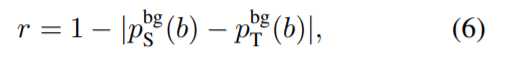
$$
p^{bg}_{S} \ and \ p^{bg}_{T}
$$
 

각각 student 모델과 teacher 모델의 background class의 예측 확률(probability)

*Intersection-over-Union(IoU)* : ground truths와 box candidates 사이의 IoU는 foreground/background 할당에 일반적으로 사용되는 기준이다. box candidate가 background에 속하는지 여부를 측정하기 위해 IoU를 사용하는 방법에 대해서 두 가지 가절이 있다. 첫 번째 가설에 따르면, box candidate와 ground-truth box 사이의 IoU가 threshold(예를들어 0.5) 보다 작으면, IoU가 클수록 box candidate가 background에 속할 확률이 더 높다는 것을 나타낸다. 이것은 초기 구현에서 Fast R-CNN [] 과 Faster R-CNN에 적용된 IoU 기반 hard negative mining으로 볼 수 있다. 이와 대조적으로, 다른 가설은 ground-truth를 가진 IoU가 더 작은 box candidate가 더 background일 가능성이 높다는것을 시사한다. 우리의 실험에서, 우리는 두 가설을 모두 검증하고 IoU와 Reverse-IoU 라고 명명한다.

 

### 3.3. Box Jittering

그림(Figure) 3의 b와 같이, box candidates의 localization accuracy 와 foreground score가 강한 양의 상관관계를 보여주지 않으므로 foreground score가 높은 box는 정확한 localization information을 제공하지 못할 수 있다. foreground score에 따라서 teacher generated pseudo boxes를 선택하는 것은 box regression에 정합하지 않고 더 나은 기준이 필요된다.

regression prediction의 일관성(consistency)을 측정하여 candidate pseudo box의 localization reliability를 추정하는 직관적인 접근법을 소개한다. 특히 teacher generated pseudo box candidate b_i가 주어졌을때, b_i 주위에 jittered box를 샘플로 추출하고, jittered box를 teacher 모델에 넣어서 refind box  ^bi 를 얻는다. 이는 다음과 같이 공식화된다.

 

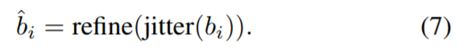

 

위의 방법(precedure)는 여러번 반복되어 refined jittered boxes {^b_i,j} 의 N_jitter의 set를 모은다. 그리고 우리는 localization reliability를  box regression variance으로 정의한다.

 

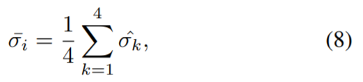

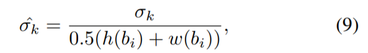

 
$$
\sigma_{k}
$$
standard derivation of the k-th coordinate of the refined jittered boxes set {^b_i,j}
$$
\hat\sigma^{}_{k}
$$
normalized 
$$
h(b_{i}) \ and \ w(b_{i})
$$
height and width of box candidate b_i

 

box regression variance이 작을 수록 localization reliability가 높다는 것을 나타낸다. 그러나, 모든 pseudo box 후보(candidates)의 box regression variances를 계산하는 것은 training 중에 견딜 수 없다. 그러므로, 실제로는 foreground score가 0.5보다 큰 boxes에 대한 reliability 만 계산한다. 이러한 방식으로 추정(estimated)해야 하는 box의 수는 이미지당 평균 수백개에서 약 17개로 줄어들기 때문에 계산 비용은 거의 무시될수 있다.

그림 3의 c에서, 우리는 localization accuracy와 box regression variance 사이의 상관 관계를 설명한다. foreground score와 비교하면, box regression variance는 localization accuracy 보다 더 잘 측정할 수 있다. 이것은 box regression variance가 threshold보다 작은 box candidates를 unlabeled 이미지에 대한 box regression branch를 훈련시키기 위한 pseudo label로 선택하도록 동기를 부여한다. unlabeled data에 대한 box regression을 training하기 위한 pseudo boxes ς 가 주어지면, regression loss은 다음과 같이 공식화 된다.

 

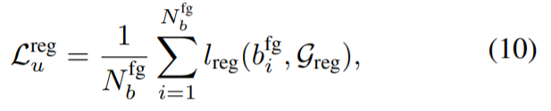

 
$$
b^{fg}_{i}
$$
i-th box aggigned as foreground
$$
N^{fg}_{b}
$$
total number of foreground box
$$
l_{reg}
$$
box regression loss

 

그러므로, 공식 4번과 10번을 3번에 적용함으로써 unlabeled 이미지의 loss는 다음과 같다.

 

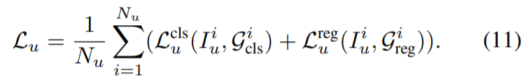

 

여기서는 pseudo boxes ς_cls 와 ς _reg 를 loss의 입력으로 사용하여 classification 과 box regression에 사용되는 pseudo boxes가 우리의 접근 방식에서 다르다는 사실을 강조한다.

 

 

## 4. Experiments

### 4.1. Dataset and Evaluation Protocol

 

### 4.2. Implementation Details

 

### 4.3. System Comparison

 

### 4.4. Ablation Studies

 

## 5. Conclusion

이 논문에서, 우리는 이전 접근법에의해 채택된 복잡한 multi-stage schema를 버리고 semi-supervised object detection을 위한 end-to-end training framework를 제안한다. 우리의 방법은 detection training을 위한 student 모델과 온라인 pseudo-labeling을 위한 지수이동평균(exponential moving average) 전략을 통해 student 모델에 의해 지속적으로 업데이트되는 teacher 모델을 활용하여 detector와 pseudo labels를 동시에 향상시킨다. end-to-end training에서, 우리는 teacher 모델의 효율적인 사용을 위해 soft teacher 와 box jittering 이라는 두 가지 간단한 기술을 제시한다. 제안된 프레임워크는 부분적으로 라벨링된 데이터와 완전히 라벨링된 데이터 모두에서 MS-COCO benchmark에서 SOTA 방법보다 더 나은 결과를 냈다.

 

## 6. Acknowledgement

We would like to thank Yue Cao for his valuable suggestions and discussions; Yutong Lin and Yixuan Wei for help on Swin Transformer experiments.

  

