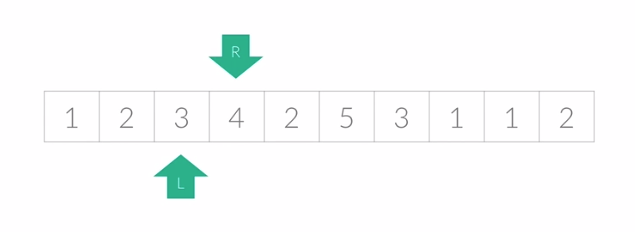

# Two Pointers

 

보통 a부터 b까지의 합이 m이 되는 경우를 묻는 문제에서 이중 포문을 사용해야하는데

경과되는 시간을 줄이기 위해 사용하는 알고리즘

2개의 포인터를 이용해서 원하는 값을 찾는 방식

 

 

### 투 포인터 방법

- 리스트에 순차적으로 접근해야 할 때 두 개의 점을 이용해 위치를 기록하면서 처리하는 기법

 

### 알고리즘 설명

1. 시작점(R)과 끝점(L)이 첫 번째 원소의 인덱스(0)을 가리키도록 한다.
2. 현재 부분 합이 M과 같다면, 카운트한다.
3. 현재 부분 합이 M보다 작거나 같다면, L을 1 증가시킨다.
4. 현재 부분 합이 M보다 크다면, R을 1 증가시킨다.
5. 모든 경우를 확인할 때까지 2번부터 4번까지의 과정을 반복한다.

 

### 예시 문제

백준 - 수들의 합 2

- https://www.acmicpc.net/problem/2003

백준 - 부분수열의 합 2

- https://www.acmicpc.net/problem/1208

백준 - 부분합

- https://www.acmicpc.net/problem/1806

백준 - 수 고르기

- https://www.acmicpc.net/problem/2230

  

--------------------

###  Reference

 

- [동빈나 유튜브 (투 포인터, 구간 합)](https://www.youtube.com/watch?v=rI8NRQsAS_s&ab_channel=%EB%8F%99%EB%B9%88%EB%82%98)

- [https://naivep.tistory.com/52](https://naivep.tistory.com/52)

- [https://myeongmy.tistory.com/7](https://myeongmy.tistory.com/7)