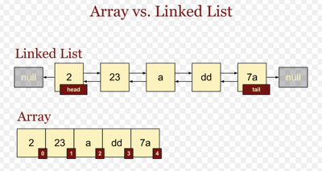

# 배열(Array)와 리스트(List)

 

 

## 배열

### 특징

- 같은 타입의 데이터만 담을 수 있다.
- 연속된 메모리 공간으로 이루어져 있다.
- 인덱스를 이용해서 값을 찾는다.

 

### 장점

- 인덱스를 통한 검색이 용이하다.
- 데이터가 메모리에 연속적으로 저장되기 때문에 메모리 관리가 편하다.

 

### 단점

- 데이터를 삽입, 삭제하는데 비용이 많이 든다.
- 하나의 데이터를 삭제할때, 공간이 남는다(메모리 낭비 발생)
- 데이터를 삽입할때, 많은 과정이 필요하다.
- 정적이므로 배열의 크기를 컴파일 이전에 정해주어야 한다.
- 컴파일 이후 배열의 크기를 변동 할 수 없다.

 

## 리스트

### 특징

- 순서가 있는 데이터의 집합(체인과 유사하다)
- 불연속적으로 메모리 공간을 차지한다.(LinkedList)
- 노드, 포인터

 

### 장점

- 다양한 타입의 데이터를 저장 할 수 있다.

- 포인터를 사용하여 다음 데이터의 위치를 가리키므로 삽입, 삭제가 용이하다.
- 동적이므로 크기가 미리 정해져 있지 않다.
- 불연속적이므로 메모리의 재사용 편리

 

### 단점

- 0번째 부터 데이터를 확인해야 하므로, 검색의 성능이 좋지 않다.
- 포인터를 통해 다음 데이터를 가리키므로 추가적인 메모리 공간 발생

 

 

### Reference

- https://www.youtube.com/watch?v=tKeRUmlmvHk&ab_channel=%EB%93%9C%EB%A6%BC%EC%BD%94%EB%94%A9by%EC%97%98%EB%A6%AC

- https://www.youtube.com/watch?v=q41J1npj86M&ab_channel=%EC%9A%B0%EB%A6%AC%EB%B0%8B_woorimIT

- https://wayhome25.github.io/cs/2017/04/17/cs-18-1/

