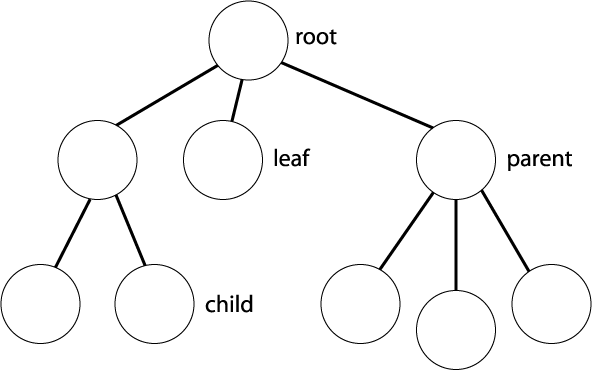

# Tree


<br/>




<br/>

### 트리 관련 용어

- 루트 노드(root node): 부모가 없는 최상위 노드
- 단말 노드(leaf node): 자식이 없는 노드
- 크기(size): 트리에 포함된 모든 노드의 개수
- 깊이(depth): 루트 노드부터의 거리
- 높이(height): 깊이 중 최대값
- 차수(degree): 각 노드의 (자식 방향) 간선 개수

<br/>

- 기본적으로 트리의 크기가 N일 때, 전체 간선의 개수는 N-1 개이다.


<br/><br/>

## 이진 탐색 트리(Binary Search Tree)

<br/>


<br/>

- 이진 탐색이 동작할 수 있도록 고안된 효율적인 탐색이 가능한 자료구조의 일종
- 이진 탐색 트리의 특징: 왼쪽 자식 노드 < 부모 노드 < 오른쪽 자식 노드
  - 부모 노드보다 왼쪽 자식 노드가 작다.
  - 부모 노드보다 오른쪽 자식 노드가 크다.


<br/>

### 데이터 조회 과정 예시

찾고자 하는 원소: 14

<br/>

step 1: 루트 노드부터 방문하여 탐색을 진행

- 현재 노드와 찾는 원소를 비교

- 찾는 원소가 더 크므로 오른쪽 방문

<br/>

step 2: 현재 노드와 값을 비교

- 현재 노드와 찾는 원소를 비교
- 찾는 원소가 더 작으므로 왼쪽 방문

<br/>

step 3: 현재 노드와 값을 비교

- 현재 노드와 찾는 원소를 비교
- 원소를 찾았으므로 탐색을 종료


<br/>

<br/>

## 트리의 순회(Tree Traversal)

- 트리 자료구조에 포함된 노드를 특정한 방법으로 한 번씩 방문하는 방법을 의미한다.
  - 트리의 정보를 시각적으로 확인할 수 있다.
- 대표적인 트리 순회 방법
  - 전위 순회(pre-order traverse): 루트를 먼저 방문한다.
  - 중위 순회(in-order traverse): 왼쪽 자식을 방문한 뒤에 루트를 방문한다.
  - 후위 순회(post-order traverse): 오른쪽 자식을 방문한 뒤에 루트를 방문한다.


<br/>


<br/>

### Code

```python


```


<br/><br/>

-----------------------

### Reference

- http://cs-people.bu.edu/tvashwin/cs112_spring09/lab06.html