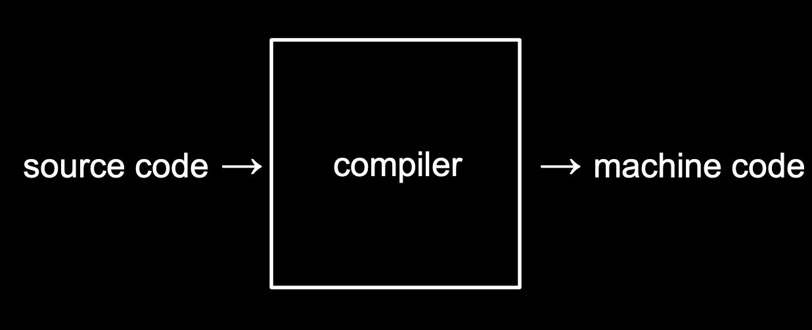

# 1. C 기초

<br/>

### C 언어

- C는 아주 오래되고 전통적인 순수 텍스트 기반의 언어

- hello world 출력

```c
#include <stdio.h>

int main(void)
{
	printf("hello, world\n");
}
```


<br/>

### 컴파일러

- 소스코드
  - 우리가 직접 작성한 코드
- 머신코드
  - 2진수로 작성된 것
  - 머신 코드로 변환해야 컴퓨터가 이해할 수 있다.
  - 이러한 작업을 **컴파일러**라는 프로그램이 수행한다.




<br/>

- clang

  - 'clang' 라는 명령어는 컴파일러 이다.

  - ```
    $ clang hello.c
    ```

  - hello.c 라는 코드를 컴파일 하라는 의미이다.

  - 그 결과 **a.out** 라는 이름의 파일이 생성된다.

- a.out 라는 파일 실행하기

  - ```
    $ ./a.out
    ```

  - 현재 디렉토리에 있는 a.out라는 이름의 프로그램을 실행


<br/>

<br/>

