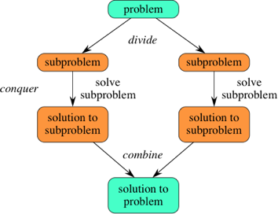

# 컴퓨터공학 입문  1-1

## 문제 해결

목차

- 문제 해결
- 컴퓨터 공학 사고력
- 컴퓨터 공학적 문제 해결 방법


문제 해결

문제(입력) --> [문제 해결 방법과 절차, 알고리즘] --> 해결(출력)

<br/>

### Computational Thinking

```
"CT는 읽기, 쓰기, 셈하기와 더불어 누구나 갖춰야 하는 기본 역량"

"CT는 컴퓨터과학의 이론, 기술, 도구를 활용하여 현실의 복잡한 문제를 해결하는 사고 방식이다.

의학, 법, 경제, 정치, 예술 등 사회 모든 분야에서 보편적으로 필요한 핵심 능력이다."

(Jeannette M. Wing)
```

<br/>

### 컴퓨터 공학 사고력

```
"주어진 문제를 분석, 이해하고
문제의 해결 방법을 컴퓨터 공학의 원리를 적용하여
알고리즘을 도출하고
컴퓨터가 이해하는 프로그래밍 언어로 제시하는 사고능력"
```

<br/>

### 일반적 문제해결과 컴퓨터공학적 문제해결 과정

일반적 문제 해결 과정

- 문제 이해 및 분석
- 문제해결 방안 탐색
- 해결 방법 도출
- 실행 및 평가


컴퓨터 공학적 문제해결 과정

- 문제 이해 및 분석
- 컴퓨터 공학 원리 적용
- 알고리즘 설계와 구현
- 결과 검토

<br/>

### 컴퓨터 공학 사고력

정보를 처리하는 과정과 방식을 이해하고, 다시 컴퓨터에게 프로그래밍 언어로 명령 할 수 있는 사고력

| 개념            | 정의                                                         |
| --------------- | ------------------------------------------------------------ |
| 데이터 수집     | 문제의 이해와 분석을 토대로 문제를 해결하기 위한 자료를 모으는 단계 |
| 자료분석        | 수집된 자료와 문제에 주어진 자료를 세심히 분류하고 분석하는 단계 |
| 데이터 표현     | 문제의 자료 내용을 그래프, 차트, 단어, 이미지 등으로 표현하는 단계 |
| 추상화          | 문제의 복잡도를 줄이기 위해 기본 주요 개념의 일반화 정의를 설정하는 단계 |
| 알고리즘과 절차 | 지금까지 문제를 해결하기 위한 과정을 순서적 단계로 표현하는 단계 |
| 자동화          | 분석한 문제 중 컴퓨터가 수행할 수 있도록 해결과정을 알고리즘화하는 단계 |
| 시뮬레이션      | 문제해결을 위한 실험모델을 만드는 단계                       |

<br/>

### 분할 정복(divide and conquer) 알고리즘



- 어떤 문제를 해결하는 알고리즘에서 원래 문제를 성질이 똑같은 여러개의 부분 문제로 나누어 해결하여 원래 문제의 해를 구하는 방식


### 의사코드, 순서도


### Quiz

- 문제를 해결하는 방법과 절차

  알고리즘

- 문제를 해결하는 절차를 미리 정의된 기호와 도형을 이요하여 시각적으로 표현한것

  순서도


