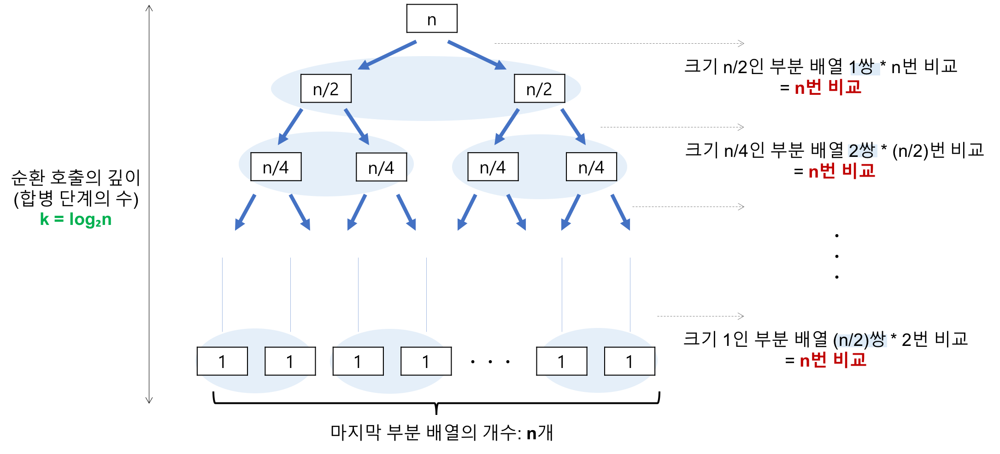

#### 목차

[TOC]

<br/>

# 고급 정렬 알고리즘

## 02.병합 정렬-1

### 1. 병합 정렬(merge sort)

- 재귀용법을 활용한 정렬 알고리즘
  1. 리스트를 절반으로 잘라 비슷한 크기의 두 부분 리스트로 나눈다.
  2. 각 부분 리스트를 재귀적으로 합병 정렬을 이용해 정렬한다.
  3. 두 부분 리스트를 다시 하나의 정렬된 리스트로 합병한다.


<br/>

<br/>


<br/>


<br/>

### 2. 알고리즘 이해

- 데이터가 네 개 일때(데이터 개수에 따라 복잡도가 떨어지는 것은 아니므로, 네 개로 바로 로직을 이해)
  - ex) data_list = [1, 9, 3, 2]
    - 먼저 [1, 9], [3, 2]로 나누고
    - 다시 앞 부분은 [1], [9]로 나누고
    - 다시 정렬해서 합친다.([1, 9])
    - 다음 [3, 2]는 [3], [2]로 나누고
    - 다시 정렬해서 합친다.([2, 3])
    - 이제 [1, 9]와 [2, 3]을 합친다.
      - 합치는 과정
      - 1 < 2 이므로 [1]
      - 9 > 2 이므로 [1, 2]
      - 9 > 3 이므로 [1, 2, 3]
      - 9 하나만 남으므로 , [1, 2, 3, 9] 반환


<br/>

### 3. 알고리즘 구현

- mergesplit 함수 구현
  - 만약 리스트 개수가 한 개 이면 해당 값 리턴
  - 그렇지 않으면 리스트를 앞 뒤, 두 개로 나누기
  - left = mergesplit(앞)
  - right = mergesplit(뒤)
  - merge(left, right)
- merge 함수 구현
  - 리스트 변수 하나 만들기(sorted)
  - left_index, right_index = 0
  - while left_index < len(left) or right_index < len(right):
    - 만약 left_index 나 right_index가 이미 left 또는 right 리스트를 다 순회했다면, 그 반대쪽 데이터를 그대로 넣고, 해당 인덱스 1증가
    - if left[left_index] < rifht[rifht_index]:
      - sorted.append(left[left_index])
      - left_index += 1
    - else:
      - sorted.append(rifht[right_index])
      - right_index += 1


<br/>

<br/>

## 02.병합 정렬-2

<br/>

### 작은 부분부터 작성해서 하나씩 구현

```python
# list를 두개로 나누기
def split(data):
    medium = int(len(data)/2)
    left = data[:medium]
    rifht = data[medium:]
    
    return
```

<br/>

```python
# mergesplit 함수 구현
# 재귀 사용
def mergesplit(data):
    if len(data) <= 1:
        return data
    medium = int(len(data)/2)
    left = mergesplit(data[:medium])
    right = mergesplit(data[medium:])
    return merge(left, right)
```

<br/>

```python
# merge 함수 구현
def merge(left, right):
    merged = list()
    left_point, right_point = 0, 0
    
    # left&right가 아직 남아있을때
    while len(left) > left_point and len(right) > right_point:
        if left[left_point] > right[right_point]:
            merged.append(right[right_point])
            right_point += 1
        else:
            merged.append(left[left_point])
            left_point += 1
        
    # left만 남아있을때
    while len(left) > left_point:
        merged.append(left[left_point])
        left_point += 1
    
    
    # right만 남아있을때
    while len(right) > right_point:
        merged.append(right[right_point])
        right_point += 1
        
    return merged
```


<br/>

<br/>

## 02.병합 정렬-3

### 최종 코드

```python
def mergesplit(data):
    if len(data) <= 1:
        return data
    medium = int(len(data)/2)
    left = mergesplit(data[:medium])
    right = mergesplit(data[medium:])
    return merge(left, right)
    
def merge(left, right):
    merged = list()
    left_point, right_point = 0, 0
    
    # left&right가 아직 남아있을때
    while len(left) > left_point and len(right) > right_point:
        if left[left_point] > right[right_point]:
            merged.append(right[right_point])
            right_point += 1
        else:
            merged.append(left[left_point])
            left_point += 1
        
    # left만 남아있을때
    while len(left) > left_point:
        merged.append(left[left_point])
        left_point += 1
    
    
    # right만 남아있을때
    while len(right) > right_point:
        merged.append(right[right_point])
        right_point += 1
        
    return merged
```


<br/>

- 결과 확인

```python
import random

data_list = random.sample(range(100), 10)
print(data_list)

res = mergesplit(data_list)
print(res)

# [34, 51, 67, 6, 79, 17, 23, 64, 84, 12]
# [6, 12, 17, 23, 34, 51, 64, 67, 79, 84]
```


<br/>

<br/>

## 02.병합 정렬-4

### 알고리즘 분석_시간 복잡도

- 알고리즘 분석은 쉽지 않음, 이 부분은 참고!

  <br/>

  - 


<br/>

- 시간 복잡도는 O(n) * O(logn) = O(n logn)


<br/>

<br/>


