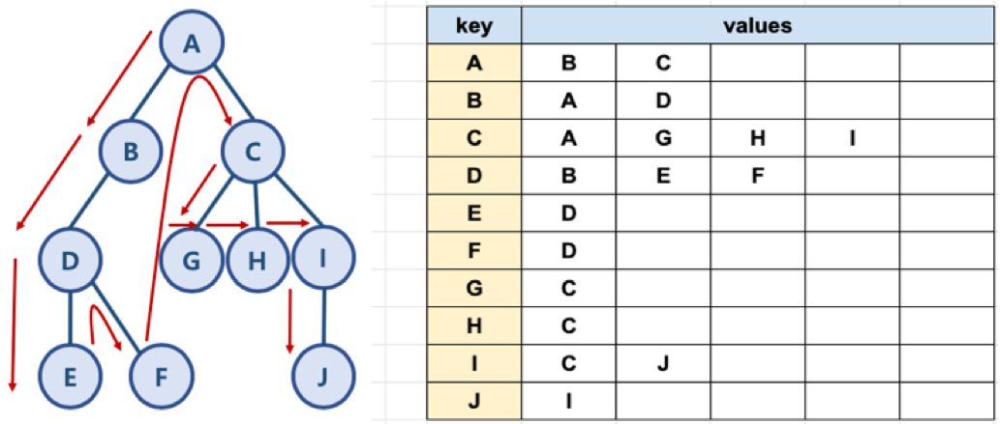

# 그래프 기본 탐색 알고리즘

## 02. 깊이 우선 탐색(DFS)

### BFS 와 DFS 란?

- 대표적인 탐색 그래프 알고리즘
  - 너비 우선 탐색 (Breadth First Search): 정점들과 같은 레벨에 있는 노드들 (형제 노드들)을 먼저 탐색하는 방식
  - 깊이 우선 탐색 (Depth First Search): 정점의 자식들을 먼저 탐색하는 방식

<br/>


<br/>


<br/>

### DFS


<br/>


<br/>

### DFS 알고리즘 구현

- 자료구조 스택과 큐를 활용함

  - need_visit 스택과 visited 큐, 두 개의 자료 구조를 생성

  <br/>

> BFS 자료구조는 두 개의 큐를 활용하는데 반해, DFS 는 스택과 큐를 활용한다는 차이가 있음을 인지해야 함

<br/>

#### 그래프 예와 파이썬 표현

<br/>



<br/>


<br/>

- Code
  - 위 그래프 그림과 진행방향이 다름(code에서는 오른쪽부터 탐색함)

````python
def dfs(graph, start_node):
    visited, need_visit = [], []

    need_visit.append(start_node)

    while need_visit:
        node = need_visit.pop()
        if node not in visited:
            visited.append(node)
            need_visit.extend(graph[node])

    return visited
````

<br/>

- Code 확인하기

```python
graph = dict()

graph['A'] = ['B', 'C']
graph['B'] = ['A', 'D']
graph['C'] = ['A', 'G', 'H', 'I']
graph['D'] = ['B', 'E', 'F']
graph['E'] = ['D']
graph['F'] = ['D']
graph['G'] = ['C']
graph['H'] = ['C']
graph['I'] = ['C', 'J']
graph['J'] = ['I']
```

````python
res = dfs(graph, 'A')
print(res)
['A', 'C', 'I', 'J', 'H', 'G', 'B', 'D', 'F', 'E']
````


<br/>

### 시간 복잡도

- 일반적인 DFS 시간 복잡도
  - 노드 수: V
  - 간선의 수: E
    - 위 코드에서 while need_visit은 V+E 번 만큼 수행함
  - 시간 복잡도: O(V+E)


<br/>

<br/>

-------------

### Reference

-  https://www.fun-coding.org/Chapter18-dfs-live.html 


<br/>


