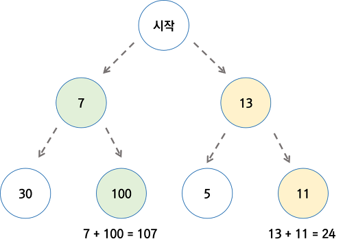

# 탐욕 알고리즘

## 01. 탐욕 알고리즘의 이해

### 1. 탐욕 알고리즘 이란?

- Greedy algorithm 또는 탐욕 알고지름 이라고 불린다.
- 최적의 해에 가까운 값을 구하기 위해 사용됨
- 여러 경우 중 하나를 결정해야할 때마다, **매순간 최적이라고 생각되는 경우를 선택**하는 방식으로 진행해서, 최종적인 값을 구하는 방식


<br/>

### 2. 탐욕 알고리즘 예시

#### 문제1. 동전 문제

- 지불해야 하는 값이 4720원 일때, 1원, 50원, 100원, 500원 동전으로 동전의 수가 가장 적게 지불하시오.
  - 가장 큰 동전부터 최대한 지불해야 하는 값을 채우는 방식으로 구현 가능
  - 탐욕 알고리즘으로 매순간 최적이라고 생각되는 경우를 선택하면 됨

<br/>

- Code

```python
def min_coin_count(value, coin_list):
    coin_count = 0
    details = []

    for coin in coin_list:
        coin_num = value // coin
        coin_count += coin_num
        value -= coin_num*coin
        details.append([coin, coin_num])

    return coin_count, details
```

<br/>

- Code 확인하기

````python
value = 4720
coin_list = [500, 100, 50, 1]

res = min_coin_count(value, coin_list)
print(res)

# (31, [[500, 9], [100, 2], [50, 0], [1, 20]])
````


<br/>

#### 문제2. 부분 배낭 문제(Fractional Knapsack Problem)

- 무게 제한이 k인 배낭에 최대 가치를 가지도록 물건을 넣는 문제

  - 각 물건은 무게(k)와 가치(v)로 표현될 수 있음

  - 물건은 쪼갤 수 있으므로 물건의 일부분이 배낭에 넣어질 수 있음, 그래서 Fractional Knapsack Problem으로 부름

    - Fractional Knapsack Problem 의 반대로 물건을 쪼개서 넣을 수 없는 배낭 문제도 존재함(0/1 Knapsack Problem으로 부름)

      | 물건(i) | 물건1 | 물건2 | 물건3 | 물건4 | 물건5 |
      | ------- | ----- | ----- | ----- | ----- | ----- |
      | 무게(w) | 10    | 15    | 20    | 25    | 30    |
      | 가치(v) | 10    | 12    | 10    | 8     | 5     |

<br/>

- Code

```python
def get_max_value(data_list, k):
    total_value = 0
    details = []
    data_list = sorted(data_list, key=lambda x: x[1]/x[1], reverse=True)

    for data in data_list:
        if k - data[0] >= 0 :
            k -= data[0]
            total_value += data[1]
            details.append([data[0], data[1], 1])
        else:
            fraction = k / data[0]
            total_value += data[1]*fraction
            details.append([data[0], data[1], fraction])
            break

    return total_value, details
```

<br/>

- Code 확인하기

```python
data_list = [(10, 10), (15, 12), (20, 10), (25, 8), (30, 5)]
k = 30

res = get_max_value(data_list, k)
print(res)

# (24.5, [[10, 10, 1], [15, 12, 1], [20, 10, 0.25]])
```


<br/>

### 3. 탐욕 알고리즘의 한계

- 탐욕 알고리즘은 근사치 추정에 활용
- 반드시 최적의 해를 구할 수 있는 것은 아니기 때문
- 최적의 해에 가까운 값을 구하는 방법 중의 하나임

<br/>



<br/>

- Greedy를 이용하면 답이 7 -> 100 이 되지만
- 진짜 가장 작은 값은 13 -> 11 로 24가 가장 작은 값이 된다.


<br/><br/>