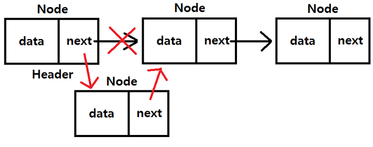

# 링크드 리스트(Linked List) -2


## 링크드 리스트의 장단점(전통적인 C언어에서의 배열과 링크드 리스트)

### 장점

- 미리 데이터 공간을 미리 할당하지 않아도 된다
  - 배열은 미리 데이터 공간을 할당 해야 함


### 단점

- 연결을 위한 별도 데이터 공간이 필요하므로 저장 공간 효율이 높지 않음
- 연결 정보를 찾는 시간이 필요하므로 접근 속도가 느림
- 중간 데이터 삭제시 앞뒤 데이터의 연결을 재구성해야 하는 부가적인 작업이 필요


## 링크드 리스트의 복잡한 기능1(링크드 리스트 데이터 사이에 데이터를 추가)


- 링크드 리스트는 유지 관리에 부가적인 구현이 필요함

  - 중간에 값을 넣기 위해서는 전에 만들어지 연결을 끊고 다시 연결해야하는 번거로움이 있다

  





<br>


```python
node = head
while node.next:
	print(node.data)
	node = node.next
print(node.data)
```


```python
node3 = Node(1.5)
```


```python
# 중간에 값을 넣을려면 우선 넣을 위치를 찾아야한다
node = head
search = True
while search:
	if node.data == 1:
		search = False
	else:
		node = node.next
# 연결을 새로 해준다
# ex) 직선으로 가던것을 돌아가도록
node_next = node.next
node.next = node3

node3.next = node_next
```


- node.data를 다시 출력해서 제대로 중간에 들어갔는지 확인!


<br>


## 파이썬 객체지향 프로그래밍으로 링크드 리스트 구현하기


```python
class Node:
	def __init__(self, data, next=None):
		self.data = data
		self.next = next
	
# node를 관리
class NodeMgmt:
	def __init__(self, data):
		self.head = Node(data)

	# 맨 끝에 새로운 node를 추가하는 기능
	def add(self, data):
		# 방어 코드
		# node가 하나만 있을때
		if self.head == "":
			self.head = Node(data)
		else:
		node = self.head
		while node.next:
			node = node.next
		node.next = Node(data)
		
	# 순회
	def desc(self):
		node = self.head
		while node:
			print(node.data)
			node = node.next
```


```python
# 실행 예시
linkelist1 = NodeMgmt(0)
linkedlist1.desc()

# 0
```


```python
for data in range(1, 10):
	linkedlist1.add(data)

linkedlist1.desc()
# 0
# 1
...
# 8
# 9
```

