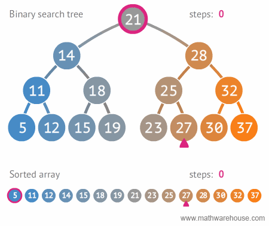
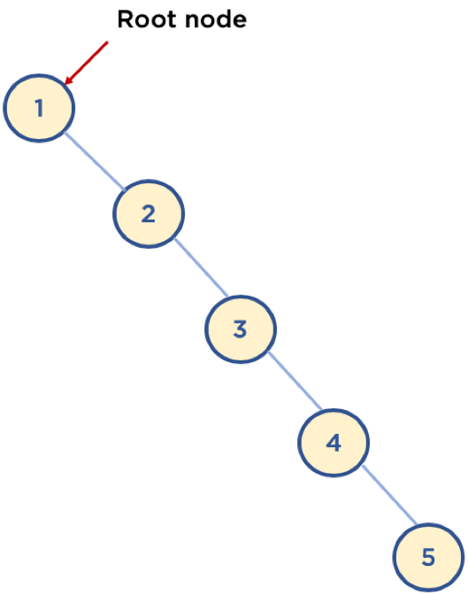

# 트리(Tree)-7

#### Tree 전체 코드

```python
class Node:
    def __init__(self, value):
        self.value = value
        self.left = None
        self.right = None

        
class NodeMgmt:
    def __init__(self, head):
        self.head = head
    
    def insert(self, value):
        self.current_node = self.head
        while True:
            if value < self.current_node.value:
                if self.current_node.left != None:
                    self.current_node = self.current_node.left
                else:
                    self.current_node.left = Node(value)
                    break
            else:
                if self.current_node.right != None:
                    self.current_node = self.current_node.right
                else:
                    self.current_node.right = Node(value)
                    break
    
    def search(self, value):
        self.current_node = self.head
        while self.current_node:
            if self.current_node.value == value:
                return True
            elif value < self.current_node.value:
                self.current_node = self.current_node.left
            else:
                self.current_node = self.current_node.right
        return False        
    
    def delete(self, value):
        # 삭제할 노드 탐색
        searched = False
        self.current_node = self.head
        self.parent = self.head
        while self.current_node:
            if self.current_node.value == value:
                searched = True
                break
            elif value < self.current_node.value:
                self.parent = self.current_node
                self.current_node = self.current_node.left
            else:
                self.parent = self.current_node
                self.current_node = self.current_node.right

        if searched == False:
            return False    

        # case1
        if  self.current_node.left == None and self.current_node.right == None:
            if value < self.parent.value:
                self.parent.left = None
            else:
                self.parent.right = None
        
        # case2
        elif self.current_node.left != None and self.current_node.right == None:
            if value < self.parent.value:
                self.parent.left = self.current_node.left
            else:
                self.parent.right = self.current_node.left
        elif self.current_node.left == None and self.current_node.right != None:
            if value < self.parent.value:
                self.parent.left = self.current_node.right
            else:
                self.parent.right = self.current_node.right        
        
        # case 3
        elif self.current_node.left != None and self.current_node.right != None: # case3
            if value < self.parent.value:
                self.change_node = self.current_node.right
                self.change_node_parent = self.current_node.right
                while self.change_node.left != None:
                    self.change_node_parent = self.change_node
                    self.change_node = self.change_node.left
                if self.change_node.right != None:
                    self.change_node_parent.left = self.change_node.right
                else:
                    self.change_node_parent.left = None
                self.parent.left = self.change_node
                self.change_node.right = self.current_node.right
                self.change_node.left = self.change_node.left
            # case 3-2
            else:
                self.change_node = self.current_node.right
                self.change_node_parent = self.current_node.right
                while self.change_node.left != None:
                    self.change_node_parent = self.change_node
                    self.change_node = self.change_node.left
                if self.change_node.right != None:
                    self.change_node_parent.left = self.change_node.right
                else:
                    self.change_node_parent.left = None
                self.parent.right = self.change_node
                self.change_node.left = self.current_node.left
                self.change_node.right = self.current_node.right

        return True
```


<br/>

- Code 확인하기
  - 0 ~ 999 중에서 임의로 100개의 숫자를 추출하여, 이진 탐색 트리에 입력, 검색, 삭제하기

```python
import random

# 0 ~ 999 중, 100개의 숫자 랜덤 선택
# 중복제거를 위해 set() 사용
bst_nums = set()
while len(bst_nums) != 100:
    bst_nums.add(random.randint(0, 999))
    
# 100개의 숫자 이진 탐색 트리에 입력, 임의로 루트노드는 500을 넣기로 함
head = Node(500)
binary_tree = NodeMgmt(head)
for num in bst_nums:
    binary_tree.insert(num)

# 입력한 100개의 숫자를 검색 (검색 기능 확인)
for num in bst_nums:
    if binary_tree.search(num) == False:
        # print ('search failed', num)

# 입력한 100개의 숫자 중 10개의 숫자를 랜덤 선택
delete_nums = set()
bst_nums = list(bst_nums)
while len(delete_nums) != 10:
    delete_nums.add(bst_nums[random.randint(0, 99)])

# 선택한 10개의 숫자를 삭제 (삭제 기능 확인)
for del_num in delete_nums:
    if binary_tree.delete(del_num) == False:
        # print ('search failed', delete_nums, del_num)
```


<br/><br/>

# 트리(Tree)-8

### 6. 이진 탐색 트리의 시간 복잡도와 단점

#### 6.1. 시간 복잡도(탐색시)

- depth(트리의 깊이)를 h라고 표기한다면, O(h)
- n개의 노드를 가진다면, h = logn에 가까우므로, 시간 복잡도는 O(logn)

<br/>



<br/>


<br/>

#### 6.2. 이진 탐색 트리 단점

- 평균 시간 복잡도는 O(logn) 이지만,
  - 이는 트리가 균형잡혀 있을 때의 평균 시간복잡도이며
- 다음 아래의 그림과 같이 되어 있을 경우, 최악의 경우에는 링크드 리스트 등과 동일한 성능을 보여준다.(O(n))

<br/>



<br/>


<br/>

----

### Reference

-  https://www.fun-coding.org/Chapter10-tree.html 
-  https://blog.penjee.com/5-gifs-to-understand-binary-search-tree/#binary-search-tree-insertion-node 

<br/><br/>