# Typora 수식 사용법

 

> .md 파일 작성 중 수식을 입력해야 했다.
>
> 
>
> 그런데 수식을 입력하는 부분에 암기(?)를 해야 하는 부분이 있어서 그냥 기록을 해두고 나중에 필요한 부분을 찾아 사용하기로 했다.
>
> 
>
> 더 많은 수식 사용법이 있지만 당장 내가 사용할법한 것들 위주로 기록했다.

 

 

## 사용법

- 본문 -> 수식 블록 click
- 단축키
  - `Ctrl` + `Shift` + `M`

 

- 수식 블록

  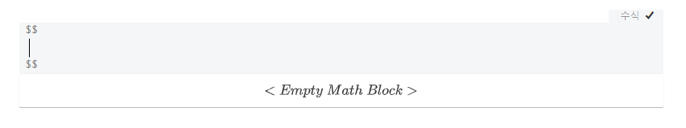

블록안에 수식을 작성하면 된다.

 

## 수식 블록

 

| Result                           | 입력할 수식                                   |
| :------------------------------- | :-------------------------------------------- |
| 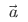      | \vec{a}                                       |
| 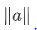    | \lVert a \rVert                               |
| 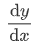       | {\operatorname{d}\!y\over\operatorname{d}\!x} |
| 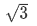       | \sqrt{3}                                      |
| 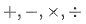   | +, -, \times, \div                            |
|      | \\\{\\}                                       |
|      | \cdots                                        |
| 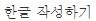   | \text{한글 작성하기}                          |
| 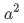       | a^2                                           |
| 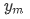     | y_m                                           |
| 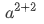 | a^{2+2}                                       |
| 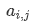        | a_{i,j}                                       |
| 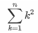     | \sum_{k=1}^n k^2                              |
| 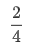      | \frac{2}{4}                                   |
|       | {2 \over 4}                                   |
| 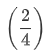   | \left(\frac{2}{4} \right)                     |
| 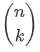   | {n \choose k}                                 |

 

### 행렬

| Result                      | 입력할 수식                                  |
| --------------------------- | -------------------------------------------- |
| 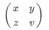 | \begin{pmatrix} x & y \\ z & v \end{pmatrix} |
| 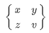 | \begin{Bmatrix} x & y \\ z & v \end{Bmatrix} |
| 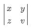 | \begin{vmatrix} x & y \\ z & v \end{vmatrix} |
| 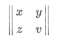 | \begin{Vmatrix} x & y \\ z & v \end{Vmatrix} |
| 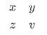 | \begin{matrix} x & y \\ z & v \end{matrix}   |

 

### 괄호

| Result                           | 입력할 수식                  |
| -------------------------------- | ---------------------------- |
| 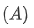       | \left( A \right)             |
| 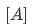   | \left[ A \right]             |
| 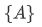   | \left\{ A \right\}           |
| 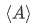 | \left\langle A \right\rangle |
|          | \left                        |

  

-----

### 참고

[위키백과: TeX 문법](https://ko.wikipedia.org/wiki/%EC%9C%84%ED%82%A4%EB%B0%B1%EA%B3%BC:TeX_%EB%AC%B8%EB%B2%95)

[MathJax](https://math.meta.stackexchange.com/questions/5020/mathjax-basic-tutorial-and-quick-reference)

