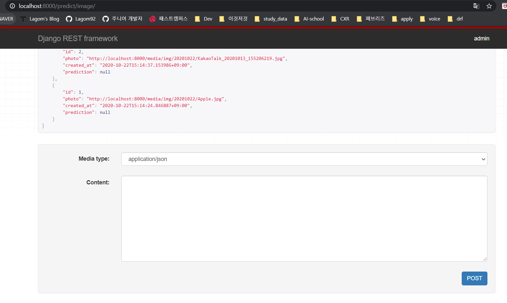
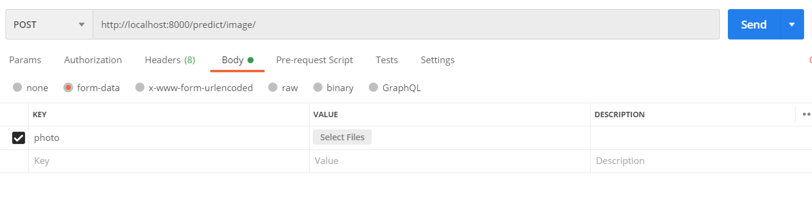
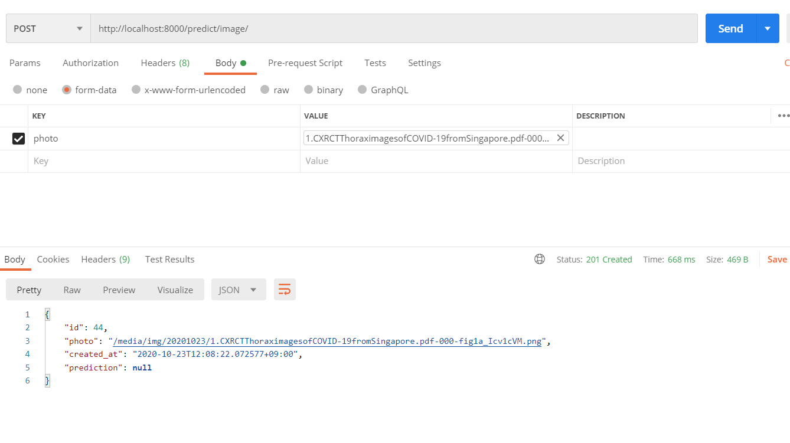

# Postman에서 이미지 post하기

 

> DRF를 구현하고 있는데 FBV로 작성한 api를 테스트하는데 작은 문제(?)가 발생했다.
>
> 그래서 
>
> postman으로 api의 동작을 테스트하려고 했다.
>
> 그런데 
>
> 이미지를 post 방식으로 요청하는 방법을 몰라서 당황했다.
>
> 
>
> 알면 쉬운 방법이니 이렇게 기록을 해두자!

 

## 나의 작은 문제(?)

- FBV로 작성 한 내 api 이미지

 

- 밑에 post 보내는 부분이 저렇게 되어있을때 이미지를 입력하는 방법을 모르겠다.
- 그 방법을 찾아 볼까 하다가 그냥 `Postman` 을 사용하는데 거 좋을꺼 같아서 위에꺼를 사용하는 방법은 찾아보지 않았다. 
- 나중에 기회가 된다면 저 부분을 공부해야겠다.

 

 

## Postman 사용(이미지 post)

 

- method를 POST로 변경
- body 클릭
- form-data 클릭
- KEY 부분의 항목을 file로 변경, 파라미터 이름 적기
- VALUE에 있는 Select Files 버튼을 눌러서 이미지 첨부하기
- Send 버튼 누르면 끝 !!

 

- 결과 확인 !

 

 

### Reference

- https://elfinlas.github.io/2019/01/16/postman-insert-img/

 