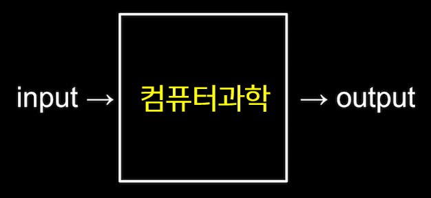
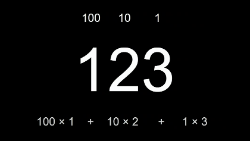
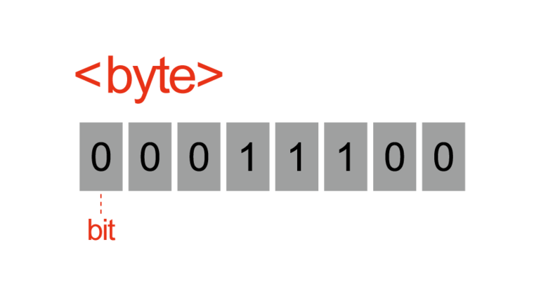

# 1. 2진법

 

### 컴퓨터 과학

- 컴퓨터 과학은 **문제 해결에 대한 학문**이다.

- 입력(input)을 전달받아 출력(output)을 만들어내는 과정
- 그 중간에 있는 과정이 컴퓨터 과학

 

 

- 입력과 출력을 표현하기 위해서는 우선 모두가 동의할 약속(표준)이 필요하다.
- 컴퓨터 과학의 가장 첫 번째 개념은 어떻게 표현하는지에 대한 표현 방법

 

### 2진법

- 10진법
  - 0, 1, 2, 3, 4, 5, 6, 7, 8, 9 총 10개의 기호로 표현하는 것
- 컴퓨터는 0과 1로만 데이터를 표현한다.
- 이처럼 0과 1로만 표현하는 것을 **2진법**이라고 한다.

 

예시) 백이십삼(10진법)

 

예시) 삼(2진법)

 

- 컴퓨터에는 트랜지스터(스위치)가 있고 on/off 상태를 통해 0과 1을 표현한다.

- 비트(bit)
  - 2진법에서 하나의 자릿수를 표현하는 단위

 

### 비트(bit)

- 정보를 저장하고 연산을 수행하기 위해 컴퓨터는 비트(bit)라는 측정 단위를 쓴다.
- 이진 숫자라는 뜻을 가진 **binary digit**의 줄임말
- 0과 1, 두 가지 값만 가질 수 있는 측정 단위 
- 디지털 데이터를 여러 비트들로 나타냄으로써 두 가지 값만을 가지고도 많은 양의 정보를 저장할 수 있다.
- 컴퓨터는 저장되어 있는 데이터를 수정하기 위해 비트에 수학적 연산을 수행할 수 있다.

 

### 비트열

- 하나의 비트는 0과 1, 두 가지의 값만 저장할  수 있다.

- 비트 한 개는 많은 양의 데이터를 나타내기에는 부족하므로 여러 숫자 조합을 컴퓨터에 나타내기 위해 비트열을 사용한다.

- **바이트(byte)**

  - 여덟(8) 개의 비트가 모여 만들어진 것
  - 2^8 = 256개의 서로 다른 바이트가 존재할 수 있다.
  - 킬로바이트, 메가바이트, 기가바이트 등

   

  

 

 

