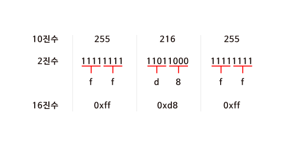
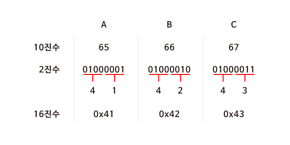

# 1. 메모리 주소

<br/>

### 16진수

- 컴퓨터 과학에서는 숫자를 10진수나 2진수 대신 **16진수(Hexadecimal)**로 표현하는 경우가 많다.
- 16진수를 사용하면 10진수보다 2진수를 간단하게 나타낼 수 있다.


<br/>

### 10진수를 16진수로 바꾸어보기

<br/>

- JPG 이미지 파일은 항상 225 216 255 로 시작되고 이것은 10진수 이다.
- 하지만 실제 컴퓨터 내부에서는 10진수를 사용하지 않는다. 컴퓨터는 0과 1만 이해할 수 있기 때문이다.

<br/>



<br/>

- **2^4 이 14이기 때문에 4bits 씩** 두 덩어리로 나누어 보면 0000 부터 1111 까지는 16 진수로 표현할 수 있다는 것을 알 수 있다.

- 16진수로 변환 후 **0x** 를 붙혀 뒤에 오는 문자들이 16진수임을 알려준다. 


<br/>

### 16진수의 유용성

- 16진수로 표현하면 2진수로 표현했을 때보다 훨씬 간단해진다.
- 또한, 컴퓨터는 8개의 비트가 모인 바이트 단위로 정보를 표현한다.
- **2개의 16진수는 1 byte의 2진수로 변환** 되기 때문에 정보를 표현하기 매우 유용하다.

<br/>



<br/>

### 메모리 주소

- 정수형 변수 n 에 50이라는 값을 저장하고 출력한다고 생각해보자.
- n 이라는 값은 **int** 타입이므로, 아래 그림과 같이 우리 컴퓨터의 메모리 어딘가에 **4바이트** 만큼의 자리를 차지하며 저장되어 있을 것이다.

<br/>


<br/>

### &

C 에서는 변수의 **메모리상 주소**를 받기 위해 **'&'**이라는 연산자를 사용할 수 있다.

- what is address ???


<br/>

```c
#include <stdio.h>

int main(void)
{
    int n = 50;
    printf("%p\n", &n);
}
```


<br/>

- 예를 들어, 위 코드를 실행하면 ‘0x7ffe00b3adbc’와 같은 값을 얻을 수 있고, 이는 변수 n의 **16진법**으로 표현된 메모리의 주소이다.
- 포인터(p)
  - 컴퓨터 메모리의 주소를 가리키는 것
  - &p


<br/>

### *

반대로, **'*'** 를 사용하면 그 메모리 주소에 있는 **실제 값**을 얻을 수 있다.

- go to address

```c
#include <stdio.h>

int main(void)
{
    int n = 50;
    printf("%i\n", *&n);
}
```

<br/>

-  위 코드는 먼저 **n의 주소**를 얻고, 또 다시 **그 주소에 해당하는 값**을 얻어와 출력한 것이므로 결국 ‘50’이라는 값이 출력한다.


<br/><br/>