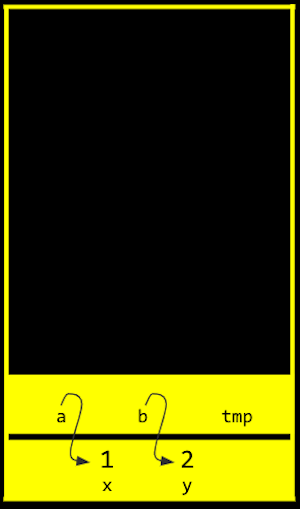

# 7. 메모리 교환, 스택, 힙

<br/>

메모리에 저장된 두 값을 교환하는 코드 작성하기


스택

힙

포인터


<br/>

- 아래와 같은 코드가 있다.
- 함수 **swap**은 정수 a와 b를 입력받아 그 값을 바꾸는 일을 수행한다.
- main 함수에서는 x에 1, y에 2를 입력하고 swap 함수를 통해 그 두 값을 바꾸려고 하고 있다.

```c
#include <stdio.h>

void swap(int a, int b);

int main(void)
{
    int x = 1;
    int y = 2;
    
    printf("x is %i, y is %i\n", x, y);
    swap(x, y);
    printf("x is %i, y is %i\n", x, y);
}

void swap(int a, int b)
{
    int tmp = a;
    a = b;
    b = tmp;
}
```


<br/>

- 위 코드를 컴파일하고 출력해보면 의도와는 다르게 swap 함수를 거친 후에도 x와 y의 값이 바뀌지 않은채 그대로 출력됨을 알 수 있다.


<br/>

- 사실 swap 함수는 교환 작업을 제대로 수행하고 있는데, 문제는 교환하는 대상이 x, y 그 자체가 아닌 함수 내에서 새롭게 정의된 a, b라는 것이다.
- a 와 b는 각각 x와 y의 **값을 복제**하여 가지게 된다
- **서로 다른 메모리 주소에 저장**되는 것이다.


<br/>

- 아래 그림에서와 같이 메모리 안에는 데이터가 저장되는 구역이 나뉘어져 있다.
- 머신 코드 영역에는 프로그램이 실행될 때 그 프로그램이 컴파일된 바이너리가 저장된다.
- 글로별 영역에는 프로그램 안에서 저장된 전역 변수가 저장된다.
- **힙** 영역에는 malloc으로 할당된 메모리의 데이터가 저장된다.
- 그리고, **스택**에는 프로그램 내의 함수와 관련된 것 들이 저장된다.


<br/>


<br/>

- 이를 바탕으로 다시 생각해보면,
- 위의 코드에서 a, b, x, y, tmp 모두 **스택 영역**에 저장되지만 a와 x, b와 y는 그 안에서도 서로 다른 위치에 저장된 변수이다.
- 따라서, a와 b를 바꾸는 것은 x와 y를 바꾸는 것에 아무런 영향도 미치지 않는 것이다.


<br/>

- 따라서 아래 그림 및 코드와 같이 a와 b를 각각 **x와 y를 가리키는 포인터로 지정**함으로써 이 문제를 쉽게 해결할 수 있다.


<br/>




<br/>

- 코드

```c
#include <stdio.h>

void swap(int *a, int *b);

int main(void)
{
    int x = 1;
    int y = 2;

    printf("x is %i, y is %i\n", x, y);
    swap(&x, &y);
    printf("x is %i, y is %i\n", x, y);
}

void swap(int *a, int *b)
{
    int tmp = *a;
    *a = *b;
    *b = tmp;
}
```


<br/><br/>