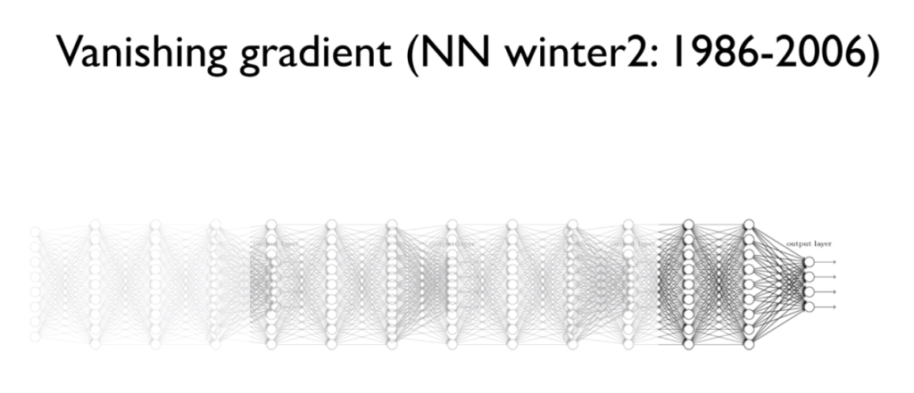

# Lecture 10-1

## ReLU: Better non-linearity


<br/>

### NN for XOR

#### Activation function

- sigmoid


<br/>

 ### lec9-2: Backpropagation(Chain rule)


<br/>

### Vanishing gradient




<br/>

### ReLU


<br/>


<br/>

<br/>

# Lecture 10-2

## Initialize weights in a smart way

딥러닝을 잘하는 방법 => 초기값 설정 !


<br/>

### RBM

- 초기값 설정 관련 내용, 단 지금은 잘 사용되지 않음
- 인코더 / 디코더


<br/>

### Xavier initialization

2010

```python
# tf 1.x
W = np.random.randn(fan_in, fan_out) / np.sqrt(fan_in)
```


<br/>

### He's initialization

2015

```python
# tf 1.x
W = np.random.randn(fan_in, fan_out) / np.sqrt(fan_in/2)
```


<br/>

<br/>

# Lecture 10-3

## NN dropout and model ensemble


<br/>

### Overfitting


<br/>

### Regularization


<br/>

### Dropout

- A simple way to prevent neural networks from overfitting [Srivastava et al.2014]


<br/>

### Ensemble


<br/>

 <br/>

# Lecture 10-4

## NN LEGO Play


<br/>

### Feedforward neural network


<br/>

### Fast forward


<Br/>

### Split & merge

- ex) CNN


<br/>

### Recurrent network

- ex) RNN


<br/>

<br/>


