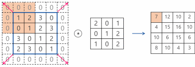

# Lecture 11-1

## CNN introduction

 

### Start with an image

 

filter

 

### Get one number using the filter

 

Wx + b

= ReLU(Wx + b)

 

 

**Stride**

 

### Output size

**= (N - F) / stride + 1**

- image: N x N
- filter: F x F

 

### Padding

 

padding 사용 이유: 입력의 사이즈와 출력의 사이즈를 같게 하기 위해서

-ing

 

 

# Lecture 11-2

## CNN introduction: Max pooling and others

 

### Pooling layer(sampling)

 

### Max pooling

 

sampling

 

### Fully Connected Layer (FC layer)

 

  