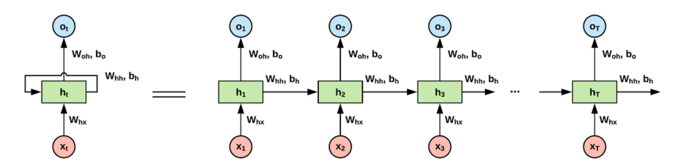
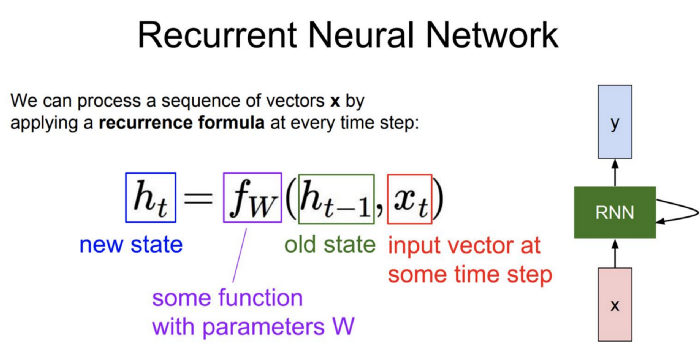
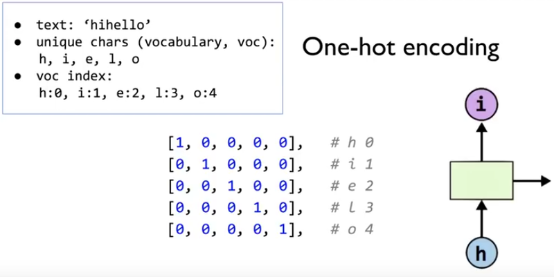
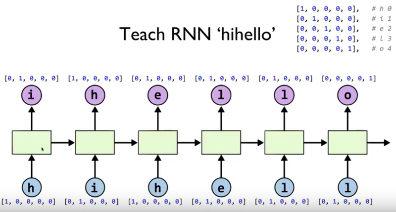

# Lecture 12

## RNN


<br/>




<br/>




<br/>

<br/>

# Lab 12-1

## RNN Basics


<br/>

### RNN in Tensorflow


<br/>

One hot encoding


<br/>

### Unfolding to n sequences


<br/>

### Batching input

batch_size


<br/>

### Code

Tf2-12-1-hello-rnn.py

```python
# Lab 12 RNN
import numpy as np
import tensorflow as tf

idx2char = ['h', 'i', 'e', 'l', 'o']
# Teach hello: hihell -> ihello
# x_data = [[0, 1, 0, 2, 3, 3]]  # hihell
y_data = [[1, 0, 2, 3, 3, 4]]  # ihello

num_classes = 5
input_dim = 5  # one-hot size, same as hidden_size to directly predict one-hot
sequence_length = 6  # |ihello| == 6
learning_rate = 0.1

x_one_hot = np.array([[[1, 0, 0, 0, 0],    # h 0
                       [0, 1, 0, 0, 0],    # i 1
                       [1, 0, 0, 0, 0],    # h 0
                       [0, 0, 1, 0, 0],    # e 2
                       [0, 0, 0, 1, 0],    # l 3
                       [0, 0, 0, 1, 0]]],  # l 3
                     dtype=np.float32)

y_one_hot = tf.keras.utils.to_categorical(y_data, num_classes=num_classes)
print(x_one_hot.shape)
print(y_one_hot.shape)

tf.model = tf.keras.Sequential()

# make cell and add it to RNN layer
# input_shape = (1,6,5) => number of sequence (batch), length of sequence, size of input dim
cell = tf.keras.layers.LSTMCell(units=num_classes, input_shape=(sequence_length, input_dim))
tf.model.add(tf.keras.layers.RNN(cell=cell, return_sequences=True))

# single LSTM layer can be used as well instead of creating LSTMCell
# tf.model.add(tf.keras.layers.LSTM(units=num_classes, input_shape=(sequence_length, input_dim), return_sequences=True))

# fully connected layer
tf.model.add(tf.keras.layers.TimeDistributed(tf.keras.layers.Dense(units=num_classes, activation='softmax')))

tf.model.compile(loss='categorical_crossentropy', optimizer=tf.keras.optimizers.Adam(lr=learning_rate),
                 metrics=['accuracy'])

# train
tf.model.fit(x_one_hot, y_one_hot, epochs=50)
tf.model.summary()

predictions = tf.model.predict(x_one_hot)
for i, prediction in enumerate(predictions):
    print(prediction)
    # print char using argmax, dict
    result_str = [idx2char[c] for c in np.argmax(prediction, axis=1)]
    print("\tPrediction str: ", ''.join(result_str))
```


<br/>

<br/>

# Lab 12-2

## Hi Hello RNN


<br/>

### One-hot encoding




<br/>




<br/>

### Code

Tf2-12-2-char-seq-rnn.py

```python
# Lab 12 Character Sequence RNN
import tensorflow as tf
import numpy as np

sample = " if you want you"
idx2char = list(set(sample))  # index -> char
char2idx = {c: i for i, c in enumerate(idx2char)}  # char -> idex

# hyper parameters
dic_size = len(char2idx)  # RNN input size (one hot size)
hidden_size = len(char2idx)  # RNN output size
num_classes = len(char2idx)  # final output size (RNN or softmax, etc.)
batch_size = 1  # one sample data, one batch
sequence_length = len(sample) - 1  # number of lstm rollings (unit #)
learning_rate = 0.1

sample_idx = [char2idx[c] for c in sample]  # char to index
x_data = [sample_idx[:-1]]  # X data sample (0 ~ n-1) hello: hell
y_data = [sample_idx[1:]]   # Y label sample (1 ~ n) hello: ello

x_one_hot_eager = tf.one_hot(x_data, num_classes)  # one hot: 1 -> 0 1 0 0 0 0 0 0 0 0
x_one_hot_numpy = tf.keras.utils.to_categorical(x_data, num_classes)  # it'll generate numpy array, either way works
y_one_hot_eager = tf.one_hot(y_data, num_classes)

tf.model = tf.keras.Sequential();
tf.model.add(tf.keras.layers.
             LSTM(units=num_classes, input_shape=(sequence_length, x_one_hot_eager.shape[2]), return_sequences=True))
tf.model.add(tf.keras.layers.TimeDistributed(tf.keras.layers.Dense(units=num_classes, activation='softmax')))
tf.model.summary()
tf.model.compile(loss='categorical_crossentropy', optimizer=tf.keras.optimizers.Adam(lr=learning_rate),
                 metrics=['accuracy'])
tf.model.fit(x_one_hot_eager, y_one_hot_eager, epochs=50)


predictions = tf.model.predict(x_one_hot_eager)

for i, prediction in enumerate(predictions):
    # print char using argmax, dict
    result_str = [idx2char[c] for c in np.argmax(prediction, axis=1)]
    print("\tPrediction str: ", ''.join(result_str))
```


<br/>

<br/>

# Lab 12-3

## Long Sequence RNN


<br/>

<br/>

# Lab 12-4

## Stacked RNN + Softmax Layer


<br/>


<br/>

### Code

Tf2-12-4-rnn-long-char.py

```python
import tensorflow as tf
import numpy as np

sentence = ("if you want to build a ship, don't drum up people together to "
            "collect wood and don't assign them tasks and work, but rather "
            "teach them to long for the endless immensity of the sea.")

char_set = list(set(sentence))
char_dic = {w: i for i, w in enumerate(char_set)}

data_dim = len(char_set)
hidden_size = len(char_set)
num_classes = len(char_set)
sequence_length = 10  # Any arbitrary number
learning_rate = 0.1

dataX = []
dataY = []
for i in range(0, len(sentence) - sequence_length):
    x_str = sentence[i:i + sequence_length]
    y_str = sentence[i + 1: i + sequence_length + 1]
    print(i, x_str, '->', y_str)

    x = [char_dic[c] for c in x_str]  # x str to index
    y = [char_dic[c] for c in y_str]  # y str to index

    dataX.append(x)
    dataY.append(y)

batch_size = len(dataX)

# One-hot encoding
X_one_hot = tf.one_hot(dataX, num_classes)
Y_one_hot = tf.one_hot(dataY, num_classes)

print(X_one_hot.shape)  # check out the shape (170, 10, 25)
print(Y_one_hot.shape)  # check out the shape


tf.model = tf.keras.Sequential();
tf.model.add(tf.keras.layers.
             LSTM(units=num_classes, input_shape=(sequence_length, X_one_hot.shape[2]), return_sequences=True))
tf.model.add(tf.keras.layers.LSTM(units=num_classes, return_sequences=True))
tf.model.add(tf.keras.layers.TimeDistributed(tf.keras.layers.Dense(units=num_classes, activation='softmax')))
tf.model.summary()
tf.model.compile(loss='categorical_crossentropy', optimizer=tf.keras.optimizers.Adam(lr=learning_rate),
                 metrics=['accuracy'])
tf.model.fit(X_one_hot, Y_one_hot, epochs=100)


results = tf.model.predict(X_one_hot)
for j, result in enumerate(results):
    index = np.argmax(result, axis=1)
    if j is 0:  # print all for the first result to make a sentence
        print(''.join([char_set[t] for t in index]), end='')
    else:
        print(char_set[index[-1]], end='')
```


<br/>

<br/>

# Lab 12-5

## Dynamic RNN


<br/>

### Different sequence length

- 문자열의 길이가 유동적(가변적)이다.

- ex) 번역


<br/>


<br/><br/><br/>

--------------

### Reference

- https://medium.com/analytics-vidhya/in-depth-tutorial-of-recurrent-neural-network-rnn-and-long-short-term-memory-lstm-networks-3a782712a09f

- https://github.com/hunkim/DeepLearningZeroToAll/tree/master/tf2