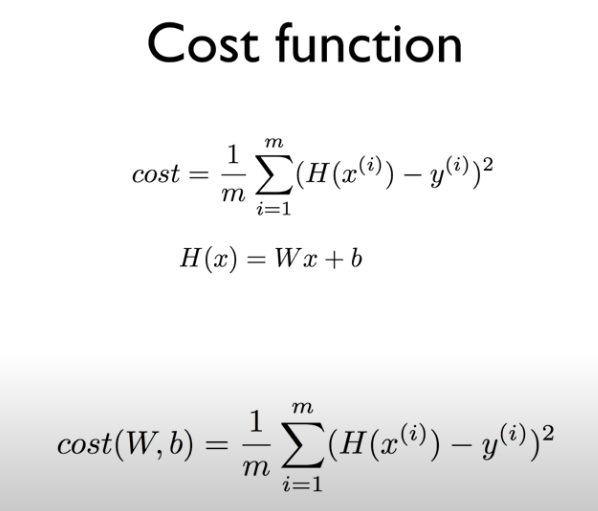

# Lecture 02

# Linear Regression


<br/>

### Predicting exam score: regsression


<br/>

- training data

| x(houre) | y(score) |
| -------- | -------- |
| 10       | 90       |
| 9        | 80       |
| 3        | 50       |
| 2        | 30       |


<br/>

### Regression(data)

| x    | y    |
| ---- | ---- |
| 1    | 1    |
| 2    | 2    |
| 3    | 3    |


<br/>

### (Linear) Hypothesis

가설

- 그래프로 그려보면 직선의 모양을 나타낸다


<br/>
수식

H(x) = Wx + b


<br/>

어떤 가설(hypothesis)이 좋은걸까?


<br/>

### Cost function

가설과 실제가 얼마나 다른지 나타내는 것

H(x): 가설

y: 실제


<br/>

H(x) - y


<br/>

단순하게 차이를 하면 양수일지 음수일지 모르므로


<br/>

제곱을 사용

**(H(x) - y) ^2**

<br/>

**장점**

차이가 클때 더 큰 차이를 만들어 준다.

<br/>

이를 통해 차이가 작게 만들어 줄 수 있다.


<br/>

**오차 제곱 평균**

: cost function


<br/>




<br/>

### 목표(Goal)

cost를 가장 작게 만게 만들어 주는 W와 b의 값 찾기


<br/><br/>

# Lab 02

## TensorFlow로 간단한 Linear Regression 구현하기


<br/>

### Code_tf_2.x

```python
import numpy as np
import tensorflow as tf

x_train = [1, 2, 3, 4]
y_train = [0, -1, -2, -3]

tf.model = tf.keras.Sequential()
# units == output shape, input_dim == input shape
tf.model.add(tf.keras.layers.Dense(units=1, input_dim=1))

sgd = tf.keras.optimizers.SGD(lr=0.1)  # SGD == standard gradient descendent, lr == learning rate
tf.model.compile(loss='mse', optimizer=sgd)  # mse == mean_squared_error, 1/m * sig (y'-y)^2

# prints summary of the model to the terminal
tf.model.summary()

# fit() executes training
tf.model.fit(x_train, y_train, epochs=200)

# predict() returns predicted value
y_predict = tf.model.predict(np.array([5, 4]))
print(y_predict)
```


<br/>

### Code_tf_1.x

```python
# Lab 2 Linear Regression
import tensorflow as tf
tf.set_random_seed(777)  # for reproducibility

# X and Y data
x_train = [1, 2, 3]
y_train = [1, 2, 3]

# Try to find values for W and b to compute y_data = x_data * W + b
# We know that W should be 1 and b should be 0
# But let TensorFlow figure it out
W = tf.Variable(tf.random_normal([1]), name="weight")
b = tf.Variable(tf.random_normal([1]), name="bias")

# Our hypothesis XW+b
hypothesis = x_train * W + b

# cost/loss function
cost = tf.reduce_mean(tf.square(hypothesis - y_train))

# optimizer
train = tf.train.GradientDescentOptimizer(learning_rate=0.01).minimize(cost)

# Launch the graph in a session.
with tf.Session() as sess:
    # Initializes global variables in the graph.
    sess.run(tf.global_variables_initializer())

    # Fit the line
    for step in range(2001):
        _, cost_val, W_val, b_val = sess.run([train, cost, W, b])

        if step % 20 == 0:
            print(step, cost_val, W_val, b_val)

# Learns best fit W:[ 1.],  b:[ 0.]
"""
0 2.82329 [ 2.12867713] [-0.85235667]
20 0.190351 [ 1.53392804] [-1.05059612]
40 0.151357 [ 1.45725465] [-1.02391243]
...
1960 1.46397e-05 [ 1.004444] [-0.01010205]
1980 1.32962e-05 [ 1.00423515] [-0.00962736]
2000 1.20761e-05 [ 1.00403607] [-0.00917497]
"""
```


<br/>

- tf.placeholer()를 사용해서 코드를 구현 할 수도 있다.

  (tf_1.x인 경우)


<br/><br/><br/>

----------------

### Reference

- https://github.com/hunkim/DeepLearningZeroToAll/blob/master/lab-02-1-linear_regression.py
- https://github.com/hunkim/DeepLearningZeroToAll/blob/master/tf2/tf2-02-1-linear_regression.py


<br/>