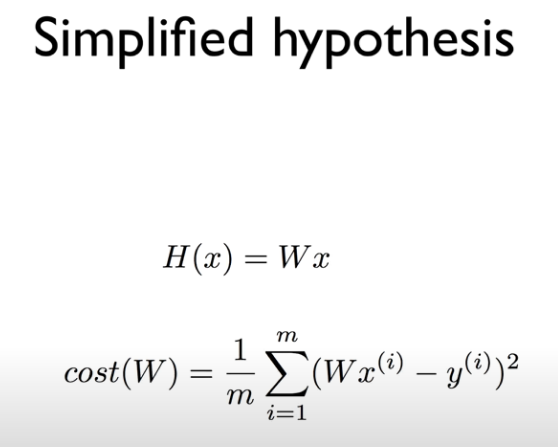
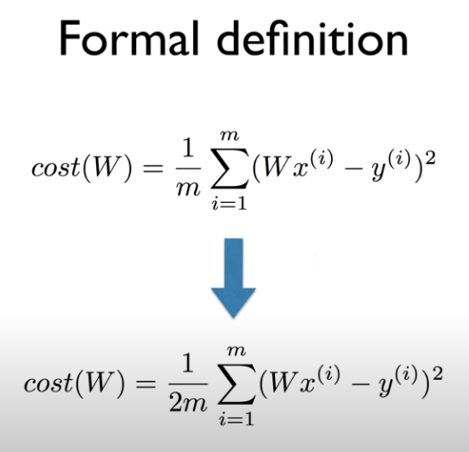
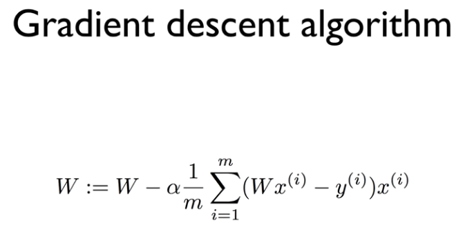

# Lecture 03

## How to minimize cost


<br/>

### Hypothesis and Cost

function


<br/>

- b = 0으로 하여 cost 함수를 간단하게 변경




<br/>

### How to minimize cost ?

cost가 0이 될때 !


<br/>

### Gradient descent algorithm

: 경사 하강법

<br/>

경사도(기울기)가 0에 가까운 방향으로 이동

계산 방법: 미분


<br/>

- 미분을 쉽게 하기 위해서 m -> 2m으로 변경




<br/>




<br/><br/>

## lab 03


<br/>

### Code tf_2.x

```python
# Lab 3 Minimizing Cost
import numpy as np
import tensorflow as tf
import matplotlib.pyplot as plt

x_train = [1, 2, 3, 4]
y_train = [0, -1, -2, -3]

tf.model = tf.keras.Sequential()
tf.model.add(tf.keras.layers.Dense(units=1, input_dim=1))

sgd = tf.keras.optimizers.SGD(lr=0.1)
tf.model.compile(loss='mse', optimizer=sgd)

tf.model.summary()

# fit() trains the model and returns history of train
history = tf.model.fit(x_train, y_train, epochs=100)

y_predict = tf.model.predict(np.array([5, 4]))
print(y_predict)

# Plot training & validation loss values
plt.plot(history.history['loss'])
plt.title('Model loss')
plt.ylabel('Loss')
plt.xlabel('Epoch')
plt.legend(['Train', 'Test'], loc='upper left')
plt.show()
```


<br/><br/><br/>

------------

### Reference

- https://github.com/hunkim/DeepLearningZeroToAll/blob/master/tf2/tf2-03-1-minimizing_cost_show_graph.py