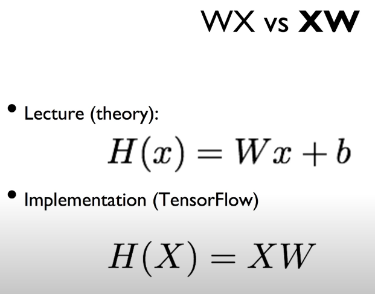

# Lecture 4

## Multivariable linear regression


<br/>


<br/>

### Matirx


<br/>

### Matrix multiplication

dot product


<br/>

### H(X) = XW


<br/>

X * W = H(X)

H(X) = XW

[5, 3]    [?, ?]    [5, 1] 이면

[?, ?] = [3, 1]


<br/>

n == none == -1


<br/>




<br/>

<br/>

## Lab 04

### multi-variable linear regression

<br/>

### Code tf_2.x

```python
# Lab 4 Multi-variable linear regression
import tensorflow as tf
import numpy as np

x_data = [[73., 80., 75.],
          [93., 88., 93.],
          [89., 91., 90.],
          [96., 98., 100.],
          [73., 66., 70.]]
y_data = [[152.],
          [185.],
          [180.],
          [196.],
          [142.]]

tf.model = tf.keras.Sequential()

tf.model.add(tf.keras.layers.Dense(units=1, input_dim=3))  # input_dim=3 gives multi-variable regression
tf.model.add(tf.keras.layers.Activation('linear'))  # this line can be omitted, as linear activation is default
# advanced reading https://towardsdatascience.com/activation-functions-neural-networks-1cbd9f8d91d6

tf.model.compile(loss='mse', optimizer=tf.keras.optimizers.SGD(lr=1e-5))
tf.model.summary()
history = tf.model.fit(x_data, y_data, epochs=100)

y_predict = tf.model.predict(np.array([[72., 93., 90.]]))
print(y_predict)
```


<br/><br/>

## Lab 04-2

### Loading Data from File


<br/>

### Code tf_2.x

```python
# Lab 4 Multi-variable linear regression
import tensorflow as tf
import numpy as np

xy = np.loadtxt('../data-01-test-score.csv', delimiter=',', dtype=np.float32)
x_data = xy[:, 0:-1]
y_data = xy[:, [-1]]

# Make sure the shape and data are OK
print(x_data, "\nx_data shape:", x_data.shape)
print(y_data, "\ny_data shape:", y_data.shape)

# data output
'''
[[ 73.  80.  75.]
 [ 93.  88.  93.]
 ...
 [ 76.  83.  71.]
 [ 96.  93.  95.]] 
x_data shape: (25, 3)
[[152.]
 [185.]
 ...
 [149.]
 [192.]] 
y_data shape: (25, 1)
'''
tf.model = tf.keras.Sequential()
# activation function doesn't have to be added as a separate layer. Add it as an argument of Dense() layer
tf.model.add(tf.keras.layers.Dense(units=1, input_dim=3, activation='linear'))
# tf.model.add(tf.keras.layers.Activation('linear'))
tf.model.summary()

tf.model.compile(loss='mse', optimizer=tf.keras.optimizers.SGD(lr=1e-5))
history = tf.model.fit(x_data, y_data, epochs=2000)

# Ask my score
print("Your score will be ", tf.model.predict([[100, 70, 101]]))
print("Other scores will be ", tf.model.predict([[60, 70, 110], [90, 100, 80]]))
```


<br/>

### Queue Runners


<br/><br/><br/>