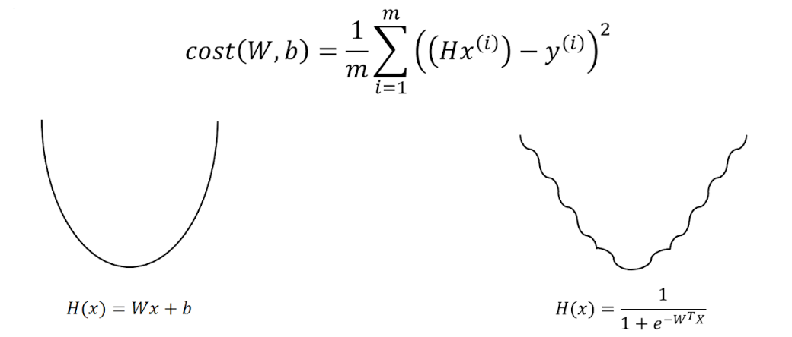

# Lecture 05-1

## Logistic (regression) classification

 

 

### classification

 

### 0, 1 encoding

 

- H(x) = Wx + b

- g(z) ----> 0 or 1

 

### sigmoid

 

 

 

 

# Lecture 05-2

## Logistic (regression) classification: cost function & gradient decent

 

### Cost function

 

 

오른쪽 그래프처럼 나오면 기울기가 0인 부분을 찾기가 어렵다. 그래서 cost function을 변경해야 한다.

 

-ing

   