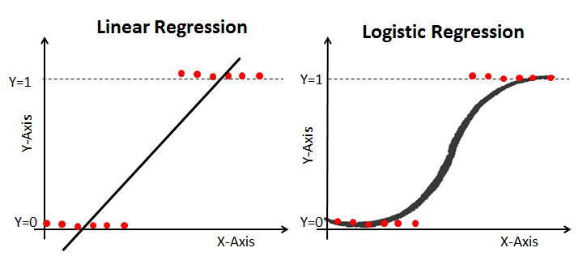

# Lecture 05-1

## Logistic (regression) classification


<br/>




<br/>

### classification


<br/>

### 0, 1 encoding


<br/>

- H(x) = Wx + b


- g(z) ----> 0 or 1


<br/>

### sigmoid

<br/>


<br/>


<br/>

<br/>

# Lecture 05-2

## Logistic (regression) classification: cost function & gradient decent


<br/>

### Cost function

<br/>


<br/>

오른쪽 그래프처럼 나오면 기울기가 0인 부분을 찾기가 어렵다. 그래서 cost function을 변경해야 한다.


<br/>

<br/>

# Lab 05

## Logistic (regression) classifier


<br/>

### Code tf_2.x

- Logistic Regression

````python
# Lab 5 Logistic Regression Classifier
import tensorflow as tf

x_data = [[1, 2],
          [2, 3],
          [3, 1],
          [4, 3],
          [5, 3],
          [6, 2]]
y_data = [[0],
          [0],
          [0],
          [1],
          [1],
          [1]]

tf.model = tf.keras.Sequential()
tf.model.add(tf.keras.layers.Dense(units=1, input_dim=2))
# use sigmoid activation for 0~1 problem
tf.model.add(tf.keras.layers.Activation('sigmoid'))

''' 
better result with loss function == 'binary_crossentropy', try 'mse' for yourself
adding accuracy metric to get accuracy report during training
'''
tf.model.compile(loss='binary_crossentropy', optimizer=tf.keras.optimizers.SGD(lr=0.01), metrics=['accuracy'])
tf.model.summary()

history = tf.model.fit(x_data, y_data, epochs=5000)

# Accuracy report
print("Accuracy: ", history.history['accuracy'][-1])
````


<br/>

- Logistic Regression Diabetes

```python
# Lab 5 Logistic Regression Classifier
import tensorflow as tf
import numpy as np

xy = np.loadtxt('../data-03-diabetes.csv', delimiter=',', dtype=np.float32)
x_data = xy[:, 0:-1]
y_data = xy[:, [-1]]

print(x_data.shape, y_data.shape)

tf.model = tf.keras.Sequential()
# multi-variable, x_data.shape[1] == feature counts == 8 in this case
tf.model.add(tf.keras.layers.Dense(units=1, input_dim=x_data.shape[1], activation='sigmoid'))
tf.model.compile(loss='binary_crossentropy', optimizer=tf.keras.optimizers.SGD(lr=0.01),  metrics=['accuracy'])
tf.model.summary()

history = tf.model.fit(x_data, y_data, epochs=500)

# accuracy!
print("Accuracy: {0}".format(history.history['accuracy'][-1]))

# predict a single data point
y_predict = tf.model.predict([[0.176471, 0.155779, 0, 0, 0, 0.052161, -0.952178, -0.733333]])
print("Predict: {0}".format(y_predict))

# evaluating model
evaluate = tf.model.evaluate(x_data, y_data)
print("loss: {0}, accuracy: {1}".format(evaluate[0], evaluate[1]))
```


<br/><br/><br/>

---------

### Reference

- https://github.com/hunkim/DeepLearningZeroToAll/blob/master/tf2/tf2-05-1-logistic_regression.py
- https://github.com/hunkim/DeepLearningZeroToAll/blob/master/tf2/tf2-05-2-logistic_regression_diabetes.py


<br/>