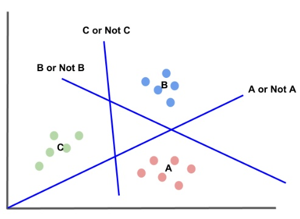

# Lecture 06-1

## Softmax Regression

 

### Logistic regression

 

- 하이퍼 플래인

 

### Multinomial classification

 

- A, B, C 세가지가 있을때, 

A인지 아닌지를 구분하는 선 과 B인지 아닌지 구분하는 선 그리고 C인지 아닌지 구분하는 선들을 이용해서 결과적으로 각각을 분류

 

행렬곱을 사용

 

 

### Cross-entropy cost function

 

#### 자세한 공부 필요 !

   

