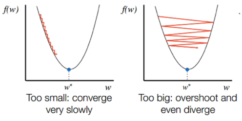

# Lecture 07-1 

## Application & Tips: Learning rate, data preprocessing, overfitting

 

### Large learning rate

- overshooting
- lr이 너무 크면 발생함

 

### Small learning rate

- takes too long, stops at local minimum
- lr이 너무 작으면 발생

 

 

즉, learning rate 를 정확학 값을 찾아야 한다

일반척으로 맨처음에는 0.01 로 시작

 

   

