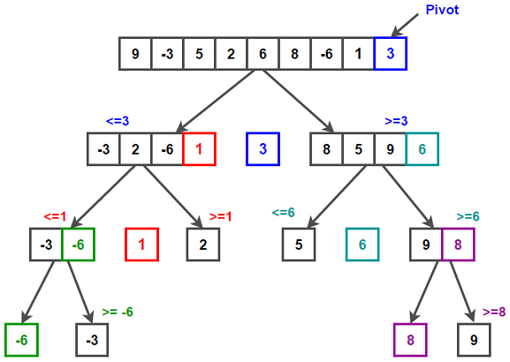

# 고급 정렬 알고리즘

## 01. 퀵 정렬(Quick Sort)

### 1. 퀵 정렬(Quick Sort) 이란?

- 정렬 알고리즘의 꽃
- 기준점(pivot이라고 부름)을 정해서, 기준점보다 작은 데이터는 왼쪽(left), 큰데이터는 오른쪽(right)으로 모으는 함수를 작성함
- pivot은 맨 앞, 맨 뒤, 중간값 중에 하나로 정해서 사용함
- 각 왼쪽(left), 오른쪽(right)은 재귀용법을 사용해서 다시 동일 함수를 호출하여 위 작업을 반복함
- 함수는 왼쪽(left) + 기준점(pivot) + 오른쪽(right)을 리턴함


<br/>

- Quick sort 과정(예시 이미지)




<br/>

- 다른 예시

  | 0    | 1    | 2    | 3    | 4    | 5    |
  | ---- | ---- | ---- | ---- | ---- | ---- |
  | 49   | 97   | 53   | 5    | 33   | 65   |

  <br/>

  pivot 선택: index 0, 49

  <br/>

  pivot(49)보다 작은것은 왼쪽, 큰값은 오른쪽으로 이동

  [작은 데이터, pivot, 큰 데이터]

  | 3    | 4    | 0    | 1    | 2    | 5    |
  | ---- | ---- | ---- | ---- | ---- | ---- |
  | 5    | 33   | 49   | 97   | 53   | 65   |

  <br/>

  pivot 왼쪽

  | 3    | 4    |
  | ---- | ---- |
  | 5    | 33   |

  <br/>

  pivot 오른쪽

  pivot 선택: index 1, 97

  | 2    | 5    | 1    |
  | ---- | ---- | ---- |
  | 53   | 65   | 97   |

  <br/>

  위의 과정을 계속 반복한다.


<br/>

### 2. 알고리즘 구현

- quick sort 함수 만들기
  - 만약 리스트 갯수가 한개이면 해당 리스트 리턴
  - 그렇지 않으면, 리스트 맨 앞의 데이터를 기준점(pivot)으로 놓기
  - left, right 리스트 변수를 만들고
  - 맨 앞의 데이터를 뺀 나머지 데이터를 기준점(pivot)과 비교
    - 기준점 보다 작으면 left.append(해당 데이터)
    - 기준점 보다 크면 right.append(해당 데이터)
  - return quicksort(left) + [pivot] + quicksort(right)  로 재귀호출


<br/>

### 3. Code

```python
def qsort(data):
    if len(data) <= 1:
        return data
    
    left, right = list(), list()
    pivot = data[0]
    
    for idx in range(1, len(data)):
        if pivot > data[idx]:
            left.append(data[idx])
        else:
            right.append(data[idx])
            
    return qsort(left) + [pivot] + qsort(right)
```

<br/>

- 함수 확인하기

```python
import random
data = random.sample(range(100), 10)

print(data)
print(qsort(data))

# [97, 95, 11, 89, 10, 67, 47, 18, 81, 29]
# [10, 11, 18, 29, 47, 67, 81, 89, 95, 97]
```

<br/>

```python
# 파이썬 list comprehension 사용
def qsort(data):
    if len(data) <= 1:
        return data
    
    pivot = data[0]
    
    left = [item for item in data[1:] if pivot > item]
    right = [item for item in data[1:] if pivot <= item]
    
    return qsort(left) + [pivot] + qsort(right)
```


<br/>

### 4. 알고리즘 분석

- 병합정렬과 유사, 시간복잡도는 O(n log n)
  - 단, 최악의 경우
    - 맨 처음 pivot이 가장 크거나, 가장 작으면
    - 모든 데이터를 비교하는 상황이 나옴
    - O(n^2)


​		

​	

<br/><br/>


