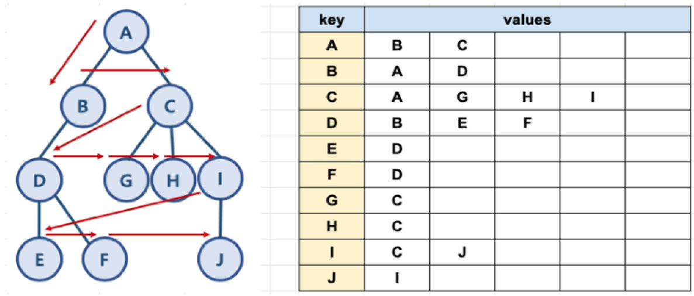
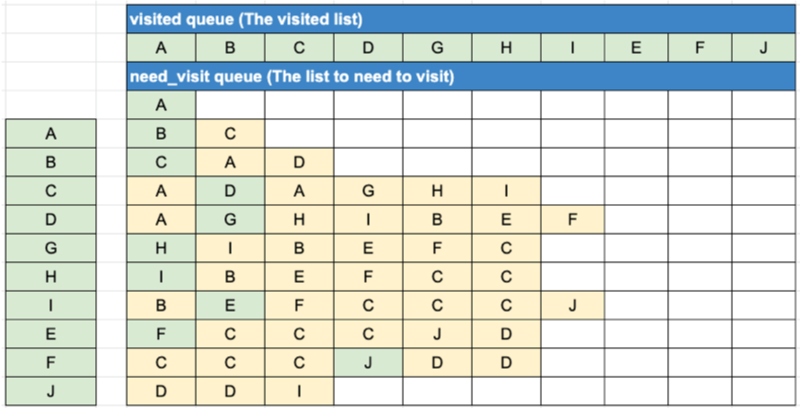

# 그래프 기본 탐색 알고리즘

## 01. 너비 우선 탐색(BFS)

### 1. BFS와 DFS 란?

- 대표적인 그래프 탐색 알고리즘
  - 너비 우선 탐색(Breadth First Search): 정점들과 같은 레벨에 있는 노드들을 먼저 탐색하는 방식
  - 깊이 우선 탐색(Depth First Search): 정점의 자식들을 먼저 탐색하는 방식


<br/>

#### BFS/DFS 방식 이해를 위한 예제

<br/>


<br/>


<br/>

### 2. 파이썬으로 그래프를 표현하는 방법

- 파이썬에서 제공하는 딕셔너리와 리스트 자료 구조를 활용해서 그래프를 표현할 수 있음

<br/>



<br/>


<br/>

- Code

```python
graph = dict()

graph['A'] = ['B', 'C']
graph['B'] = ['A', 'D']
graph['C'] = ['A', 'G', 'H', 'I']
graph['D'] = ['B', 'E', 'F']
graph['E'] = ['D']
graph['F'] = ['D']
graph['G'] = ['C']
graph['H'] = ['C']
graph['I'] = ['C', 'J']
graph['J'] = ['I']
```


<br/>

### 3. BFS 알고리즘 구현

- 자료구조 큐를 활용함
  - need_visit 큐와 visited 큐, 두 개의 큐를 생성(방문이 필요한 것과 방문한 것)

<br/>



<br/>


<br/>

- Code

```python
def bfs(graph, start_node):
    visited = list()
    need_visit = list()
    
    need_visit.append(start_node)

    while need_visit:
        node = need_visit.pop(0)
        if node not in visited:
            visited.append(node)
            need_visit.extend(graph[node])

    return visited
```

<br/>

- Code 확인하기

```python
graph = dict()

graph['A'] = ['B', 'C']
graph['B'] = ['A', 'D']
graph['C'] = ['A', 'G', 'H', 'I']
graph['D'] = ['B', 'E', 'F']
graph['E'] = ['D']
graph['F'] = ['D']
graph['G'] = ['C']
graph['H'] = ['C']
graph['I'] = ['C', 'J']
graph['J'] = ['I']
```

```python
print(graph)

res = bfs(graph, 'A')
print(res)

# {'A': ['B', 'C'], 'B': ['A', 'D'], 'C': ['A', 'G', 'H', 'I'], 'D': ['B', 'E', 'F'], 'E': ['D'], 'F': ['D'], 'G': ['C'], 'H': ['C'], 'I': ['C', 'J'], 'J': ['I']}
# ['A', 'B', 'C', 'D', 'G', 'H', 'I', 'E', 'F', 'J']
```


<br/>

### 4. 시간 복잡도

- 일반적인 BFS 시간 복잡도
  - 노드 수: V
  - 간선의 수: E
    - 위 코드에서 while need_visit 은 V+E 번 만큼 수행함
  - 시간 복잡도: O(V+E)


<br/><br/>

--------------

### Reference

-  https://www.fun-coding.org/Chapter18-bfs-live.html 


<br/>