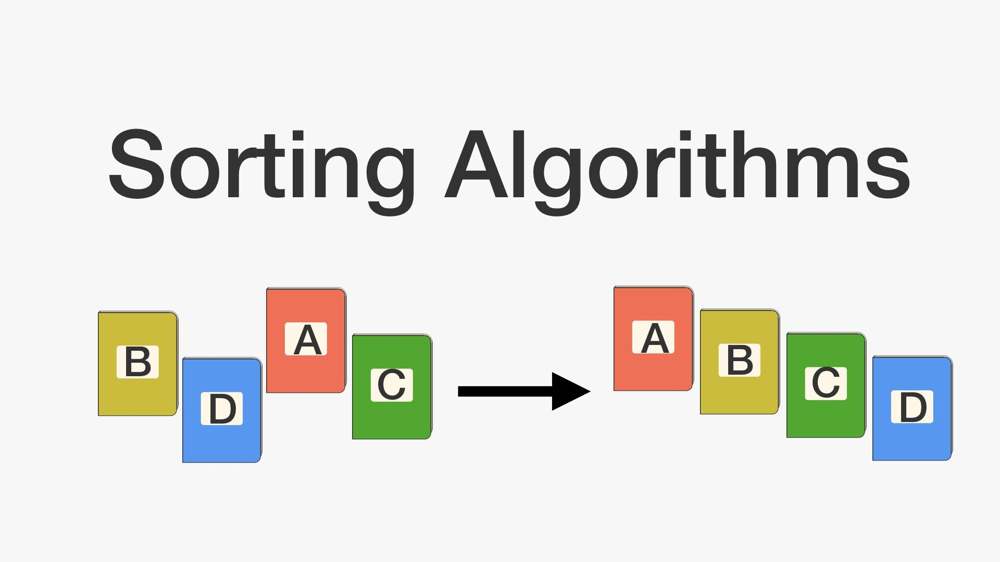

# 기본 정렬 알고리즘 - 01.정렬

<br/>

## 0. 알고리즘 연습 방법

- 알고리즘을 잘 작성하기 위해서는 잘 작성된 알고리즘을 이해하고 스스로 만들어봐야 한다.
  - 모사! 그림을 잘 그리기 위해서는 잘 그린 그림을 모방하는 것부터 시작


<br/>

- 알고리즘 연습 방법

```
1. 연습장과 펜을 준비
2. 알고리즘 문제를 읽고 분석
3. 간단하게 테스트용으로 매우 간단한 경우부터 복잡한 경우 순서대로 생각해보면서 연습장과 펜을 이용하여 알고리즘을 생각
4. 가능한 알고리즘이 보인다면 구현할 알고리즘을 세부 항목으로 나누고 문장으로 세부 항목을 나누어서 적기
5. 코드화하기 위해 데이터 구조 또는 사용할 변수를 정리
6. 각 문장을 코드 레벨로 적기
7. 데이터 구조 또는 사용할 변수가 코드에 따라 어떻게 변하는지를 손으로 적으면서 임의 데이터로 코드가 정상 동작하는지를 연습장과 펜으로 검증
```


<br/>

## 1. 정렬(Sorting) 이란?



<br/>

- 정렬: 어떤 데이터들이 주어졌을 때 이를 정해진 순서대로 나열하는 것
- 정렬은 프로그램 작성시 빈번하게 필요로 함
- 다양한 알고리즘이 고안되었으며, 알고리즘 학습의 필수

<br/>

> 다양한 정렬 알고리즘 이해를 통해 동일한 문제에 대해 다양한 알고리즘이 고안될 수 있음을 이해하고 각 알고리즘간 성능 비교를 통해 알고리즘 성능 분석에 대해서도 이해할 수 있음


