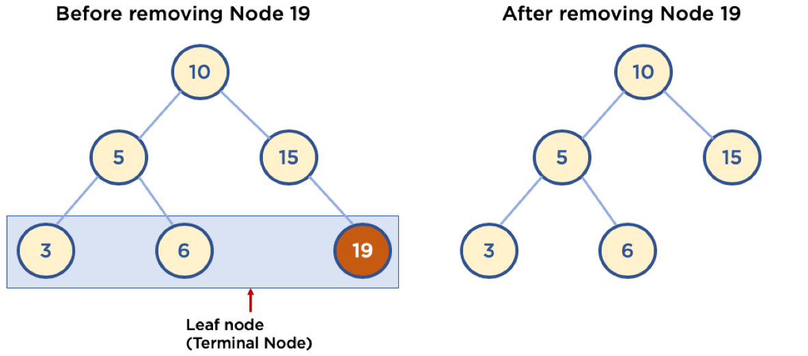
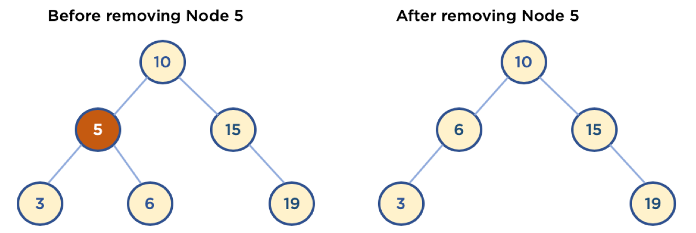

# 트리(Tree)-4

### 5.4. 이진 탐색 트리 삭제

- 매우 복잡함, 경우를 나누어서 이해하는 것이 좋음

 

#### 5.4.1. Leaf Node 삭제

- Leaf Node: Child Node가 없는 Node
- 삭제할 Node의 Parent Node가 삭제할 Node를 가리키지 않도록 한다.

 

 

#### 5.4.2. Child Node가 하나인 Node 삭제

- 삭제할 Node의 Parent Node가 삭제할 Node의 Child Node를 가리키도록 한다.

 

 

#### 5.4.3. Child Node가 두 개인 Node 삭제

1. 삭제할 Node의 오른쪽 자식 중, 가장 작은 값을 삭제할 Node의 Parent Node가 가리키도록 한다.

2. 삭제할 Node의 왼쪽 자식 중, 가장 큰 값을 삭제할 Node의 Parent Node가 가리키도록 한다.

 

1. 삭제할 Node의 오른쪽 자식중, 가장 작은 값을 삭제할 Node의 Parent Node가 가리키게 할 경우

   - 삭제할 Node의 오른쪽 자식 선택

   - 오른쪽 자식의 가장 왼쪽에 있는 Node를 선택

   - 해당 Node를 삭제할 Node의 Parent Node의 왼쪽 Branch가 가리키게 함

   - 해당 Node의 왼쪽 Branch가 삭제할 Node의 왼쪽 Child Node를 가리키게 함

   - 해당 Node의 오른쪽 Branch가 삭제할 Node의 오른쪽 Child Node를 가리키게 함
   - 만약 해당 Node가 오른쪽 Child Node를 가지고 있었을 경우에는, 해당 Node의 본래 Parent Node의 왼쪽 Branch가 해당 오른쪽 Child Node를 가리키게 함

 

 

 

-----

### Reference

-  https://www.fun-coding.org/Chapter10-tree.html 

 