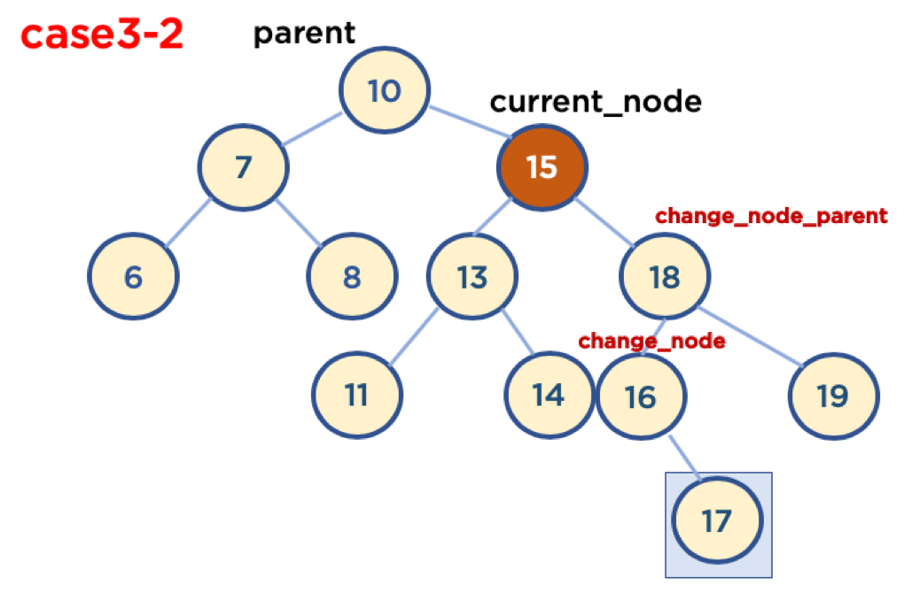

# 트리(Tree)-5

### 5.5. 이진 탐색 트리 삭제 코드 구현과 분석

#### 5.5.1 삭제할 Node 탐색

- 삭제할 Node가 없는 경우도 처리해야 함
  - 이를 위해 삭제할 Node가 없는 경우는 False를 리턴하고, 함수를 종료 시킴

```python
def delete(self, value):
    searched = False
    self.current_node = self.head
    self.parent = self.head
    while self.current_node:
        if self.current_node.value == value:
            searched = True
            break
        elif value < self.current_node.value:
            self.parent = self.current_node
            self.current_node = self.current_node.left
        else:
            self.parent = self.current_node
            self.current_node = self.current_node.right

    if searched == False:
        return False

    # 이후 부터는 case들을 분리해서 코드 작성 !
```


<br/>

#### 5.5.2 Case1: 삭제할 Node가 Leaf Node인 경우

<br/>


<br/>

```python
# self.current_node가 삭제할 Node, self.parent는 삭제할 Node의 Parent Node인 상태
    if self.current_node.left == None and self.current_node.right == None:
        if value < self.parent.value:
            self.parent.left = None
        else:
            self.parent.right = None
        
        del self.current_node
```


<br/>

#### 5.5.2 Case2: 삭제할 Node가 Child Node를 한 개 가지고 있을 경우

<br/>


<br/>

```python
if self.current_node.left != None and self.current_node.right == None:
        if value < self.parent.value:
            self.parent.left = self.current_node.left
        else:
            self.parent.right = self.current_node.left

    elif self.current_node.left == None and self.current_node.right != None:
        if value < self.parent.value:
            self.parent.left = self.current_node.right
        else:
            self.parent.right = self.current_node.right
```


<br/>

<br/>

# 트리(Tree)-6

#### 5.5.3 Case3-1: 삭제할 Node가 Child Node를 두 개 가지고 있을 경우(삭제할 Node가 Parent Node 왼쪽에 있을 때)

- 기본 사용 가능 전략
  1. **삭제할 Node의 오른쪽 자식 중, 가장 작은 값을 삭제할 Node의 Parent Node가 가리키도록 한다.**
  2. 삭제할 Node의 왼쪽 자식 중, 가장 큰 값을 삭제할 Node의 Parent Node가 가리키도록 한다.
- 기본 사용 가능 전략 중, 1번 전략을 사용하여 코드를 구현하기로 함
  - 경우의 수가 또다시 두가지가 있음
    - Case3-1-1: 삭제할 Node가 Parent Node의 왼쪽에 있고, 삭제할 Node의 오른쪽 자식 중, 가장 작은 값을 가진 Node의 Childe Node가 없을 때
    - Case3-1-2: 삭제할 Node가 Parent Node의 왼쪽에 있고, 삭제할 Node의 오른쪽 자식 중, 가장 작은 값을 가진 Node의 오른쪽에 Child Node가 있을 때
      - 가장 작은 값을 가진 Node의 Child Node가 왼쪽에 있을 경우는 없음, 왜냐하면 왼쪽 Node가 있다는 것은 해당 Node보다 더 작은 값을 가진 Node가 있다는 뜻이기 때문임

<br/>


<br/>

```python
 # case 3
    if self.current_node.left != None and self.current_node.right != None:
        # case 3-1
        if value < self.parent.value:
            self.change_node = self.current_node.right
            self.change_node_parent = self.current_node.right
            while self.change_node.left != None:
                self.change_node_parent = self.change_node
                self.change_node = self.change_node.left
            

            # case 3-1-2
            if self.change_node.right != None:
                self.change_node_parent.left = self.change_node.right
            else:
                self.change_node_parent.left = None
            
            self.parent.left = self.change_node
            self.change_node.right = self.current_node.right
            self.change_node.left = self.change_node.left
```


<br/>

#### 5.5.4 Case3-2: 삭제할 Node가 Child Node를 두 개 가지고 있을 경우(삭제할 Node가 Parent Node 오른쪽에 있을 때)

- 기본 사용 가능 전략
  1. **삭제할 Node의 오른쪽 자식 중, 가장 작은 값을 삭제할 Node의 Parent Node가 가리키도록 한다.**
  2. 삭제할 Node의 왼쪽 자식 중, 가장 큰 값을 삭제할 Node의 Parent Node가 가리키도록 한다.
- 기본 사용 가능 전략 중, 1번 전략을 사용하여 코드를 구현하기로 함
  - 경우의 수가 또다시 두가지가 있음
    - Case3-2-1: 삭제할 Node가 Parent Node의 왼쪽에 있고, 삭제할 Node의 오른쪽 자식 중, 가장 작은 값을 가진 Node의 Childe Node가 없을 때
    - Case3-2-2: 삭제할 Node가 Parent Node의 왼쪽에 있고, 삭제할 Node의 오른쪽 자식 중, 가장 작은 값을 가진 Node의 오른쪽에 Child Node가 있을 때
      - 가장 작은 값을 가진 Node의 Child Node가 왼쪽에 있을 경우는 없음, 왜냐하면 왼쪽 Node가 있다는 것은 해당 Node보다 더 작은 값을 가진 Node가 있다는 뜻이기 때문임

<br/>



<br/>

````python
 # case 3
    if self.current_node.left != None and self.current_node.right != None:
        # case 3-1
        if value < self.parent.value:
        	...
        
        # case 3-2
        else:
            self.change_node = self.current_node.right
            self.change_node_parent = self.current_node.right
            while self.change_node.left != None:
                self.change_node_parent = self.change_node
                self.change_node = self.change_node.left
            # case 3-2-2
            if self.change_node.rifht != None:
                self.change_node_parent.left = self.charnge_node.right
            else:
                self.change_node_parent.left = None
                
            self.parent.right = self.change_node
            self.change_node.left = self.current_node.left
            self.change_node.right = self.change_node.right 
````


<br/>

-----

### Reference

-  https://www.fun-coding.org/Chapter10-tree.html 

<br/>

<br/>

