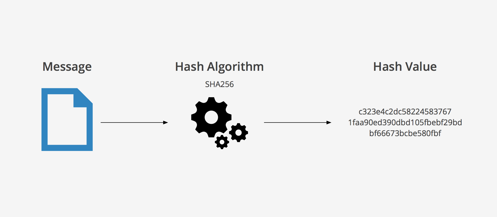

# 해쉬 테이블-5

## 6.3. 빈번한 충돌을 개선하는 기법

- 해쉬 함수를 재정의 및 해쉬 테이블 저장공간을 확대

- ex)

  ```python
  hash_table = list([None for i in range(16)])
  
  def hash_func(key):
  	return key%16
  ```

<br/>

### 참고-해쉬 함수와 키 생성 함수

- 파이썬의 hash() 함수는 실행할 때마다, 값이 달라질 수 있음

- 유명한 해쉬 함수들이 있음: SHA(Secure Hash Algorithm, 안전한 해쉬 알고리즘)

  - 어떤 데이터도 유일한 고정된 크기의 고정값을 리턴해주므로 해쉬 함수로 유용하게 활용 가능

  <br/>

  #### SHA-1

  ```python
  import hashlib
  
  data = 'test'.encode()	# 바이트로 바꿔줌
  hash_object = hashlib.sha1()
  hash_object.update(data)
  hex_dig = hash_object.hexdigest()
  print(hex_dig)
  ```

  

  <br/>

  #### SHA-256

  ```python
  import hashlib
  
  data = 'test'.encode()	# 바이트로 바꿔줌
  hash_object = hashlib.sha256()
  hash_object.update(data)
  hex_dig = hash_object.hexdigest()
  print(hex_dig)
  ```

  <br/>

  


<br/>

### 연습4: 연습2의 Chaining 기법을 적용한 해쉬 테이블 코드에 키 생성 함수를 sha256 해쉬 알고리즘을 사용하도록 변경해보기

```
1. 해쉬 함수: key%8
2. 해쉬 키 생성: hash(data)
```

<br/>

```python
import hashlib

hash_table = list([0 for i in range(8)])

# 변경된 부분
def get_key(data):
    hash_object = hashlib.sha256()
    hash_object.update(data.encode())
    hex_dig = hash_object.hexdigest()
    return int(hex_dig, 16)		# 문자열 hex_dig를 16진수로 변환

def hash_func(key):
    return key%8

def save_data(data, value):
    index_key = get_key(data)
    hash_address = hash_func(index_key)
    if hash_table[hash_address] != 0:		# 데이터가 들어가 있으면
        for index in range(len(hash_table[hash_address])):
            if hash_table[hash_address][index][0] == index_key:
                hash_table[hash_address][index][1] = value
                return
        hash_table[hash_address].append([index_key, value])
    else:
        # 데이터가 없다면
        hash_table[hash_address] = [[index_key, value]]
    
def read_data(data):
    index_key = get_key(data)
    hash_address = hash_func(index_key)
    if hash_table[hash_address] != 0:
        for index in range(len(hash_table[hash_address])):
            if hash_table[hash_address][index][0] == index_key:
                return hash_table[hash_address][index][1]
        return None
    else:
        return None
```


<br/>

## 7. 시간 복잡도

- 일반적인 경우(Collision이 없는 경우)는 O(1)

- 최악의 경우(Collision이 모두 발생하는 경우)는 O(n)

  > 해쉬 테이블의 경우, 일반적인 경우를 기대하고 만들기 때문에, 시간 복잡도는 O(1) 이라고 말할 수 있음


### 검색에서 해쉬 테이블의 사용 예시

	- 16개의 배열에 데이터를 저장하고, 검색할 때 O(n)
	- 16개의 데이터 저장공간을 가진 위의 해쉬 테이블에 데이터를 저장하고, 검색할 때 O(1)


