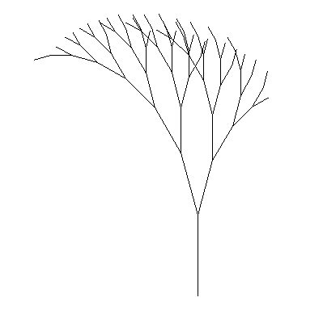
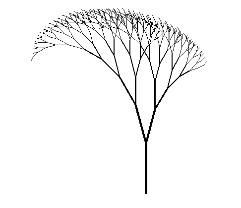

# 1202

<br/>

### ot 진행


<br/>

### python 기초


<br/>

### turtle 그래픽스

```python
import turtle as t
```

<br/>

```
>>> import turtle as t
>>> help(t)
>>> dir(t)
```

<br/>

```python
# 사각형 그리기
import turtle as t

for i in range(4):
	t.forward(100)
	t.right(90)
```


<br/>

```python
# 나무의 모양 그리기
import turtle as t

# 위치, 각도, 길이
def branch(pos, angle, length):
    if length < 20: return
    t.penup()
    t.goto(pos)
    t.pendown()
    t.setheading(angle)
    t.forward(length)
    pos_new = t.pos()
    branch(pos_new, angle+15, length*0.8)
    branch(pos_new, angle-15, length*0.7)
    
t.hideturtle()
t.speed(0)
t.setundobuffer(None)
t.tracer(100)
branch((0, -200), 90, 100)
```


<br/>

- 결과 이미지




<br/>

```python
# 나무 업그레이드 하기
import turtle as t

# 위치, 각도, 길이
def branch(pos, angle, length, thick):
    if length < 10: return
    t.penup()
    t.goto(pos)
    t.pendown()
    t.setheading(angle)
    t.pensize(thick)
    t.forward(length)
    pos_new = t.pos()
    branch(pos_new, angle+15, length*0.8, thick*0.75)
    branch(pos_new, angle-15, length*0.7, thick*0.75)

t.hideturtle()
t.speed(0)
t.setundobuffer(None)
t.tracer(100)
branch((0, -300), 90, 100, 5)

```





<br/>

### colorsys

```python
import colorsys
```

<br/>

- 참고: https://www.vagrearg.org/content/hsvrgb


<br/>

### PySimpleGUI

```python
import PySimpleGUI as sg
```

<br/>

- 참고: https://pysimplegui.readthedocs.io/en/latest/cookbook/


<br/><br/>