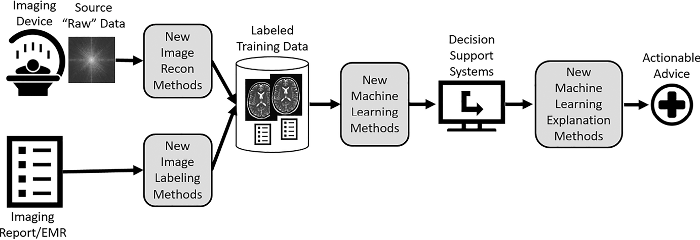
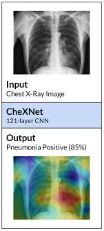

# 1. Introduction to medical image analysis

 

 

 

 

# 2. Introduction to medical image analysis

 

### Aritificial Intelligent

 

### Classification

- ex) cat vs dog

 

### Segmentation

- ex) 자율주행

 

### Enhancement

- ex) 영상의 해상도를 높여주는것

 

### Registration

- ex) 연관된 이미지를 합치는것

 

### ImageNet

- image DeepLearning이 발전하게 된 계기 중의 하나

 

### Contents

 

|                | Conventional methods                                         | Deep Learning methods                                     |
| -------------- | ------------------------------------------------------------ | --------------------------------------------------------- |
| Classification | - Logistic regression - Neural network - Support vector machine - Random forest | - Deep neural network - Convolutional neural network |
| Segmentation   | - Thresholding - Region growing -  Graph cut - Active contour model - Active shape model | - FCN - U-Net - DeepLab                         |
| Enhancement    | - Normalization - Histogram equalization - Filtering - Dictionary learning | - SRCNN - GAN - SRGAN                           |
| Registration   | - Transformation matix - Iterative closet point(ICP) - Non rigid ICP - Deformable models | - FlowNet - CNN for Registraion                      |

 

 

### Reference

- 이미지(intro_1) 출처: A roadmap for foundational research on artificial intelligence in medical imaging
- 이미지(CheXnet) 출처: https://stanfordmlgroup.github.io/projects/chexnet/