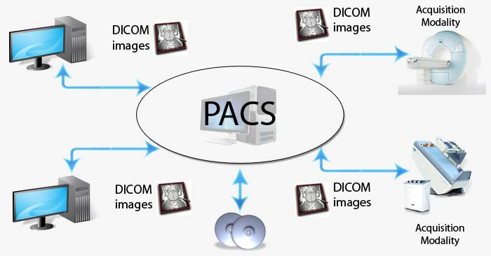

# 2. PACS, DICOM and Visualization

 

### PACS(Picture Archiving and Communication System)

 

 

 

### DICOM(Digital Imaging and COmmunications in Medicine)

 

- International standard for medical images
- 메디컬 이미지에 대한 국제 표준

 

- Formats of medical images with clinical information
- 영상 뿐만 아니라 의료 정보도 들어가 있다.

 

- Other medical image formats
  - Dicom (dcm)
    - a.dcm 형식
  - Analyze (hdr/img)
  - Raw data (mhd/raw)
  - Nifti (nii, nii.gz)

 

### Medical Image Format

 

 

- Dimensions
- Voxel Spacing
- Origin
- 등등

 

### Medical Image Visualization

 

- ITK-SNAP
  - 
- 3D Slicer
- ImageJ
- 등등

   