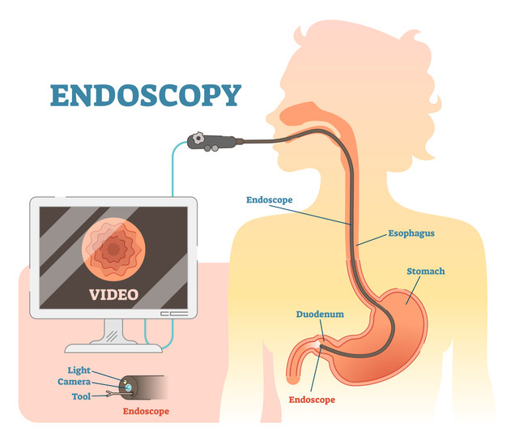

# 3. Image acquisition

 

- 오른쪽 Acquisition 에 대해 학습

 

### Medical Imaging

- Endoscopy
- Microscopy

 

- X-ray
- Computed Tomography(CT)
- Positron Emission Tomography(PET)

 

- Magnetic Resonance Imaging(MRI)

 

### Image Acquisition

 

 

- 일반적인 사진의 경우 가시광선이 반사되는 것을 통해 이미지를 본다.

 

### Endoscopy

내시경 검사

 

 

### Microscopy

현미경 관찰[검사]

 

 

   