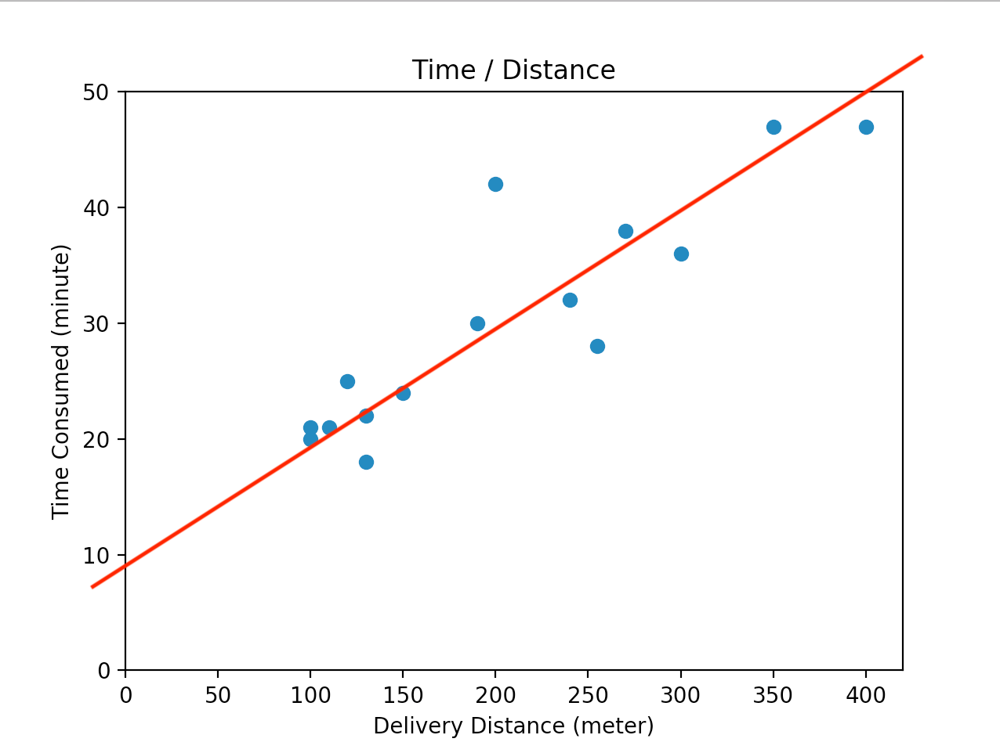

# 2. Linear Regression

 

## Linear Regression

 
$$
h_{w, b}(x) = wx + b
$$

 
$$
J(w, b) = \frac{1}{2m}\sum_{i=1}^m (h_{w, b}(x^{(i)} - y^{(i)})^2
$$

 
$$
minimize j(w, b)
$$
w, b 를 찾는 것

 

 

## Cost Function

 
$$
J(w, b) = \frac{1}{2m}\sum_{i=1}^m (h_{w, b}(x^{(i)} - y^{(i)})^2
$$

## Gradient Descent

 
$$
b := b - \alpha \frac{\partial}{\partial b} J(w, b)
$$
 
$$
w := w - \alpha \frac{\partial}{\partial w} J(w, b)
$$
 
$$
w_j := w_j - \alpha \frac{\partial}{\partial w_j} J
$$

 

 

   