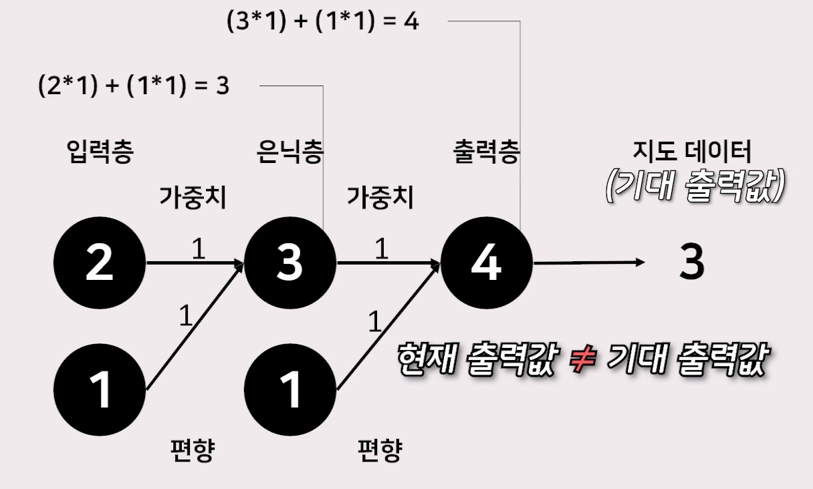
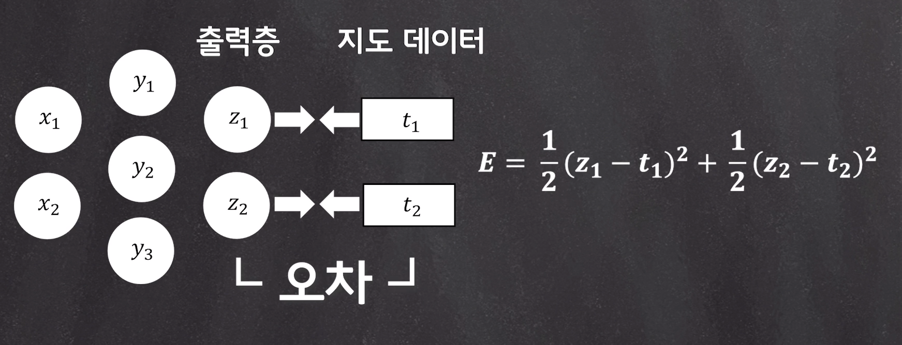
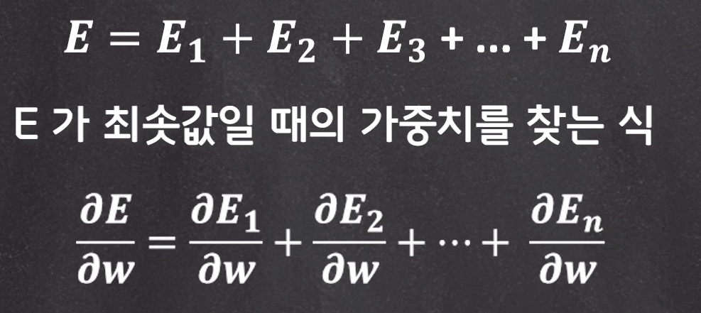

# 14. 딥러닝 원리-2

 

### 신경망의 목적

- 손실함수가 최솟값일 때의 파라미터를 찾아 올바른 학습 결과를 내는 것 
- 회귀분석과 로지스틱회귀와 기본 개념이 같다.
- 단, 회귀분석에서 사용하는 파라미터의 개수보다 신경망에서 사용하는 파라미터의 개수가 더 많다.

 

## 순전파 & 역전파(backpropagation)

 

 

- 뉴런의 가중치를 효율적으로 조정하기 위하여, 거꾸로 무엇인가를 전파하는 방식

 

- 역전파는 출력값과 지도 데이터 사이에 생기는 오차를 이용해 출력층에서 입력층 쪽으로 가중치를 조정하는 것

 

- 역전파는 경사 하강법을 사용하는 것

 

- 손실함수 식

 

- 손실함수: 출력값과 지도 데이터 사이의 오차

- 역전파는 이 손실 함수가 최솟값일 때의 가중치로 원래의 가중치를 조정해야 한다.
- 입력값 각각의 손실 함수 전체를 고려해야 함

- 특정 입력값에서 손실함수 최솟값은 크게 의미가 없다.
- 특정 입력값에서의 손실 함수값이 최소가 되더라도 전체를 생각했을 때 크게 의미는 없다.
- 궁극적인 목표는 모든 입력값을 대상으로 손실 함수가 최솟값일 때의 파라미터를 찾는 것

 

손실함수 미분 식

 

- 손실함수 E를 가중치 W에 관해 편미분 하는 것
- 미분한 값이 0에 가까운 가중치를 찾아야 한다.
  - 이유: 경사하강법에서 기울기의 값이 0에 가까워 졌을 때 손실 함수값이 최솟값 후보가 되기 때문이다.
  - 0에 가깝워도 최소가 아닐 수도 있다
  - 파동 같은 그래프가 나올 수 있음
  - local minimum, Global minimum

 

- 손실함수 E를 각각 전개하여 직접 편미분 하는 것은 번거롭다.
- 그래서 입력값 각각의 손실 함수를 편미분 한 후에 합이 0에 가까운지 확인하는 것이 더 간단하다.

 

- 추가 역전파 공부 필요!!

 

### 역전파 기법의 문제

**기울기 소멸 문제**

 

활성화 함수

- 시그모이드
  - 미분의 최대치가 0.3
  - 여러 층을 걸칠수록 기울기는 점차 0에 수렴(기울기 소멸 문제 발생)
- 소프트맥스
  - 출력값으로부터 확률 벡터를 얻기 위해 사용됨
  - 각 출력 노드의 출력값을 0 ~ 1사이의 값으로 제한

 

- 시그모이드나 소프트맥스는 최종 출려을 결정하는데 있어서 합리적인 선택이 가능

 

- 출력된 값들이 항상 너무 작은 값을 가지고 있었기에 신경망이 깊어지면 깊어질수록 오차의 기울기가 점차 작아지며, 끝으로 가는 도중 기울기가 소실돼버리면서 가중치 조정이 이뤄지지 않는다는 문제가 발생

 

### ReLU

기울기 소멸 문제 해결을 위한 방법

제프리 힌튼 교수

 

- 입력이 음수일 때는 0을 출력
- 입력이 양수일 때는 값 그대로 출력

  

-------------------------

### 퀴즈

1. 출력값과 지도 데이터 사이에 생기는 '오차'를 이용해 출력층에서 입력층 쪽으로 가중치를 조정하는 방법은 무엇인가?

    

   답:  역전파

    

2. 경사하강법에서 기울기가 0이면 반드시 그 지점은 최솟값이 된다.

    

   답: X

    

3. 역전파 기법은 기울기 소멸 문제로 신경망이 깊어지면 깊어질수록 오차의 기울기가 점차 작아지며 기울기가 소실되는 문제가 발생하지만 _ _ _ _ 활성화 함수를 활용하여 어느정도 해결 할 수 있었다. (영문 대소문자 구분하여 작성하세요)

    

   답: ReLU

  