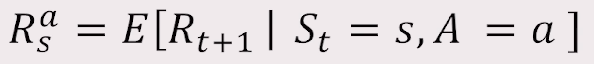
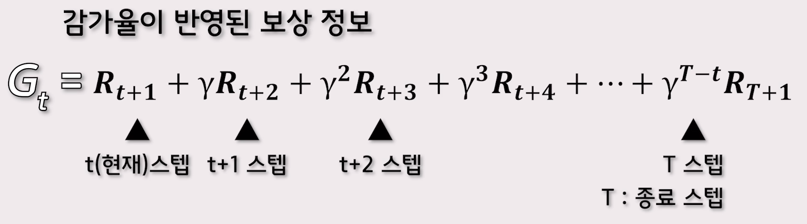

# 15. 강화학습-1

 

강화학습은

지도 학습처럼 정답이 있지도 않고

비지도 학습처럼 데이터만을 기반으로 학습하지도 않는다.

 

강화학습에는 에이전트라는 존재가 환경과 상호작용하며, 

이 환경에는 보상이라는 기준이 있어서 다양한 시행착오를 겪어가며,

보상을 최대화 하는 방향으로 학습을 진행

 

보상

- 패널티를 받는다.

- 보상을 받는다.

 

- 강화학습은 다양한 시행착오를 통해 학습이 가능하며, 비교적 명확한 보상을 설정할 수 있는 문제를 해결하는데 사용되고 있다.

 

- ex) 구글 딥마인드의 알파고

- 이를 통해 인공지능과 강화학습에 많은 관심이 생겼다.

 

강화학습

- 보상을 최대화하는 의사결정 전략
- 순차적인 행동들을 알아나가는 방법

 

### MDP(Markov decision process)

순차적으로 계속 행동을 결정해야하는 문제를 수학적으로 정의한 것

 

#### 구성 요소

- 행동
- 상태
- 보상 함수
- 상태 변환 확률
- 감가율

 

- 에이전트(Agent)
  - 강화학습에서 의사결정을 하는 역할

 

- 환경
  - 에이전트의 의사결정을 반영하며, 에이전트에게 반영된 정보를 주는 역할

 

- 상태(State)
  - 에이전트는 상태라는 것을 기반으로 의사결정을 진행하게 된다.
  - 의사결정을 하기 위해 사용되는 관측값, 행동, 보상을 가공한 정보

 

- 행동(Action)
  - 에이전트가 의사결정을 통해 취할 수 있는 행동
  - A_t
  - 환경에 따라 결정
    - 이산적 행동
      - 이산적인 행동을 하는 환경은 에이전트에게 주어지는 행동의 선택지가 있으며 에이전트는 그 중 하나를 선택한다.
    - 연속적 행동
      - 연속적인 행동을 하는 환경 같은 경우에는 선택지마다 특정값을 수치로 입력하게 되고, 에이전트는 입력된 값만큼 행동하게 된다.

 

- 관측(Observation)
  - 환경에서 제공해주는 정보
  - 구분
    - 시각적 관측
      - 현재 상태의 정보를 이미지로 표현한 것
    - 수치적 관측
      - 이미지의 형태가 아닌, 수치로만 표현한것

 

- 보상함수(Reward Function)

  - 가장 중요함

  - 보상함수는 에이전트가 특정 상태에서 특정 행동을 했을 때 보상을 받게 되고 에이전트는 이 보상정보를 통해 학습을 진행하게 된다.

  - 일반적으로 현재 상태에서 특정 행동을 했을 때 얻는 보상의 기대값

     
    $$
    R^{a}_{s}
    $$
     

  - 

  - 현재 상태(s)에서 현재 상태의 행동(a)을 취해서 얻을 수 있는 보상(R)의 기댓값(E)을 의미한다.

 

- 강화학습은 에피소드가 끝나게 됬을때 에이전트가 지난왔던 상태에서 했던 행동에 대한 정보를 기록한다.
- 그리고 그 정보를 이용하여 그다음 에피소드에 대한 의사결정을 하게 된다.
- 또, 에피소드가 끝나면 이 에피소드를 통해 얻게된 정보로 기록을 업데이트하며 과정을 반복한다.

 

- 에이전트는 더 나은 의사결정을 하기 위해
- 현재 스텝에서 받았던 보상으로 부터 에피소드가 끝날때 까지 받았던 보상들을 더한 것을 정보로 이용

 

### 감가율

- γ [감마]
- 0 부터 1 사이의 값
- 1에 가까울 수록 미래의 보상에 더 많은 가중치를 두게 된다.
- 초기상태에서 에이전트가 미래에 받을 보상을 현재 가치로 환산하여 효율적인 판단을 할 수 있도록 하는 값
- 
- 감가율이 반영된 보상정보를 기록해 보면 현재 스텝부터 받았던 보상부터 에피소드가 끝날 때까지 받았던 보상들에 감가율을 스텝 차이만큼 곱해서 더해주게 된다.
- 이 값을 **반환값**이라고 부른다.

 

### 탐험(Exploration)

- 무작위 움직임

- 에이전트에게 무작위로 움직이게 설정하여 여러 경로를 시도해 보라는 개념

 

### 이용(활용 - Exploitation)

- 익숙한 움직임

- 탐험과 대립되는 개념

- 에이전트가 찾아놓은 길로 하여 계속해서 선택하고 움직이게 되는 것

  

----------------------------------

### 퀴즈

1. 강화학습은 에이전트가 보상이라는 기준에 따라 환경과 상호작용하며 보상을 최대로 얻어내는 과정을 따른다.

 

​	답: O

 

2. MDP의 구성요소와 그 역할과 알맞게 짝지어지지 않은 것은 몇 번인가요?

   보상함수 : 에이전트가 특정 상태에서 특정 행동을 했을 때 주어지는 보상의 기댓값을 정의하는 함수

   환경 : 의사결정을 하는 주체

   상태 : 에이전트가 의사 결정을 하기 위한 관측값, 보상 등을 가공한 것

   행동 : 에이전트가 의사결정을 통해 취할 수 있는 것

   관측 : 환경에서 제공해 주는 정보로 시각적, 수치적 관측으로 나누어진다.

 

​	답: 환경

​		에이전트: 의사결정을 하는 주체

 

3. _ _ _ 은 초기상태에서 에이전트가 미래에 받을 보상을 현재 가치로 환산하여 효율적인 판단을 할 수 있도록 하는 값으로 0과 1사이의 값으로 구성된다.

 

​	답: 감가율

  