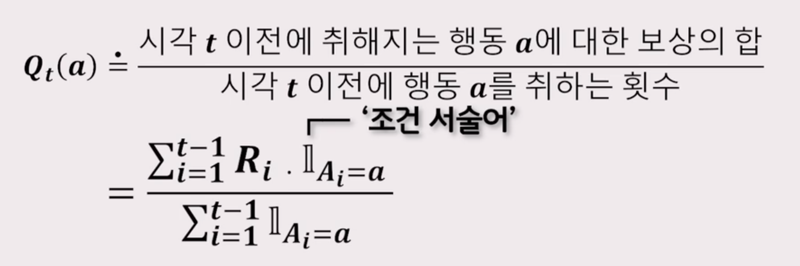
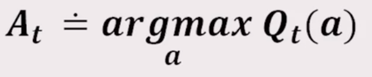

# 16. 강화학습-2

 

### 주요 목적

- 에이전트가 많은 보상을 받기 위해 최적의 정책을 학습하는 것

 

- 에이저트가 최적의 정책을 찾기 위해서는 여러 상황에서 다양한 행동을 하며 많은 경험을 해보는 것이 필수이다.

 

### 탐험(Exploration)

- 다양한 경험을 할 수 있도록 에이전트의 행동을 결정하는 기법
- 탐험의 기본적인 방법 중 하나
  - 무작위 탐색 방법(Random Exploration)
    - 에이전트가 취할 수 있는 행동 중 하나를 임의로 선택하는 단순한 기법
    - 에이전트가 다양한 경험을 할 수 있도록 유도하는 것
    - 하지만, 너무 다양한 경험을 하려면 너무 많은 시간이 걸리는 단점이 생긴다.

 

### 활용(Exploration)

- 학습된 결과에 따라 에이전트의 행동을 결정하는 기법
- 활용의 기본적인 방법 중 하나
  - 탐욕적 방법(Greedy method)
    - 주어진 시점에 에이전트가 가장 큰 보상을 줄 것이라고 기대하는 행동만을 선택하는 것

 

- 단 한 번의 행동에 대해 최대의 보상을 원한다면 활용이 바람직하지만 장기적으로 보상의 총합을 키우기 위해서는 탐험이 좋은 선택일 수 있다.

 

### 활용과 탐험의 딜레마 혹은 갈등

- 하나의 행동을 선택할 때, 활용과 탐험을 동시에 할 수 없기 때문에 이것은 종종 활용과 탐험의 딜레마 혹은 갈등으로 불리게 된다.

 

- 활용과 탐험 사이의 균형을 잡을 수 있게 해주는 정교한 방법들이 다수 존재한다.

 

- 사전지식

 

- 강화학습만의 독특한 어려움
  - 활용과 탐험의 적절한 분배에 대한 필요성

 

### 행동가치방법(action-value-method)

- 행동의 가치를 추정하고 추정값으로부터 행동을 선택하도록 결정하는 기법

- 어떤 행동이 갖는 가치의 참값은 행동이 선택될때의 평균 보상이며, 참값을 추정하는 방법은 실제로 받은 보상의 산술평균을 계산하는 것이다.
- 행동이 갖는 가치
- 
- 조건 서술어: 참이면 1, 거짓이면 0의 값을 갖는 확률변수
- 만약 식의 분모가 0이어서 계산을 할 수 없을 때는 0과 같은 어떠한 기본값으로 정의
- 만약 분모가 무한으로 커지게 된다면 큰 수의 법칙에 따라 행동의 실제 가치로 접근하게 된다.

 

### 가장 간단한 행동 선택 규칙

- 추정 가치가 최대인 행동 중 하나를 선택하는 것

- 
- 즉, 앞에서 말한 탐욕적 행동 중 하나를 선택하는 것

 

### 입실론-탐욕적 방법(ε - greedy)

- 탐욕적 행동을 대체할만한 한 가지 단순한 대안
- 대부분의 시간 동안에는 탐욕적 선택을 수행하고, 아주 가끔 한번씩, 즉 상대적 빈도수를 작은 값으로 유지하면서 탐욕적 선택 대신 모든 행동을 대상으로 무작위 선택을 하는 것
- 이때 모든 행동이 선택될 학률은 균등
- 행동 선택은 행동 가치 추정과는 무관하게 이뤄진다.
- 실제로 이 방법의 효용성은 미지수이다.

 

 

---------------

### 퀴즈

1. 에이전트가 다양한 경험을 할 수 있도록 에이전트의 행동을 결정하는 기법은 무엇인가요?

 

​	답: 탐험

 

2. 학습된 결과에 따라 에이전트의 행동을 결정하는 기법은 무엇인가요?

 

​	답: 활용

 

3. 하나의 행동을 선택할 때, 활용과 탐험을 동시에 할 수 없기 때문에 이것은 종종 _ _으로 불리게 된다.

 

​	답: 갈등

   