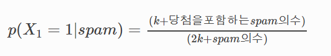

# Naive Bayes classifier 

- MLE

- MAP

- 나이브 베이즈 분류기

베이즈 정리를 활용한 분류기

- 장점

class를 빠르고 쉽게 예측

가정한 독립성이 충족되는 경우 분류기가 더 좋은 성능을 보임

연속형 예측 변수보다 범주형 예측 변수일 경우에 더 좋은 성능을 보임

- 단점

zero frequency(예들들어 트레인 데이터셋 중에 스팸 메일에 '당점'이라는 단어가 없다면 '당첨'이라는 단어가 들어가면 무조건 스팸이 아니라고 분류해 버릴수 있다.) => 해결방법: 'Laplace Smoothing'

estimation이 좋지 않음

independence에 대한 가정이 비현실적

### Laplace Smoothing

- 공식

- k = 0 or k = 1

#### 참고

[https://ybigta-data-science.readthedocs.io/en/latest/6_Data_Science_from_Scratch/03_Naive%20Bayes%20Classifier/](https://ybigta-data-science.readthedocs.io/en/latest/6_Data_Science_from_Scratch/03_Naive Bayes Classifier/)
