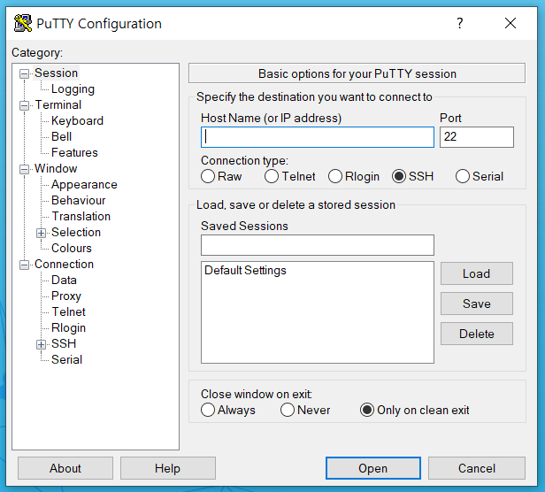

# AWS with PuTTY

- 준비물

  PuTTY

  WinSCP

  Amazon EC2에서 생성된 프라이빗 키 형식(.pem) 파일

  Public IP

  

## PuTTY

### PuTTY Key Generator(PuTTYgen)

- Load

  ​	 .pem 파일을 .ppk 파일로 변환

- SSH-2 RSA 선택

- Save private key 클릭

### PuTTY(PuTTY Configuration)

- Host Name(or IP address) 쓰기

  ​	ex) ubuntu@ 12.123.123.123

- Port는 22

- 왼쪽 Category에서 Connection => SSH => Auth 메뉴로 이동

  Browse버튼 클릭 =>  위에서 생성한 .ppk 파일 선택

- Session으로 돌아와서 Saved Sessions에 값 입력 후 Save 클릭

- Open !

- AWS EC2 서버에 접속이 된것을 확인!

## WinSCP

SFTP, SCP, FTP 및 FTPS 프로토콜을 사용하여 원격 컴퓨터로 파일을 업로드하고 전송할 수 있는 Windows용 GUI 기반 파일 관리자

- 이것을 이용하면 드래그 앤 드랍으로 AWS 서버에 파일을 올릴 수 있다.

-----------------------------

#### 참고

[PuTTY 설치](https://www.chiark.greenend.org.uk/~sgtatham/putty/latest.html)

[WinSCP 설치](https://winscp.net/eng/download.php)

[AWS 사이트_PuTTY](https://docs.aws.amazon.com/ko_kr/AWSEC2/latest/UserGuide/putty.html)

