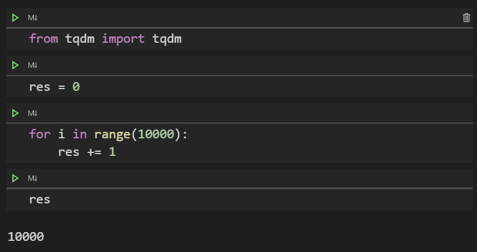
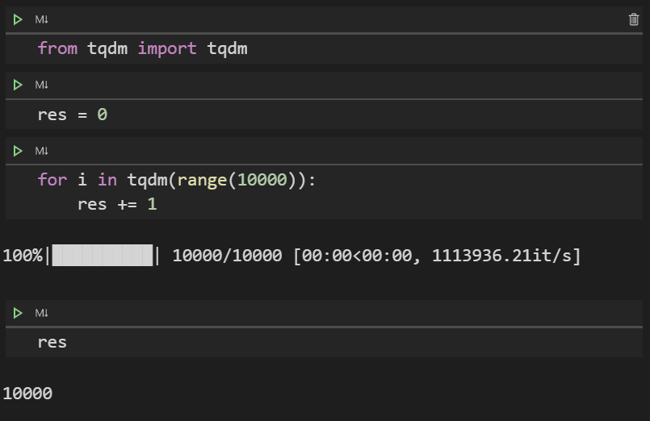
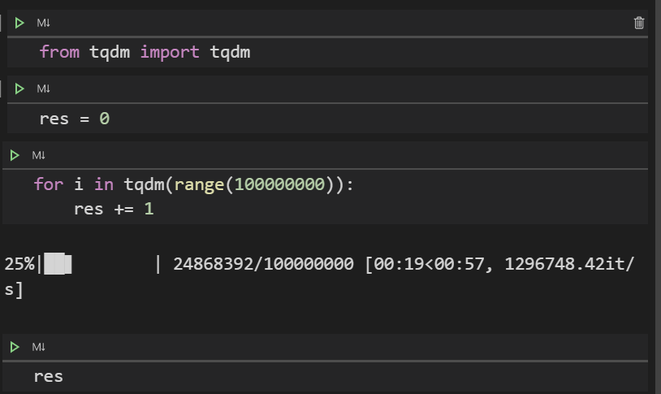

# tqdm 라이브러리

### 반복문 상태바 라이브러리


<br/>

> Python으로 코드를 작석하다 보면 for 문을 이용한 반복문을 사용하는 경우가 많다.
>
> 반복문을 많이 오래 하는 경우 결과가 나오기 까지 너무 시간이 걸리게 된다.
>
> 그럴때 tqdm을 사용하여 진행이 얼마나(몇%) 되었는지 확인하면 심리적 안정감(?)을 찾을 수 있다.
>
> 마치 지하철역에서 기차를 기다리면서 전광판을 보는 것과 같은 기분을 느낄 수 있을 것이다.


<br/>

### 설치

```python
pip install tqdm
```


<br/>

### 사용법

```python
from tqdm import tqdm
```


### 예시

- 간단한 for문을 통해서 사용해 보기




<br/>




<br/>

- 범위마 매우 큰 경우 1% 부터 천천히 올라가는 모습을 확인 할 수 있다.(너무 작으면 금방 100%가 되버림)




<br/>

### 파라미터

- iterable : 반복자 객체

- desc : 진행바 앞에 텍스트 출력

- leave : bool, default로 True. (진행상태 잔상이 남음)

- ncols : 진행바 컬럼길이. width 값으로 pixel 단위로 보임

- ascii : True로 하면 '#'문자로 진행바가 표시됨


<br/>

이외의 다른 파라미터나 옵션이 필요하거나 알고싶은 경우 아래의 Reference를 참고한다.


<br/><br/>

<br/>

### Reference

- [https://github.com/tqdm/tqdm](https://github.com/tqdm/tqdm)
- [https://tqdm.github.io/docs/notebook/](https://tqdm.github.io/docs/notebook/)


<br/>